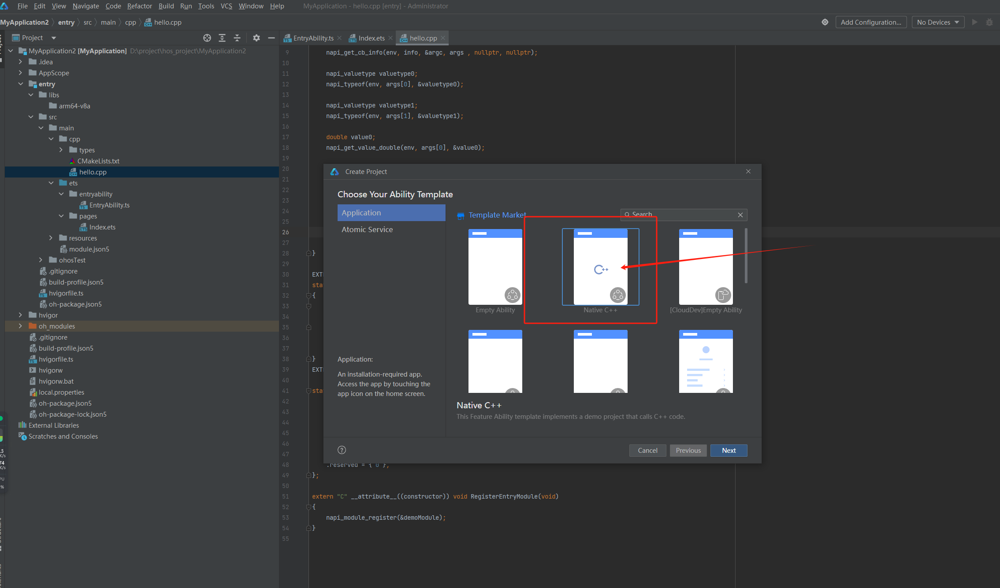
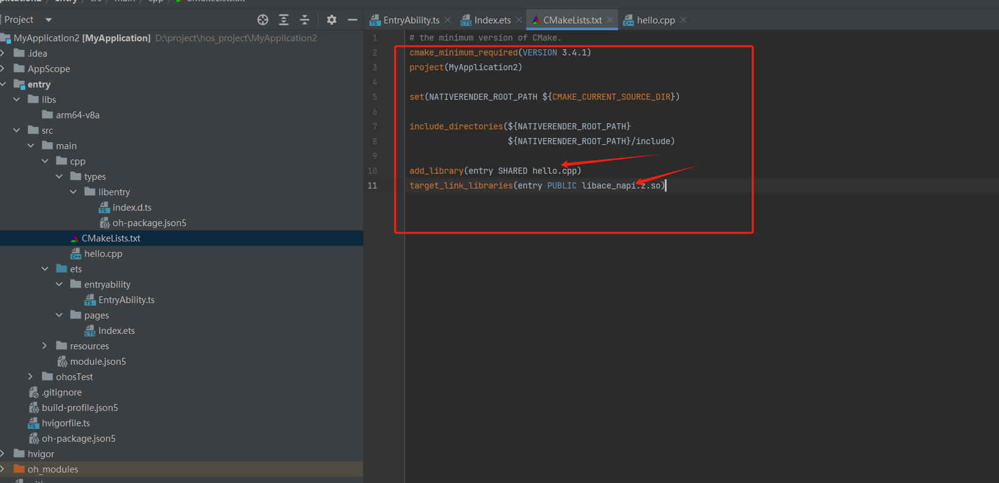
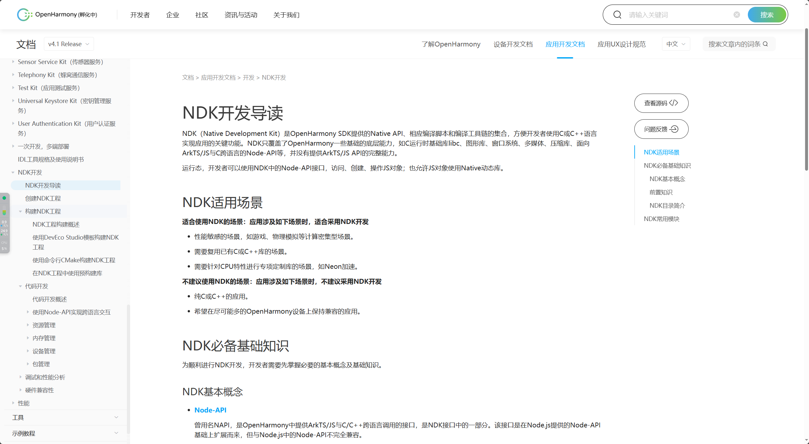
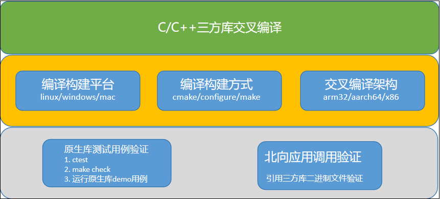
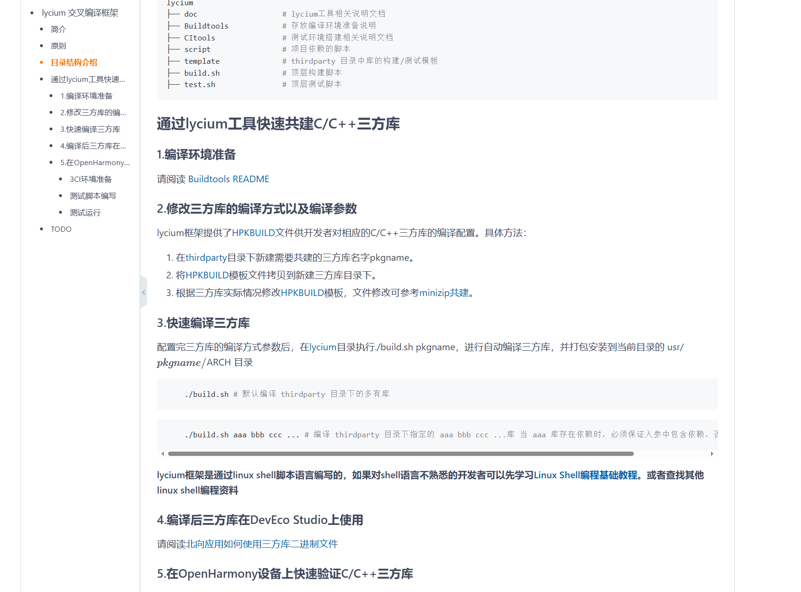
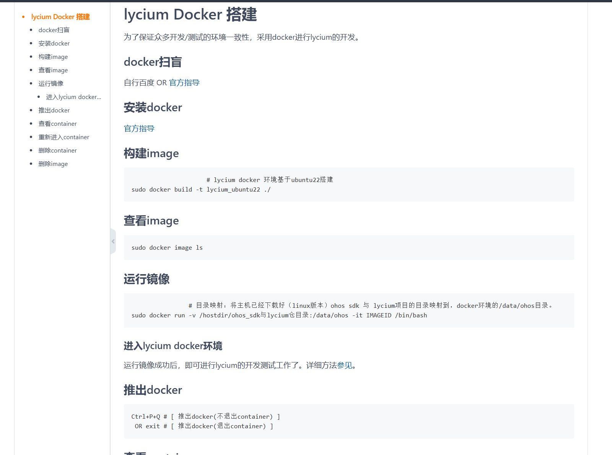

# 06-native库


## 前言


本章并非完全介绍应用开发，因为很多时候c++侧都不是开发业务，都是引入一些高效好用的第三方库来使用。


## native开发





使用应用开发工具建立一个C++工程。


最简单结构





就是常见的cmake结构，使用CMakeLists.txt来做编译


可以看到这个里面引入一个


```cmake


target_link_libraries(entry PUBLIC libace_napi.z.so)


```


这就是链接js和c++通信最重要的一个组件库。


怎么引入更多系统库呢？大家可以打开这里：








有非常详细的文档。


## 引入第三方库


本章重点不是介绍官方重复的东西。


如何自己引入很多已经使用很久，但是鸿蒙生态还未集成的库呢？





最根本的还是使用交叉编译链。


但是怎么能够快速引入呢？


SIG社区给了广大开发者经一个非常好用的答案，另外在这个仓库里面也已经集成了很多很多库，若是还需要其他仓库，也可以使用这套工具来集成，非常方便。


### lycium 交叉编译框架


lycium是一款协助开发者通过shell语言实现C/C++三方库快速交叉编译，并在OpenHarmony 系统上快速验证的编译框架工具。开发者只需要设置对应C/C++三方库的编译方式以及编译参数，通过lycium就能快速的构建出能在OpenHarmony 系统运行的二进制文件。





链接：[https://gitcode.com/openharmony-sig/tpc\_c\_cplusplus/blob/master/lycium/README.md](https://gitcode.com/openharmony-sig/tpc\_c\_cplusplus/blob/master/lycium/README.md)


lycium是一个编译环境自行搭建的也是一个非常麻烦的事情。


官方贴心的给出了docke编译环境





### HPKBUILD


最重要的一个文件，如何引入一个仓库，然后能够快速生成一个应用可用的第三方库


```gn


# This is an example HPKBUILD file. Use this as a start to creating your own,


# and remove these comments.


# NOTE: Please fill out the license field for your package! If it is unknown,


# then please put 'unknown'.


# Contributor: Your Name <youremail@domain.com>


# Maintainer: Your Name <youremail@domain.com>


pkgname=NAME # 库名


pkgver=VERSION # 库版本


pkgrel=0 # 发布号


pkgdesc="" # 库描述


url="" # 官网链接


archs=("armeabi-v7a" "arm64-v8a") # cpu 架构


license=()


depends=() # 依赖库的目录名 必须保证被依赖的库的archs是当前库的archs的超集


makedepends=() # 构建库时的依赖工具->需要用户安装的工具


source="https://downloads.sourceforge.net/$pkgname/$pkgname-$pkgver.tar.gz" # 库源码下载链接


downloadpackage=true # 是否自动下载压缩包，如若不写默认 true. (应对一些特殊情况，代码只能 git clone (项目中依赖 submoudle ))


autounpack=true # 是否自动解压，如若不写默认 true, 如果为 false 则需要用户在 prepare 函数中自行解压


buildtools= # 编译方法, 暂时支持cmake, configure, make等, 是什么就填写什么. 如若不写默认为cmake.


builddir= # 源码压缩包解压后目录名 编译目录名


packagename=$builddir.tar.gz # 压缩包名


# 为编译设置环境，如设置环境变量，创建编译目录等


prepare() {


    cd $builddir


    cd ${OLDPWD}


}


# ${OHOS_SDK} oh sdk安装路径


# $ARCH 编译的架构是 archs 的遍历


# $LYCIUM_ROOT/usr/$pkgname/$ARCH 安装到顶层目录的usr/$pkgname/$ARCH


# 执行编译构建的命令


build() {


    # 如果是cmake构建 "$@"=-DCMAKE_FIND_ROOT_PATH="..." -DCMAKE_TOOLCHAIN_FILE="..." -DCMAKE_INSTALL_PREFIX="..." 依赖库的搜索路径,toolchain file 路径,安装路径


    cd $builddir


    ${OHOS_SDK}/native/build-tools/cmake/bin/cmake "$@" -DOHOS_ARCH=$ARCH -B$ARCH-build -S./ -L


    make -j4 -C $ARCH-build


    # 对最关键一步的退出码进行判断


    ret=$?


    cd $OLDPWD


    return $ret


}


# 打包安装


package() {


    cd $builddir


    make -C $ARCH-build install


    cd $OLDPWD


}


# 进行测试的准备和说明


check() {


    echo "The test must be on an OpenHarmony device!"


}


# 清理环境


cleanbuild() {


    rm -rf ${PWD}/$builddir #${PWD}/$packagename


}


```

## 相关阅读

- [源码结构](05-yuan-ma-jie-gou.md)
- [NAPI接口](07-napi-jie-kou.md)
- [图形子系统-openharmony](12-tu-xing-zi-xi-tong-openharmony.md)
