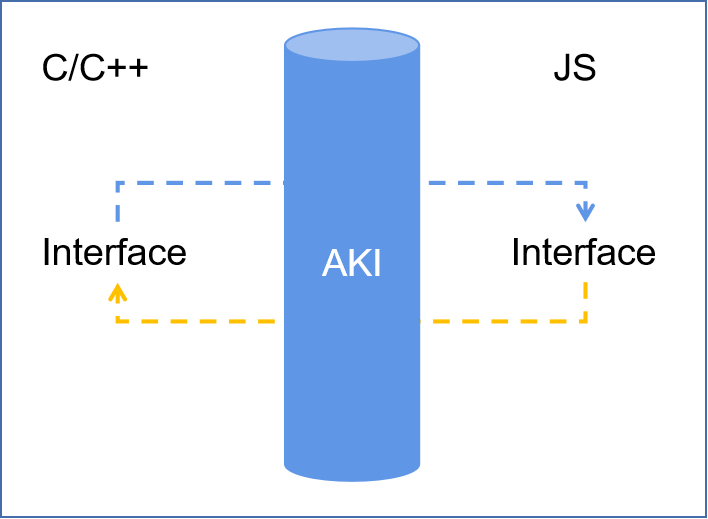

# 07-NAPI接口-aki

## 简介

正常使用NAPI写接口，太过于复杂，体验十分的差，这里提供一个很好的工具，开箱即用，开发者只需关注c++逻辑实现即可。

AKI (Alpha Kernel Interacting) 是一款边界性编程体验友好的ArkTs FFI开发框架，针对OpenHarmony Native开发提供JS与C/C++跨语言访问场景解决方案。支持极简语法糖使用方式，一行代码完成JS与C/C++的无障碍跨语言互调，所键即所得。

链接：

[https://gitcode.com/openharmony-sig/aki](https://gitcode.com/openharmony-sig/aki)

## 优势

1. 极简使用，解耦FFI代码与业务代码，友好的边界性编程体验；
2. 提供完整的数据类型转换、函数绑定、对象绑定、线程安全等特性；
3. 支持JS & C/C++互调；
4. 支持与Node-API嵌套使用；



## 使用

非常简易的使用

CMakeLists.txt定义

```cmake


# the minimum version of CMake.


cmake_minimum_required(VERSION 3.4.1)


project(aki_demo)


set(NATIVERENDER_ROOT_PATH ${CMAKE_CURRENT_SOURCE_DIR})


include_directories(${NATIVERENDER_ROOT_PATH}


                    ${NATIVERENDER_ROOT_PATH}/include)


# 本例直接使用根目录源码作为依赖，实际工程使用时，需要`clone`源码到指定路径


set(NATIVERENDER_ROOT_PATH ${CMAKE_CURRENT_SOURCE_DIR}/../../../../aki/)


add_library(entry SHARED hello.cpp)


add_subdirectory(${NATIVERENDER_ROOT_PATH} aki)


target_link_libraries(entry PUBLIC


    aki_jsbind)


```

样例cpp

```cpp


#include <string>


#include <aki/jsbind.h>


std::string SayHello(std::string msg)


{


    return msg + " too.";


}


JSBIND_GLOBAL()


{


    JSBIND_FUNCTION(SayHello);


}


JSBIND_ADDON(hello) // 注册 AKI 插件名为: hello


```

调用

<pre class="language-javascript"><code class="lang-javascript"><strong>import aki from 'libentry.so'
</strong>


this.message = aki.SayHello("hello world");


</code></pre>

比正常接入多了一个so


开发过程再也不用关心一大堆复杂的定义和类型转换

其他使用参考文档：[https://gitcode.com/openharmony-sig/aki/blob/master/README.md](https://gitcode.com/openharmony-sig/aki/blob/master/README.md)

## AKI 与原生 NAPI 的对比

原生的 Node-API（NAPI）要求开发者手写大量样板：用 `napi_value` 接收参数、逐一对每个参数做类型校验与提取、手动把 C++ 返回值封装回 `napi_value`、并用 `napi_define_properties` 注册对象与方法。当接口复杂（多参数、对象、回调、Promise）时，代码量陡增且极易出错。

AKI 的设计目标是"边界性编程友好"：把 FFI 胶水代码与业务代码解耦，开发者只需在 C++ 侧用声明式宏描述要导出的接口，AKI 在编译期自动生成 ArkTS↔C++ 的绑定代码。

| 维度         | 原生 NAPI                     | AKI                         |
| ---------- | --------------------------- | --------------------------- |
| 参数/返回值转换   | 手动 `napi_get_value_*`       | 自动推导                        |
| 对象/类导出     | 手写 `napi_define_properties` | `JSBIND_CLASS` 声明           |
| 回调/Promise | 手动封装                        | `JSBIND_ASYNC` / Promise 支持 |
| 开发心智负担     | 高                           | 低                           |

## 数据类型支持

AKI 覆盖从基础类型到复杂对象的完整映射：

* **基础类型**：`int`、`double`、`bool`、`std::string` 等直接传参；
* **容器**：`std::vector`、`std::map` 与 ArkTS 数组/对象互转；
* **函数与回调**：C++ 接收 JS 传来的函数并回调，支持 `std::function`；
* **对象绑定**：用 `JSBIND_CLASS` + `JSBIND_METHOD` / `JSBIND_PROPERTY` 把一个 C++ 类暴露为 ArkTS 对象；
* **异步**：`JSBIND_ASYNC` 或返回 `Promise`，把耗时操作放到后台线程，结果通过 Promise 回传 JS，避免阻塞 UI 线程。

```cpp
class Calculator {
public:
    int Add(int a, int b) { return a + b; }
};

JSBIND_CLASS(Calculator) {
    JSBIND_METHOD(Add);
}
JSBIND_ADDON(calculator)
```

## 线程模型与线程安全

ArkTS 运行在单线程上，重计算或阻塞调用必须放到后台线程。AKI 通过 Promise/异步回调把这些结果安全地派发回 ArkTS 主线程，开发者无需手动管理 `napi_threadsafe_function`。同时 AKI 对导出的对象做了引用管理，避免 C++ 对象已被释放而 JS 侧仍持有引用导致的崩溃。

## 工程集成

1. 将 AKI 源码克隆到工程指定路径（如 `third_party/aki`）；
2. 在 Native 模块的 `BUILD.gn` 中依赖 `aki_jsbind`；
3. 在 `CMakeLists.txt` 中 `add_subdirectory(.../aki)` 并 `target_link_libraries(entry PUBLIC aki_jsbind)`；
4. ArkTS 侧通过 `import aki from 'libxxx.so'` 引入，直接调用导出的方法。

## 适用场景与限制

AKI 适合 C/C++ 业务逻辑重、需要频繁与 ArkTS 互调的场景（音视频、图形、算法、游戏引擎等）。它并不能替代所有原生 NAPI 用法：在需要精细控制 ArkTS 对象生命周期、与现有 Node-API 库深度集成时，仍可直接使用原生 Node-API，AKI 也支持与 Node-API 嵌套混用。

## 相关阅读

* [NAPI接口](07-napi-jie-kou.md)
* [源码结构](05-yuan-ma-jie-gou.md)
