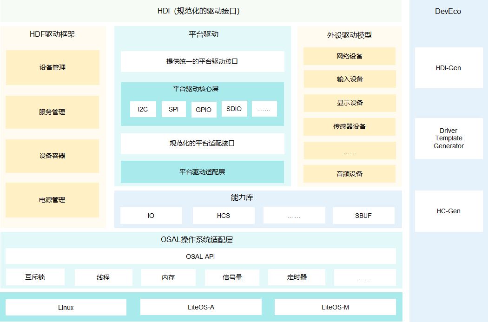
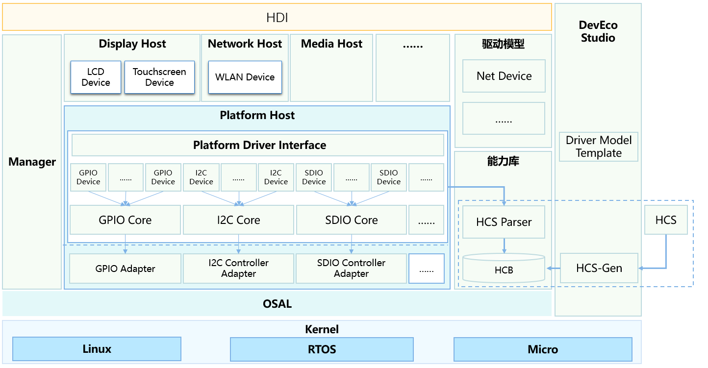
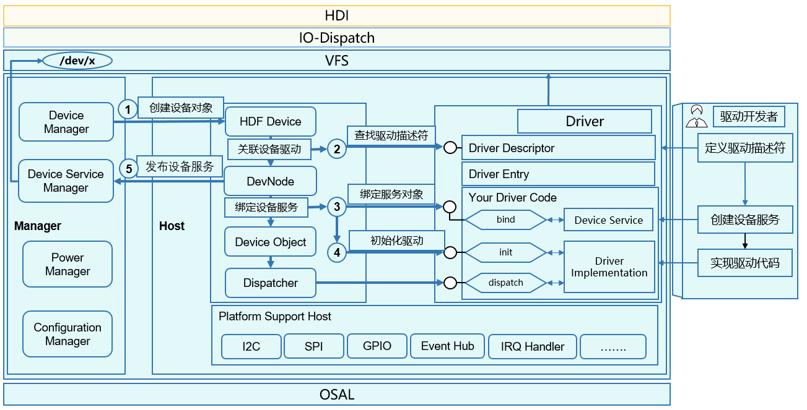
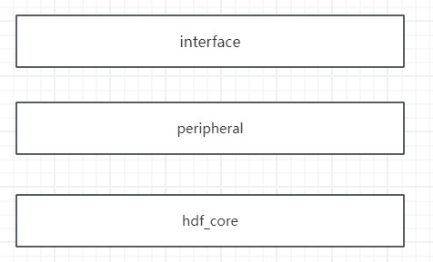

# 09-HDF驱动框架

## 简介

OpenHarmony 系统 HDF 驱动框架采用 C 语言面向对象编程模型构建，通过平台解耦、内核解耦，来达到兼容不同内核，统一平台底座的目的，从而帮助开发者实现驱动一次开发，多系统部署到的效果。

官方文档：[https://gitcode.com/openharmony/docs/blob/master/zh-cn/readme/%E9%A9%B1%E5%8A%A8%E5%AD%90%E7%B3%BB%E7%BB%9F.md](https://gitcode.com/openharmony/docs/blob/master/zh-cn/readme/%E9%A9%B1%E5%8A%A8%E5%AD%90%E7%B3%BB%E7%BB%9F.md)

## 架构

OpenHarmony驱动框架采用主从架构设计模式，围绕着框架、模型、能力库和工具四个维度能力展开构建。





HDF驱动架构主要组成部分：

HDI（Hardware Device Interface，硬件设备统一接口）层：通过规范化的设备接口标准，为系统提供统一、稳定的硬件设备操作接口。

HDF驱动框架：提供统一的硬件资源管理、驱动加载管理、设备节点管理、设备电源管理以及驱动服务模型等功能，需要包含设备管理、服务管理、DeviceHost、PnPManager等模块。

统一的配置界面：支持硬件资源的抽象描述，屏蔽硬件差异，可以支撑开发者开发出与配置信息不绑定的通用驱动代码，提升开发及迁移效率，并可通过HC-Gen等工具快捷生成配置文件。

操作系统抽象层（OSAL，Operating System Abstraction Layer）：提供统一封装的内核操作相关接口，屏蔽不同系统操作差异，包含内存、锁、线程、信号量等接口。

平台驱动：为外设驱动提供Board硬件（如：I2C/SPI/UART总线等平台资源）操作统一接口，同时对Board硬件操作进行统一的适配接口抽象以便于不同平台迁移。

外设驱动模型：面向外设驱动，提供常见的驱动抽象模型，主要达成两个目的，提供标准化的器件驱动，开发者无需独立开发，通过配置即可完成驱动的部署；提供驱动模型抽象，屏蔽驱动与不同系统组件间的交互，使得驱动更具备通用性。

## 使用开发流程

文档：[https://docs.openharmony.cn/pages/v4.1/zh-cn/device-dev/driver/driver-hdf-manage.md](https://docs.openharmony.cn/pages/v4.1/zh-cn/device-dev/driver/driver-hdf-manage.md)



### 详细解析

### 目录结构作用

hdf\_core

```


/drivers/hdf_core/adapter


├── khdf/liteos         #提供驱动框架对LiteOS-A内核依赖适配


├── khdf/liteos_m       #提供驱动框架对LiteOS-M内核依赖适配


├── uhdf                #提供用户态驱动接口对系统依赖适配


└── uhdf2               #提供用户态驱动框架对系统依赖适配


/drivers/hdf_core/framework


├── core           #实现驱动框架的核心代码


│   ├── adapter    #实现对内核操作接口适配，提供抽象化的接口供开发者使用


│   ├── common     #驱动框架公共基础代码


│   ├── host       #驱动宿主环境模块


│   ├── manager    #驱动框架管理模块


│   └── shared     #host和manager共享模块代码


├── include        #驱动框架对外提供能力的头文件


│   ├── audio      #AUDIO对外提供能力的头文件


│   ├── bluetooth  #蓝牙对外提供能力的头文件


│   ├── core       #驱动框架对外提供的头文件


│   ├── ethernnet  #以太网操作相关的头文件


│   ├── net        #网络数据操作相关的头文件


│   ├── osal       #系统适配相关接口的头文件


│   ├── platform   #平台设备相关接口的头文件


│   ├── utils      #驱动框架公共能力的头文件


│   └── wifi       #WLAN对外提供能力的头文件


├── model          #提供驱动通用框架模型


│   ├── audio      #AUDIO框架模型


│   ├── display    #显示框架模型


│   ├── input      #输入框架模型


│   ├── misc       #杂项设备框架模型，包括dsoftbus、light、vibrator


│   ├── network    #WLAN框架模型


│   └── sensor     #Sensor驱动模型


│   └── storage    #存储驱动模型


│   └── usb        #USB驱动模型


├── sample         #HCS配置描述示例及HDF驱动示例


├── support        #提系统的基础能力 


│   └── platform   #平台设备驱动框架及访问接口，范围包括GPIO、I2C、SPI等


│   └── posix      #posix框架及访问接口，范围包括Mem、Mutex、Sem、Spinlock、Thread、Time等


├── test           #测试用例


├── tools          #hdf框架工具相关的源码


│   └── hc-gen     #配置管理工具源码


│   └── hcs-view   #


│   └── hdf-dbg    #


│   └── hdf-dev_eco_tool #


│   └── hdf-gen    #


│   └── idl-gen    #


│   └── leagecy    #


└── utils          #提供基础数据结构和算法等


```

HDI接口

```


├── README.en.md


├── README.md


├── sensor                          #sensor HDI 接口定义


│   └── v1_0                        #sensor HDI 接口 v1.0版本定义


│       ├── BUILD.gn                #sensor idl文件编译脚本


│       ├── ISensorCallback.idl     #sensor callback 接口定义idl文件


│       ├── ISensorInterface.idl    #sensor interface 接口定义idl文件


│       └── SensorTypes.idl         #sensor 数据类型定义idl文件


├── audio                           #audio HDI 接口定义


│   └── ...


├── camera                          #camera HDI接口定义


├── codec                           #codec HDI接口定义


├── display                         #display HDI接口定义


├── face_auth                       #faceauth HDI接口定义


├── format                          #format HDI接口定义


├── input                           #input HDI接口定义


├── misc                            #misc HDI接口定义


├── pinauth                         #pinauth HDI接口定义


├── usb                             #usb HDI接口定义


├── fingerprint_auth                #fingerprintauth HDI接口定义


└── wlan                            #wlan HDI接口定义


```

peripheral HDI接口实现


```


-   audio：Audio HDI接口的定义


-   codec：Codec HDI接口的定义


-   display：Display HDI 接口定义及其默认实现


-   format：Format HDI接口定义


-   input：Input HDI接口定义及其实现


-   sensor：Sensor HDI接口定义与实现


-   wlan：WLAN HDI接口定义与实现


-   usb：USB DDK接口定义与实现


-   camera：Camera HDI接口定义及其实现


-   ril：Ril HDI接口定义及其实现


```


### 体系结构



## 相关阅读

* [启动流程](10-qi-dong-liu-cheng.md)
* [内核子系统-标准系统Linux](19-nei-he-zi-xi-tong-biao-zhun-xi-tong-linux.md)
* [OTA升级子系统](22-ota-sheng-ji-zi-xi-tong.md)
