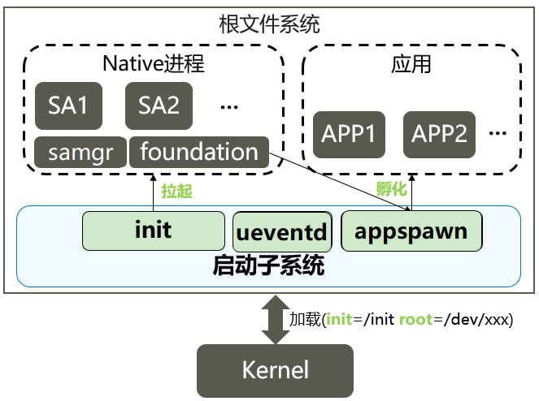
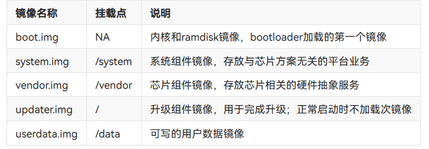
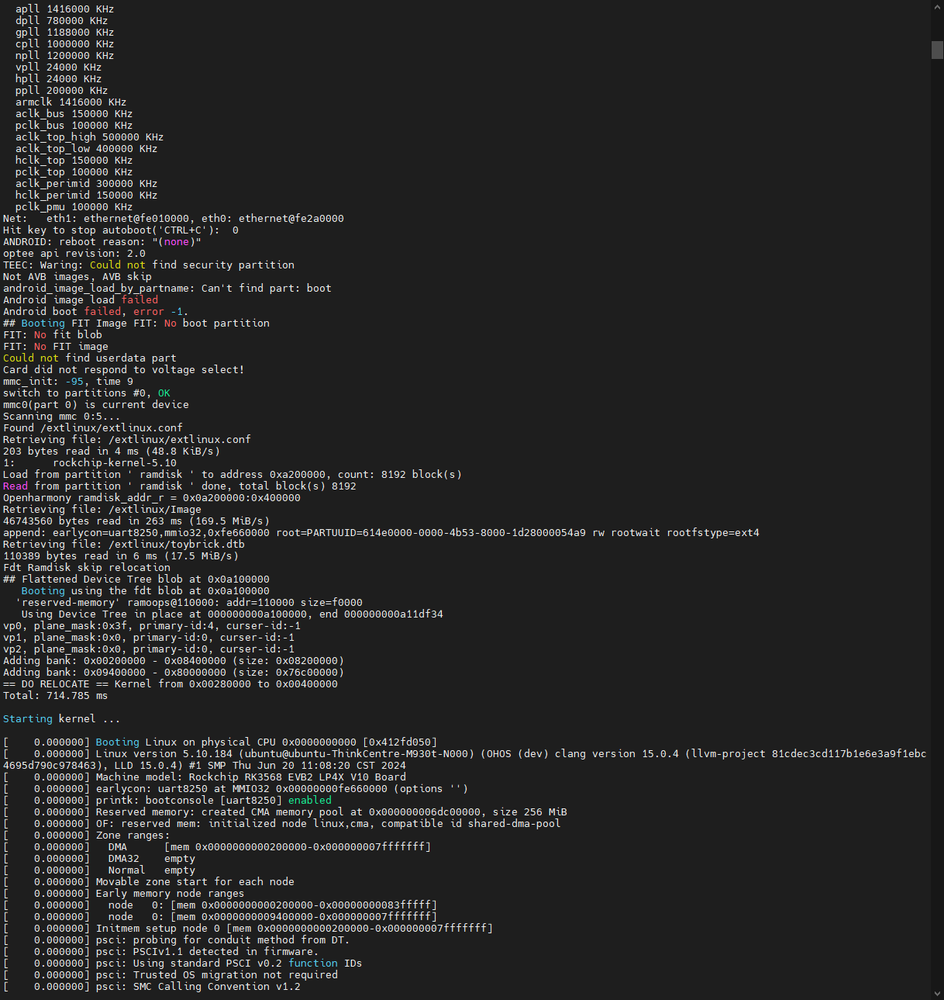
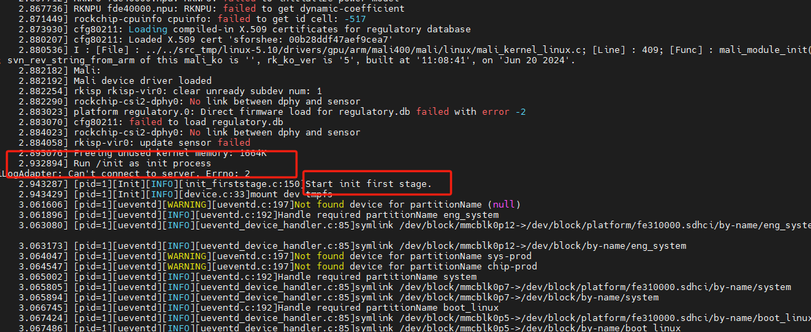
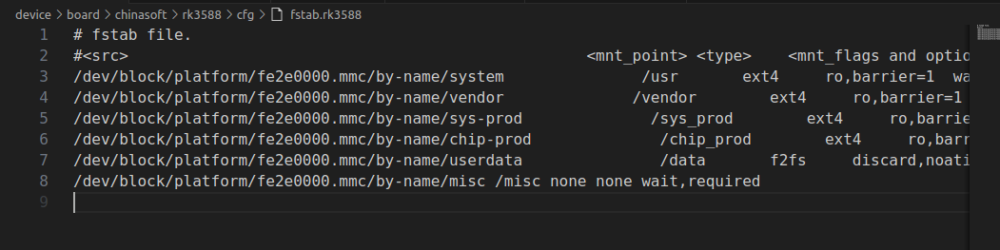

# 10-启动流程

## 上下文



## uboot流程

u-boot启动进入内核时，可以通过bootargs传递关键信息给内核。

SOC启动时都由bootloader来加载镜像，具体过程包括以下几个大的步骤：

* bootloader初始化ROM和RAM等硬件，加载分区表信息。
* bootloader根据分区表加载`boot.img`，从中解析并加载`ramdisk.img`到内存中。
* bootloader准备好分区表信息，ramdisk地址等信息，进入内核，内核加载ramdisk并执行init。
* init准备初始文件系统，挂载`required.fstab`（包括`system.img`和`vendor.img`的挂载）。
* 扫描`system.img`和`vendor.img`中`etc/init`目录下的启动配置脚本，执行各个启动命令。

分区说明



引导启动



启动system



## 启动参数

以rk3568为例


```


 cat /proc/cmdline


 


earlycon=uart8250,mmio32,0xfe660000 root=PARTUUID=614e0000-0000 rw rootwait rootfstype=ext4 console=ttyFIQ0 ohos.boot.eng_mode=on hardware=rk3568 default_boot_device=fe310000.sdhci ohos.required_mount.system=/dev/block/platform/fe310000.sdhci/by-name/system@/usr@ext4@ro,barrier=1@wait,required ohos.required_mount.vendor=/dev/block/platform/fe310000.sdhci/by-name/vendor@/vendor@ext4@ro,barrier=1@wait,required ohos.required_mount.misc=/dev/block/platform/fe310000.sdhci/by-name/misc@none@none@none@wait,required ohos.required_mount.bootctrl=/dev/block/platform/fe310000.sdhci/by-name/bootctrl@none@none@none@wait,required


```


内核将bootargs信息写入/proc/cmdline，其中就包含了default\_boot\_device，这个值是内核当中约定好的系统启动必要的主设备目录。以ohos.required\_mount.为前缀的内容则是系统启动必要的分区挂载信息，其内容与fstab.required文件内容应当是一致的。另外，分区挂载信息中的块设备节点就是default\_boot\_device目录中by-name下软链接指向的设备节点。例如，default\_boot\_device的值为soc/10100000.himci.eMMC，那么ohos.required\_mount.system的值就包含了/dev/block/platform/soc/10100000.himci.eMMC/by-name/system这个指向system设备节点的软链接路径。

在创建块设备节点的过程中，会有一个将设备路径与default\_boot\_device的值匹配的操作，匹配成功后，会在/dev/block/by-name目录下创建指向真实块设备节点的软链接，以此在访问设备节点的过程中实现芯片平台无关化。

详细介绍init进程启动后，从读取required fstab信息到创建required分区块设备节点再到最后完成required分区挂载



## 引导启动配置文件 <a href="#yin-dao-qi-dong-pei-zhi-wen-jian" id="yin-dao-qi-dong-pei-zhi-wen-jian"></a>

Init配置文件基于JSON格式，用来配置系统启动时必要的命令和服务。Init在系统启动时解析配置文件，并根据配置文件执行对应的命令，启动相应的服务。

#### 基本概念 <a href="#ji-ben-gai-nian" id="ji-ben-gai-nian"></a>

1. 分组配置文件（device.xxxx.group.cfg）（标准系统支持），文件由jobs、services和groups组成。用来限制能够执行的jobs和service。根据cmdline中的bootgroup属性决定当前的分区。当前支持下列分组：
   * ​device.boot.group 系统默认配置，触发执行配置文件中的所有的job和服务。
   * device.charge.group charge模式，限制只启动改文件中允许的job和服务。
2. 启动配置文件（init.cfg），文件由jobs、services和import组成。
   * services（linux内核支持）， 用于配置系统支持的native服务，服务具体配置参考 [**服务管理**](https://docs.openharmony.cn/pages/v4.0/zh-cn/device-dev/subsystems/subsys-boot-init-service.md)。
   * jobs， 配置等待执行命令集合，jobs具体参考 [**jobs管理**](https://docs.openharmony.cn/pages/v4.0/zh-cn/device-dev/subsystems/subsys-boot-init-jobs.md)。
   * import（linux内核支持），import是导入cfg文件，目的是减少cfg大小，分离不同的功能。

init进程启动时，首先完成系统初始化工作，然后开始解析配置文件。系统在解析配置文件时，会将配置文件分成三类：

1. init.cfg默认配置文件，由init系统定义，优先解析。
2. /system/etc/init/\*.cfg各子系统定义的配置文件。
3. /vendor/etc/init/\*.cfg厂商定义的配置文件。

### cfg文件编写模板

```json


{


    "import" : [


            "/etc/example1.cfg",


            "/etc/example2.cfg"


    ],


    "jobs" : [{


            "name" : "jobName1",


            "cmds" : [


                "start serviceName",


                "mkdir dir1"


            ]


        }, {


            "name" : "jobName2",


            "cmds" : [


                "chmod 0755 dir1",


                "chown root root dir1"


            ]


        }


    ],


    "services" : [{


            "name" : "serviceName",


            "path" : ["/system/bin/serviceName"]


        }


    ]


}


```

1. cfg文件是严格按照JSON格式编写的，当添加服务或命令未生效时，可以优先排查添加内容的格式是否正确。
2. 对于import解析，在解析完成一个import中的cfg文件路径时，会立即解析该cfg文件。
3. example1.cfg 需要导入的cfg文件。
4. serviceName：service名称， 用户自定义。
5. /system/bin/serviceName: 当前服务的可执行文件全路径和参数， 数组形式。
6. jobName1：job名称， 用户自定义。

## jobs管理 <a href="#jobs-guan-li" id="jobs-guan-li"></a>

使用文档：[https://docs.openharmony.cn/pages/v4.0/zh-cn/device-dev/subsystems/subsys-boot-init-jobs.md](https://docs.openharmony.cn/pages/v4.0/zh-cn/device-dev/subsystems/subsys-boot-init-jobs.md)

## 服务管理 <a href="#fu-wu-guan-li" id="fu-wu-guan-li"></a>

使用文档：[https://docs.openharmony.cn/pages/v4.0/zh-cn/device-dev/subsystems/subsys-boot-init-service.md](https://docs.openharmony.cn/pages/v4.0/zh-cn/device-dev/subsystems/subsys-boot-init-service.md)

## 系统参数 <a href="#xi-tong-can-shu" id="xi-tong-can-shu"></a>

使用文档：[https://docs.openharmony.cn/pages/v4.0/zh-cn/device-dev/subsystems/subsys-boot-init-sysparam.md](https://docs.openharmony.cn/pages/v4.0/zh-cn/device-dev/subsystems/subsys-boot-init-sysparam.md)

## 相关阅读

* [HDF驱动框架](09-hdf-qu-dong-kuang-jia.md)
* [系统samgr](08-xi-tong-samgr.md)
* [内核子系统-标准系统Linux](19-nei-he-zi-xi-tong-biao-zhun-xi-tong-linux.md)
