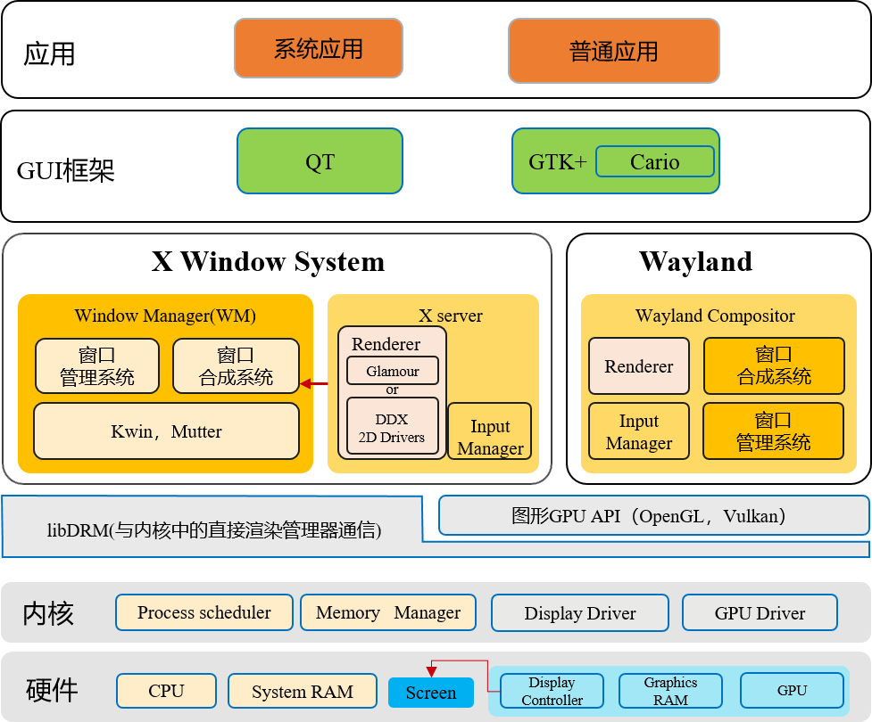
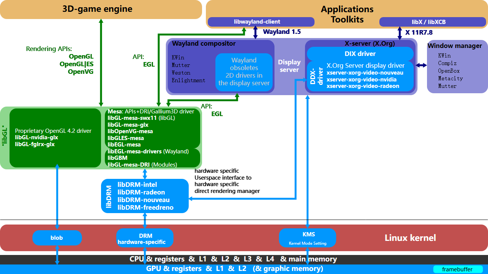
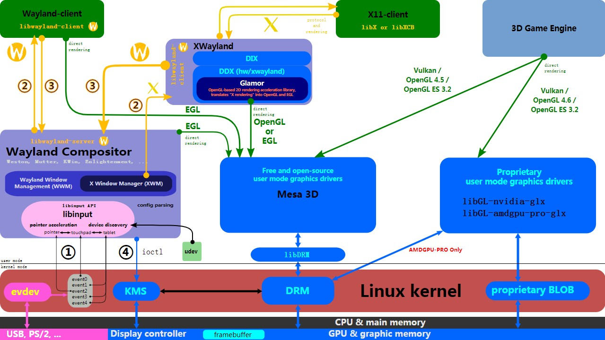
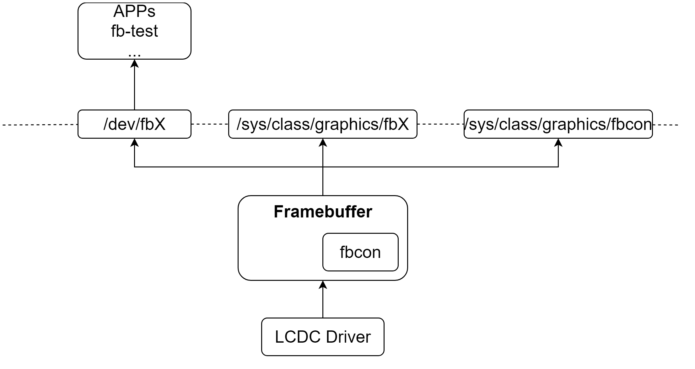
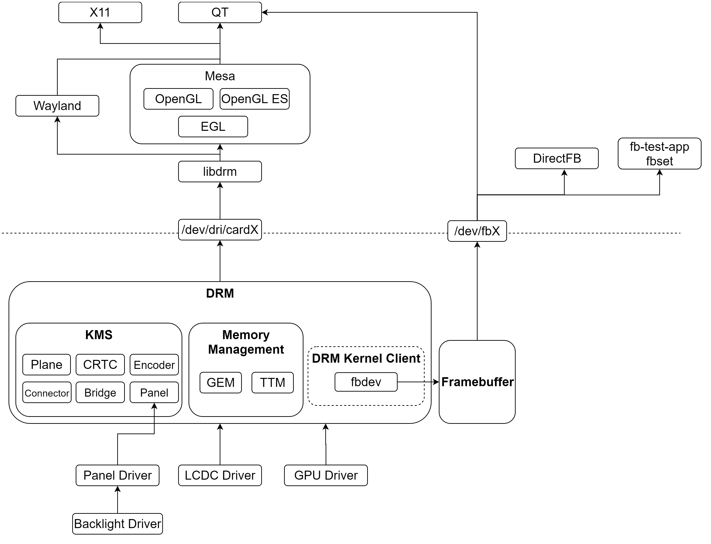
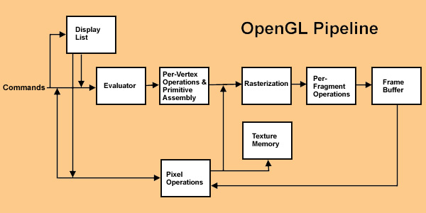

# 12-图形子系统-Linux图形显示系统

## Linux平台

参考：[https://www.cnblogs.com/arnoldlu/p/18077391](https://www.cnblogs.com/arnoldlu/p/18077391)

Linux视窗架构

应用/游戏、图形框架、图形加速引擎、内核驱动、硬件之间的关系

Wayland实现流程，以及X11通过XWayland实现流程

## 内核空间

### Framebuffer Drivers

### DRM

## 用户空间

### libdrm

libdrm的作用就是将内核功能封装成 一系列的open/close/ioctl 等标准接口，应用程序调用这些接口来驱动设备实现画面显示，绝大部分可以分成两类行为：Graphics Execution Manager (GEM)、Kernel Mode-Setting (KMS)，gem：显存管理，如显存的分配和释放，kms：显示模式管理，如分辨率等的设置。

### OpenGL

OpenGL是用于渲染2D、3D矢量图形的跨语言、跨平台API。其具有其他功能：建立3D模型、图形变换、颜色模式、光照和材质设置、纹理映射、图像增强功能和位图显示扩展功能、双缓存功能。

Vulkan的最大任务不是竞争DirectX，而是取代OpenGL，所以重点要看和后者的对比。在高分辨率、高画质、需要GPU发挥的时候，Vulkan、OpenGL的速度基本差不多，但是随着分辨率的降低，CPU越来越重要，Vulkan逐渐体现了出来。

OpenGL体系架构可以通过基于状态的pipeline表达，命令从左侧进入pipeline，输出到FrameBuffer。

### Mesa

Mesa是OpenGL的一个实现，同时还包括很多硬件图形加速驱动。Mesa还实现了OpenGL ES、Vulkan、EGL、OpenCL、OpenMAX等协议。

Mesa内部分为Graphics API层和用户空间驱动层。Graphics API层实现各种协议的API接口；用户空间驱动层实现不同GPU驱动，对接DRM设备。

结合应用和libdrm说明里不同应用、图形API、Mesa类别、GPU驱动流程：

## 相关阅读

- [图形子系统-openharmony](12-tu-xing-zi-xi-tong-openharmony.md)
- [图形子系统-Linux图形显示系统之DRM](12-tu-xing-zi-xi-tong-linux-tu-xing-xian-shi-xi-tong-zhi-drm.md)
