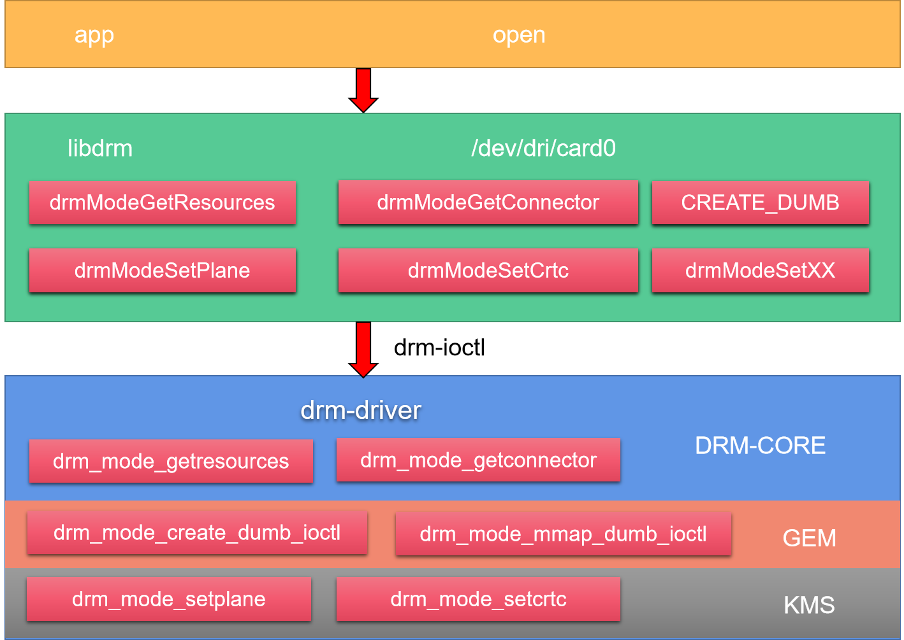
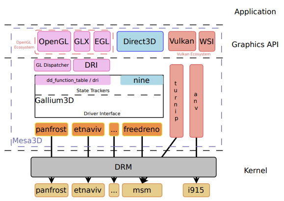
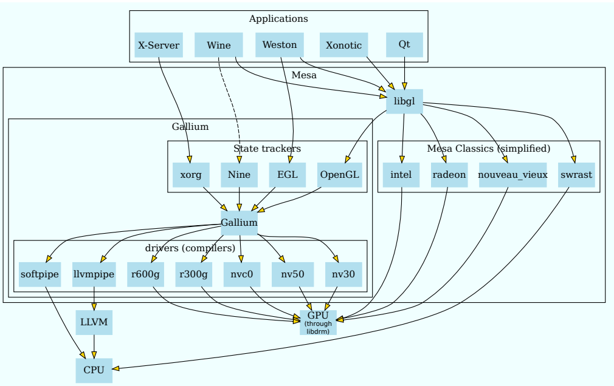

# 12-图形子系统-Linux图形显示系统

## Linux平台

参考：[https://www.cnblogs.com/arnoldlu/p/18077391](https://www.cnblogs.com/arnoldlu/p/18077391)

Linux视窗架构

应用/游戏、图形框架、图形加速引擎、内核驱动、硬件之间的关系

Wayland实现流程，以及X11通过XWayland实现流程

## 内核空间

### Framebuffer Drivers

### DRM

## 用户空间

### libdrm

libdrm的作用就是将内核功能封装成 一系列的open/close/ioctl 等标准接口，应用程序调用这些接口来驱动设备实现画面显示，绝大部分可以分成两类行为：Graphics Execution Manager (GEM)、Kernel Mode-Setting (KMS)，gem：显存管理，如显存的分配和释放，kms：显示模式管理，如分辨率等的设置。

### OpenGL

OpenGL是用于渲染2D、3D矢量图形的跨语言、跨平台API。其具有其他功能：建立3D模型、图形变换、颜色模式、光照和材质设置、纹理映射、图像增强功能和位图显示扩展功能、双缓存功能。

Vulkan的最大任务不是竞争DirectX，而是取代OpenGL，所以重点要看和后者的对比。在高分辨率、高画质、需要GPU发挥的时候，Vulkan、OpenGL的速度基本差不多，但是随着分辨率的降低，CPU越来越重要，Vulkan逐渐体现了出来。

OpenGL体系架构可以通过基于状态的pipeline表达，命令从左侧进入pipeline，输出到FrameBuffer。

### Mesa

Mesa是OpenGL的一个实现，同时还包括很多硬件图形加速驱动。Mesa还实现了OpenGL ES、Vulkan、EGL、OpenCL、OpenMAX等协议。

Mesa内部分为Graphics API层和用户空间驱动层。Graphics API层实现各种协议的API接口；用户空间驱动层实现不同GPU驱动，对接DRM设备。

结合应用和libdrm说明里不同应用、图形API、Mesa类别、GPU驱动流程：

## Linux 图形栈总览

一个完整的 Linux 图形显示链路，自上而下通常分为五层：

1. **应用/游戏**：产生绘制需求；
2. **图形框架/工具库**：如 GTK、Qt、EFL，提供控件与绘制抽象；
3. **图形 API 与实现**：OpenGL / OpenGL ES / Vulkan 通过 Mesa 实现，Mesa 再调用对应 GPU 的用户态驱动；
4. **libdrm**：把内核 DRM 能力封装为 `open/close/ioctl` 标准接口；
5. **内核 DRM/KMS + 显示硬件**：完成显存管理与最终上屏。

理解这套栈，有助于理解 OpenHarmony 标准系统在 Linux 内核上的显示实现（见下节）。

## Wayland 与 X11

* **X11（X Window System）**：历史悠久的显示服务协议，由 X Server 统一管理窗口、输入与显示；但其客户端/服务端分离带来的开销、以及安全性与合成能力的不足，逐渐被取代。
* **Wayland**：更现代的协议，把合成职责交给 Compositor（合成器），客户端直接把画面交给合成器，合成器再统一通过 DRM/KMS 上屏；X11 应用可通过 **XWayland** 兼容运行。OpenHarmony 标准系统并不依赖 X11/Wayland，而是自建显示与合成服务。

## EGL 与窗口系统

EGL 是 OpenGL ES 与底层"窗口系统/原生显示"之间的桥梁，负责创建渲染表面（Surface）、管理图形上下文（Context）。在 Linux 上 EGL 通常后端对接 GBM（Generic Buffer Management）或 Wayland/X11，最终通过 libdrm 操作 DRM 设备。

## KMS/DRM 显示管线

DRM 的 Kernel Mode-Setting（KMS）把"上屏"抽象为四个对象：

* **Connector**：物理显示接口（HDMI、eDP、DSI 等）；
* **Encoder**：把 CRTC 输出的信号编码为连接器所需的格式；
* **CRTC**：扫描输出控制器，决定从哪块 FrameBuffer 取数据、以什么分辨率/时序输出；
* **Plane**：图层，支持多图层合成（如主图层 + 光标图层 + 视频叠加层），硬件叠加可显著降低合成开销。

显示上屏即：为 CRTC 绑定 FrameBuffer（含 Plane 配置），由硬件按时序扫描到屏幕。

## OpenHarmony 在标准系统上的显示路径

OpenHarmony 标准系统运行于 Linux 内核之上，其图形服务（含合成器）**直接基于 DRM/KMS** 管理显示设备与图层合成，并不经过 X11/Wayland。Mesa 提供的 GPU 用户态驱动则用于硬件加速渲染。换言之：上层是 OpenHarmony 自有的图形/窗口架构，底层复用 Linux 的 DRM/KMS 显示驱动与 Mesa 加速能力——这正是本章梳理 Linux 图形栈的意义所在。

更底层的 DRM 机制（GEM 显存管理、KMS 详细流程）见本章续篇《图形子系统-Linux图形显示系统之DRM》。

## 相关阅读

* [图形子系统-openharmony](12-tu-xing-zi-xi-tong-openharmony.md)
* [图形子系统-Linux图形显示系统之DRM](12-tu-xing-zi-xi-tong-linux-tu-xing-xian-shi-xi-tong-zhi-drm.md)
