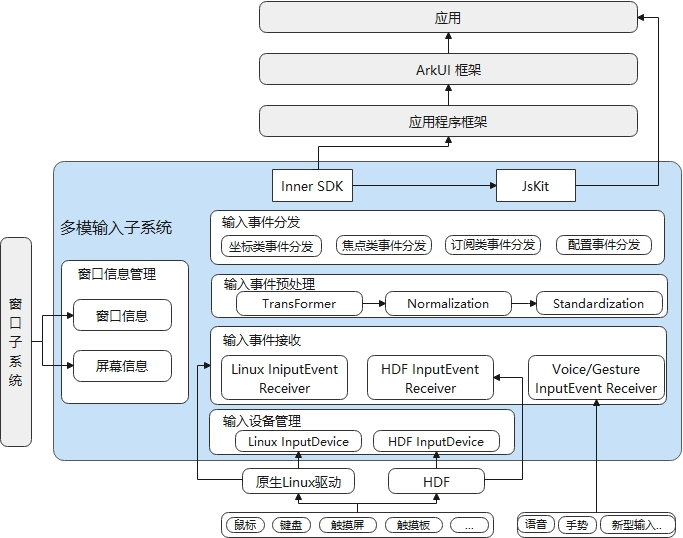
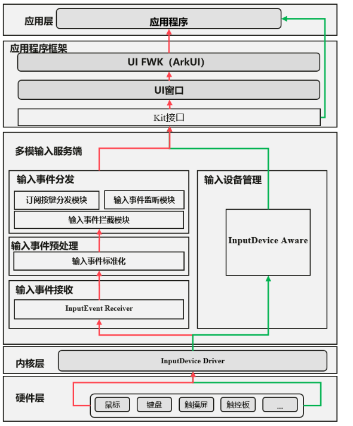
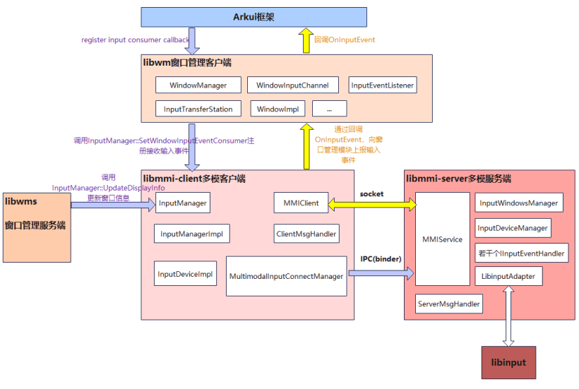
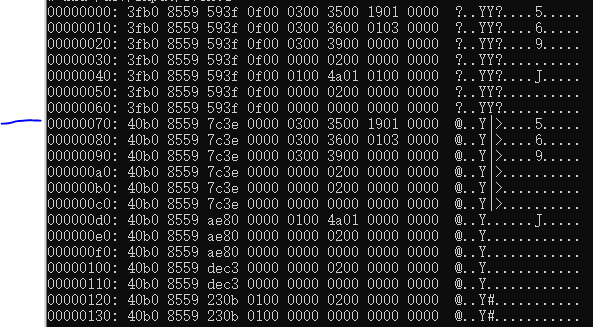
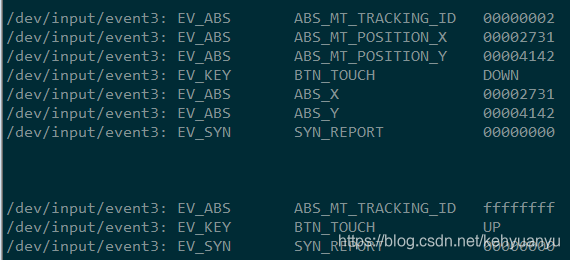
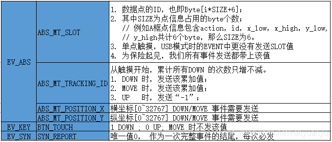
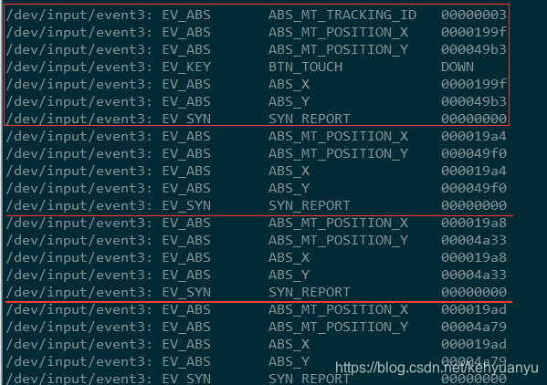
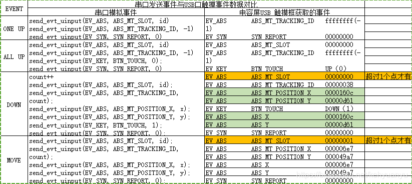
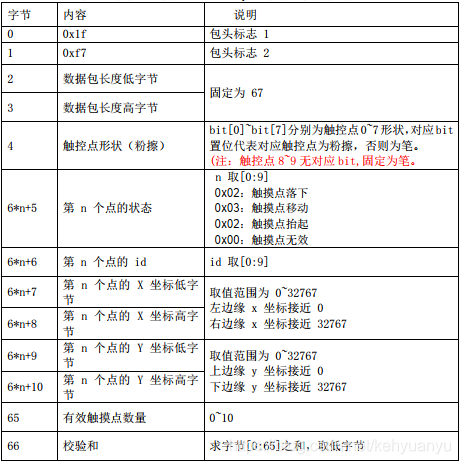
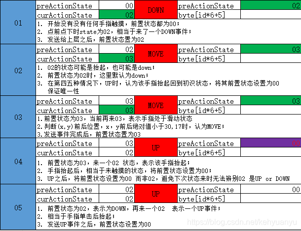

# 14-多模输入子系统

## 简介

文档参考：[https://gitcode.com/openharmony/docs/blob/master/zh-cn/readme/%E5%A4%9A%E6%A8%A1%E8%BE%93%E5%85%A5%E5%AD%90%E7%B3%BB%E7%BB%9F.md](https://gitcode.com/openharmony/docs/blob/master/zh-cn/readme/%E5%A4%9A%E6%A8%A1%E8%BE%93%E5%85%A5%E5%AD%90%E7%B3%BB%E7%BB%9F.md)

多模输入子系统基于Linux原生驱动和HDF驱动接收设备输入事件，如键盘、鼠标、触摸屏、触摸板等， 对输入事件进行归一化和标准化后通过innerSDK分发到ArkUI框架，ArkUI框架封装事件后转发到应用，或者innerSDK通过JsKit接口直接分发事件到应用。

## 架构

## 流程

## 样例

### 内核TP

Linux内核调通后，生成/dev/input/event4节点

上报数据为

前面五行是序号和事件发生的事件信息

&#x20;0300表示事件类型EV\_ABS为绝对坐标事件&#x20;

3500表示事件代码0x0035表示ABS\_MT\_POSITION\_X表示上报X轴坐标位置&#x20;

1901 0000 表示值也就是表示上报的坐标是0x00000119

详细多触摸协议：[https://kernel.org/doc/html/v4.12/input/multi-touch-protocol.html?login=from\_csdn](https://kernel.org/doc/html/v4.12/input/multi-touch-protocol.html?login=from\_csdn)

libinput库负责将linux底层的事件转换成其内部事件

libinput库：[https://wayland.freedesktop.org/libinput/doc/latest/api/?login=from\_csdn](https://wayland.freedesktop.org/libinput/doc/latest/api/?login=from\_csdn)

## 详细解析input事件

文档：[https://tinylab-1.gitbook.io/linux-doc/zh-cn/input/multi-touch-protocol](https://tinylab-1.gitbook.io/linux-doc/zh-cn/input/multi-touch-protocol)

单点的DOWN，UP 事件

EVENT 分为EV\_ABS，EV\_KEY，EV\_SYN 三种类型

* ABS\_MT\_SLOT：上报触点ID

* ABS\_MT\_TRACKING\_ID：为触摸点分配ID，用于轨迹跟踪

* ABS\_MT\_POSITION\_X：上报触摸点X轴坐标信息

* ABS\_MT\_POSITION\_Y：上报触摸点Y轴坐标信息

* ABS\_MT\_TOUCH\_MAJOR：上报触摸区域长轴信息（触点椭圆形）

* ABS\_MT\_WIDTH\_MAJOR：上报触摸区域短轴信息（触点椭圆形）

单点的DOWN，MOVE事件

### 协议格式

状态变换

### 事件的含义

*   `ABS_MT_TOUCH_MAJOR`

    触点长轴的长度。该长度应该和屏幕尺寸单位一致。若屏幕有 X \* Y 的分辨率，则 `ABS_MT_TOUCH_MAJOR` 最大的长度为对角线 - `sqrt(X^2 + Y^2)`。

*   `ABS_MT_TOUCH_MINOR`

    触点短轴的长度，屏幕尺寸单位。若触点形状是圆形，该事件可以忽略 \[4]。

*   `ABS_MT_WIDTH_MAJOR`

    触点工具长轴的长度，屏幕尺寸单位。这应该理解为触点工具本身的大小。这里假设触点的方向和触点工具的方向是相同的 \[4]。

*   `ABS_MT_WIDTH_MINOR`

    触点工具短轴的长度，屏幕尺寸单位。若触点工具的形状是圆形，则忽略该事件 \[4]。

这里可以利用上面四个事件来获取额外的触点信息。比如，可以用 `ABS_MT_TOUCH_MAJOR` / `ABS_MT_WIDTH_MAJOR` 比例来表示触摸压力的大小。手指和手掌都有不同的宽度特征，可以用来做区分。

*   `ABS_MT_PRESSURE`

    当前触摸区域的压力，任意单位。可以用于基于压力的设备，取代 `TOUCH` 和 `WIDTH`，或者用于任何带有空间压力分布感应信号的设备。

*   `ABS_MT_DISTANCE`

    触点和屏幕表面之间的距离，屏幕尺寸单位。0 距离意味着触点和屏幕是接触的。一个正数意味着触点是悬浮在屏幕之上的。

*   `ABS_MT_ORIENTATION`

    触点椭圆外形的方向。该值应该描述触点中心顺时针一周中的 1/4 的方位。带符号数值的范围是随意的。但是，当触点椭圆外形和表面 Y 轴对齐时，应该返回 0 值。当椭圆外形向左转变时，应该返回负值，向右转变时，应该返回正值。当完全和 X 轴对齐时，应该返回范围最大值。

    触点椭圆外形默认是对称的。对于那些能够检测 360 度方向的设备，上报的值一定要超过范围最大值，来显示大于一周的 1/4。对于一个颠倒的手指，应该返回 `max * 2`。

    当触摸区域是圆形时，方位是可以忽略的，或者内核驱动获取不到该信息。如果设备只能识别两个轴，不能分辨出介于两者之间的值，内核驱动可以部分支持该事件。在这种情况下，`ABS_MT_ORIENTATION` 的范围应该为 \[0, 1] \[4]。

*   `ABS_MT_POSITION_X`

    触点椭圆外形中心点 X 轴坐标值

*   `ABS_MT_POSITION_Y`

    触点椭圆外形中心点 Y 轴坐标值

*   `ABS_MT_TOOL_X`

    触摸工具中心点的 X 轴坐标值。若设备无法分辨触摸点和触摸工具自身时，该事件可以忽略。

*   `ABS_MT_TOOL_Y`

    触摸工具中心点的 Y 轴坐标值。若设备无法分辨触摸点和触摸工具自身时，该事件可以忽略。

    这 4 个位置值可以用于分割触点位置和触摸工具位置。若两者都有，工具轴是指向触点的。否则，工具轴和触点轴是对齐的。

*   `ABS_MT_TOOL_TYPE`

    触摸工具的类型。许多内核驱动无法分辨触摸工具的类型，例如是手指或者触摸笔。在这种情况下，这个事件应该被忽略掉。这个协议当前支持 `MT_TOOL_FINGER` 和 `MT_TOOL_PEN` 两者类型 \[2]。对于类型 B 的设备，这个事件是由 INPUT 子系统核心处理。驱动应该使用 `input_mt_report_slot_state()` 函数。

*   `ABS_MT_BLOB_ID`

    `BLOB_ID` 把多个包组合成一个任意形状的触点。顺序的坐标点形成一个多边形，定义了触点的形状。这是一个类型 A 设备上的匿名分组，应该和 trackingID 区分开。大部分类型 A 设备没有 ‘BLOB’ 能力，所以驱动可以安全的忽略这个事件。

*   `ABS_MT_TRACKING_ID`

    `TRACKING_ID` 标示一个触点的整个生命周期 \[5]。`TRACKING_ID` 的数值范围应该足够大，从而保证一段时间类的每一个触点标示都是唯一的。对于类型 B 设备来说，这个事件是由 INPUT 子系统核心处理，驱动应该使用 `input_mt_report_slot_state()` 函数。

## 相关阅读

- [图形子系统-openharmony](12-tu-xing-zi-xi-tong-openharmony.md)
- [窗口子系统](13-chuang-kou-zi-xi-tong.md)
