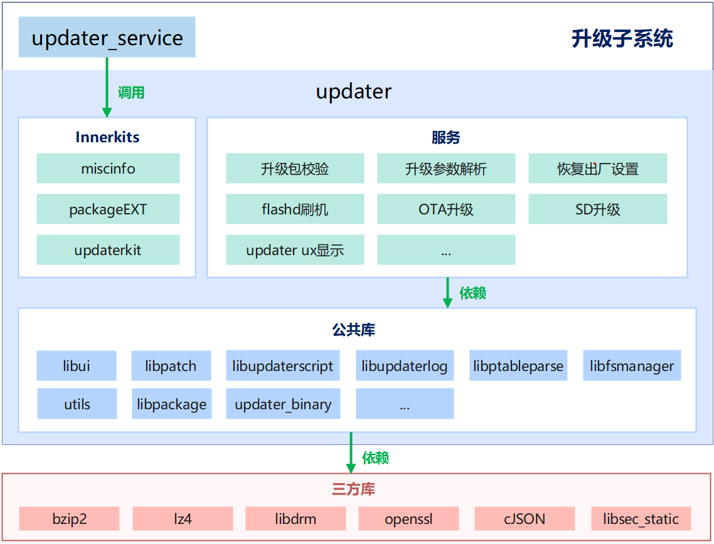

# 22-OTA升级子系统

## 简介

OTA（Over the Air）提供对设备远程升级的能力。升级子系统对用户屏蔽了底层芯片的差异，对外提供了统一的升级接口。基于接口进行二次开发后，可以让厂商的设备（如IP摄像头等）轻松支持远程升级能力。

## 架构

## 核心能力

OTA（Over-The-Air）提供对设备的远程升级能力，其核心价值在于：

* **屏蔽底层差异**：对用户与厂商屏蔽不同芯片平台、不同分区布局的差异。
* **统一升级接口**：对外提供一致的升级接口，厂商基于此二次开发即可让设备（如 IPC 摄像头、开发板等）支持远程升级。
* **全生命周期管理**：覆盖升级包制作、下发、校验、安装与回滚的完整链路。

## 升级包类型

* **全量升级包**：包含完整系统镜像，体积大但可靠性高。
* **差分升级包**：仅包含与旧版本的差异，体积小、省流量，依赖版本基线。
* **变分区升级**：针对分区布局发生变化的场景，对分区表本身进行调整。

## 主要组成

1. **升级包制作工具**
   * 在编译/发布侧，将新版本镜像与目标设备信息打包为标准升级包（含版本信息、校验信息）。
2. **升级包管理（包管理组件）**
   * 运行在常规系统分区，负责升级包的下载、存储、完整性校验与状态维护。
   * 写入 `misc` 分区标记，告知 bootloader/updater 进入升级模式。
3. **升级包安装组件（updater）**
   * 运行在独立的 **updater 分区**，与常规系统解耦。
   * 启动后读取 `misc` 分区获取升级状态，对升级包再次校验以确保合法有效。
   * 从升级包中解析出可执行升级程序，创建子进程执行分区烧写/替换，并在完成后清除升级标记。
4. **版本与回滚**
   * 升级失败或新版本异常时，可回退到上一可用版本，保障设备可恢复。

## 典型升级流程

1. 设备侧包管理组件从服务器拉取升级包并落盘。
2. 校验升级包签名/完整性，写入 `misc` 标记进入升级模式。
3. 设备重启进入 updater 分区，安装组件校验并执行升级程序。
4. 升级完成后重启进入新系统；若失败则依据回滚策略恢复。

## 关键设计点

* **双分区/独立 updater**：升级执行环境与日常系统隔离，避免升级中途异常导致设备变砖。
* **多重校验**：制作侧与安装侧均做签名/完整性校验，防止非法或破损包被刷入。
* **对外统一接口**：厂商只需对接统一升级 API，无需关心各芯片的底层烧写细节。

## 相关阅读

* [HDF驱动框架](09-hdf-qu-dong-kuang-jia.md)
* [启动流程](10-qi-dong-liu-cheng.md)
* [DFX子系统](20-dfx-zi-xi-tong.md)
