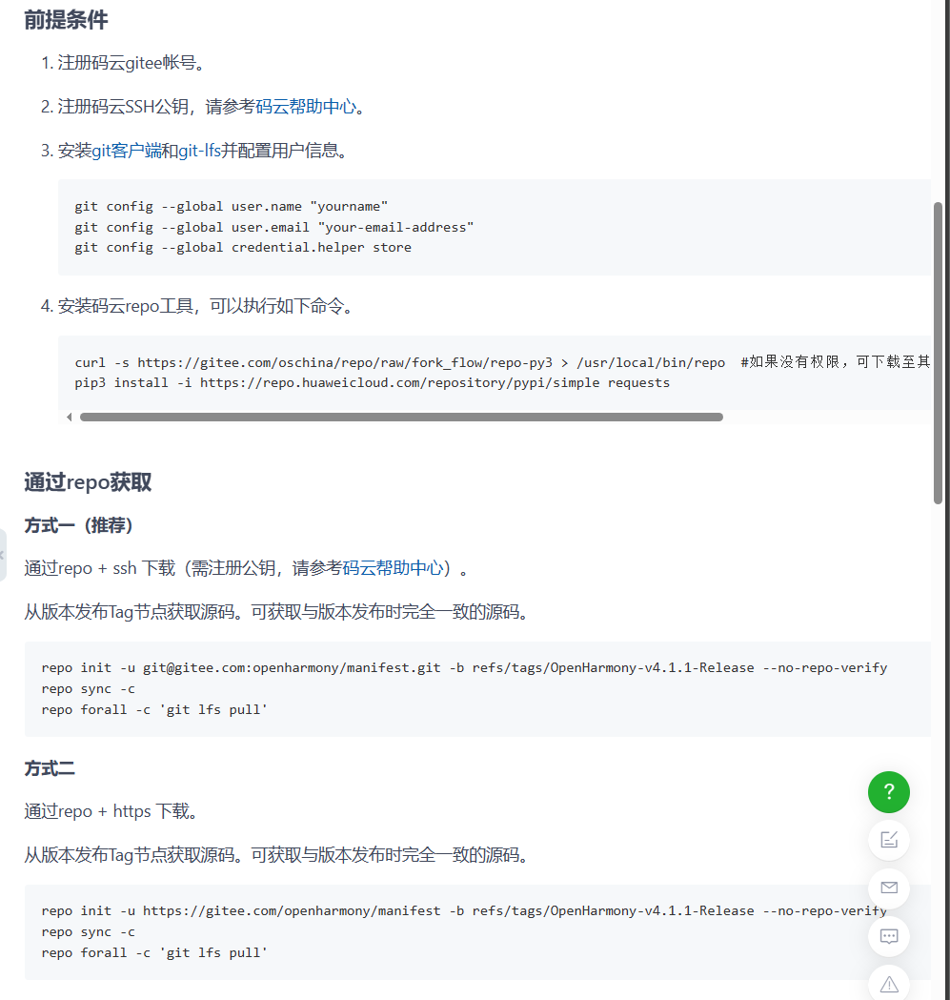
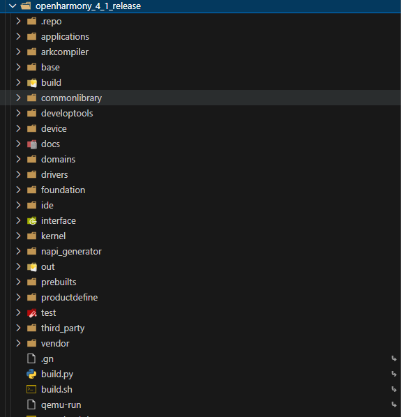
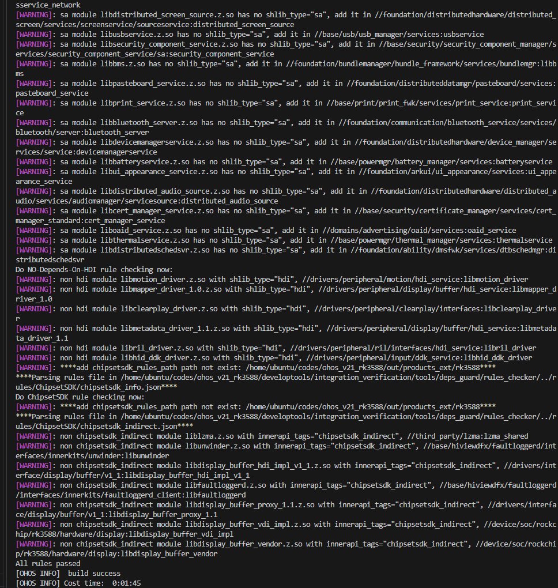

# 02-开发环境搭建篇

## 获取代码&编译

文档地址：[https://gitcode.com/openharmony/docs/blob/master/zh-cn/release-notes/Readme.md](https://gitcode.com/openharmony/docs/blob/master/zh-cn/release-notes/Readme.md)

上面是每一个release的notes，获取对应版本代码。

建议不使用master的代码，代码太新，版本激进，而且容易有编译失败的风险。

以4.1.1 Release版本为例

### 代码拉取

文档地址：[https://gitcode.com/openharmony/docs/blob/master/zh-cn/device-dev/quick-start/quickstart-pkg-sourcecode.md](https://gitcode.com/openharmony/docs/blob/master/zh-cn/device-dev/quick-start/quickstart-pkg-sourcecode.md)

tag版本地址：[https://gitcode.com/openharmony/docs/blob/master/zh-cn/release-notes/OpenHarmony-v4.1.1-release.md](https://gitcode.com/openharmony/docs/blob/master/zh-cn/release-notes/OpenHarmony-v4.1.1-release.md)





文档有详细的获取代码方式

代码拉取后的结构





后续会对源码结构再细化

### 编译工具环境


```sh


sudo apt-get update -y 


sudo apt-get install -y 


# 如果是ubuntu20.04系统请直接安装python3.9，如果是ubuntu18.04请改为安装python3.8


sudo apt-get install -y apt-utils binutils bison flex bc build-essential make mtd-utils gcc-arm-linux-gnueabi u-boot-tools python3.9 python3-pip git zip unzip curl wget gcc g++ ruby dosfstools mtools default-jre default-jdk scons python3-distutils perl openssl libssl-dev cpio git-lfs m4 ccache zlib1g-dev tar rsync liblz4-tool genext2fs binutils-dev device-tree-compiler e2fsprogs git-core gnupg gnutls-bin gperf lib32ncurses5-dev libffi-dev zlib* libelf-dev libx11-dev libgl1-mesa-dev lib32z1-dev xsltproc x11proto-core-dev libc6-dev-i386 libxml2-dev lib32z-dev libdwarf-dev


 


sudo apt-get install -y grsync xxd libglib2.0-dev libpixman-1-dev kmod jfsutils reiserfsprogs xfsprogs squashfs-tools  pcmciautils quota ppp libtinfo-dev libtinfo5 libncurses5 libncurses5-dev libncursesw5 libstdc++6  gcc-arm-none-eabi vim ssh locales doxygen


sudo apt-get install -y libxinerama-dev libxcursor-dev libxrandr-dev libxi-dev


sudo apt-get install libc6-dev-i386 lib32ncurses5-dev x11proto-core-dev libx11-dev lib32z1-dev libgl1-mesa-dev libxml2-utils xsltproc unzip fontconfig kpartx python-mako gcc-arm-linux-gnueabihf libssl-dev gcc-arm-linux-gnueabihf


sudo apt install gcc-arm-linux-gnueabi


```


官方工具环境在实际使用的时候会有部分问题，提供一版比较全面的工具环境，直接安装即可

另外prebuilts不要忘记拉取，源码下直接执行

```sh


bash build/prebuilts_download.sh


```

最后执行编译

```sh


./build.sh --product-name rk3568


```





编译成功

## 使用docker方式编译

文档地址：[https://gitcode.com/openharmony/docs/blob/master/zh-cn/device-dev/get-code/gettools-acquire.md](https://gitcode.com/openharmony/docs/blob/master/zh-cn/device-dev/get-code/gettools-acquire.md)

其他和正常使用一样

## 总体流程

搭建一套可用的 OpenHarmony 开发环境，通常遵循以下步骤：

1. 准备一台 Linux 构建主机（推荐 Ubuntu 20.04/22.04，内存 ≥ 16GB，磁盘 ≥ 200GB）；
2. 安装 `repo` 与基础依赖工具；
3. 获取指定版本的源码（建议基于 release tag，而非 master）；
4. 下载 `prebuilts`（编译所需的工具链与二进制）；
5. 用 `hb set` 选择目标产品；
6. 执行编译（`build.sh` 或 `hb build`）；
7. 烧录镜像到开发板 / 运行模拟器验证。

## 代码获取：repo 与版本选择

OpenHarmony 由数百个独立的 git 仓库组成，使用 `repo` 做统一清单管理。为避免编译失败与接口不稳定，强烈建议基于 **release 标签** 获取代码，而不是跟踪 master：

```bash
repo init -u https://gitcode.com/openharmony/manifest.git \
         -b OpenHarmony-4.1.1-Release --no-clone-bundle
repo sync -c -j8
```

* `master` 分支代码较新、变更激进，容易出现编译失败或接口不兼容；
* 每个版本都有对应的 Release Notes 与 tag（如 `OpenHarmony-v4.1.1-release`），按需求选择；
* 拉取后的目录即 OpenHarmony 源码根，后续章节会细化其结构。

## 构建工具 hb

`hb` 是 OpenHarmony 的命令行构建入口，底层封装了 GN（描述构建图）与 Ninja（执行构建）。常用命令：

```bash
hb set      # 交互式选择产品（如 rk3568、hi3516dv300）
hb env      # 查看当前产品与环境信息
hb build    # 全量构建当前产品
hb build -T //test/xts/acts   # 仅构建某个模块/目标
hb clean    # 清理构建产物
```

## prebuilts 与编译

`prebuilts` 包含 Clang 工具链、sysroot、编译脚本等二进制，必须提前下载，否则编译会找不到工具链：

```bash
bash build/prebuilts_download.sh
./build.sh --product-name rk3568
```

## 不同系统类型的环境差异

* **标准系统（Linux 内核）**：需要完整的 LLVM/Clang 工具链与较大的构建资源；
* **轻量/小型系统（LiteOS-M / LiteOS-A）**：可使用更轻量的工具链，部分场景通过 `hb build` 的 lite 流程构建，对主机资源要求更低。

## 使用 Docker 方式

官方提供 Docker 镜像，预置了完整的构建环境，能有效规避"在我机器上能编"的环境差异问题。进入容器后的构建步骤与上面一致。

## 常见环境问题排查

| 现象                | 可能原因             | 处理                                |
| ----------------- | ---------------- | --------------------------------- |
| `repo sync` 失败/中断 | 网络/代理不稳定         | 重试，必要时配置代理或更换镜像源                  |
| 编译报找不到工具链         | 未执行 prebuilts 下载 | 先运行 `build/prebuilts_download.sh` |
| 磁盘空间不足            | 全量代码+产物需 200GB+  | `df -h` 检查，清理或扩容                  |
| 大文件缺失             | 未安装 git-lfs      | 安装 git-lfs 后重新同步                  |
| 编译 OOM / 卡死       | 并行度过高            | 降低并行数（如 `hb build -j 4`）          |
| Python 版本相关报错     | Ubuntu 版本与预期不符   | 20.04 用 Python 3.9，18.04 用 3.8    |

## 相关阅读

- [如何学习openharmony？](../01-ru-he-xue-xi-openharmony.md)
- [开发工具篇](../03-kai-fa-gong-ju-pian.md)
- [源码结构](../../02-framework/05-yuan-ma-jie-gou.md)
