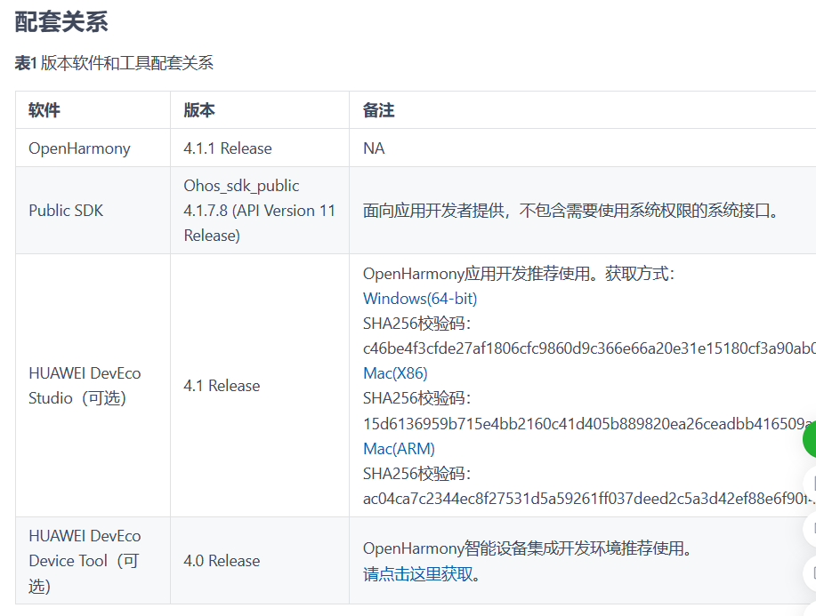
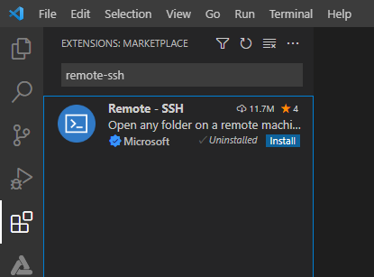
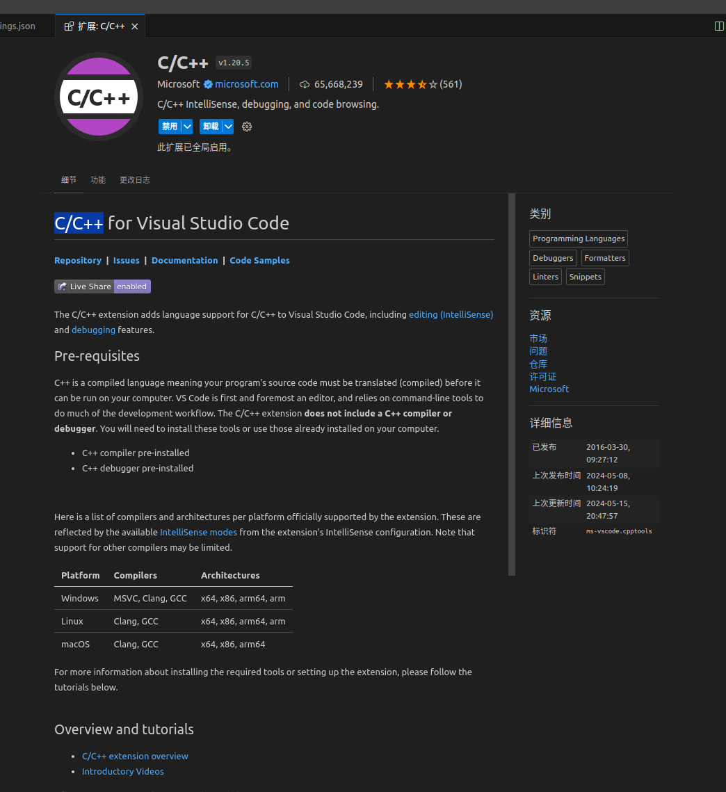
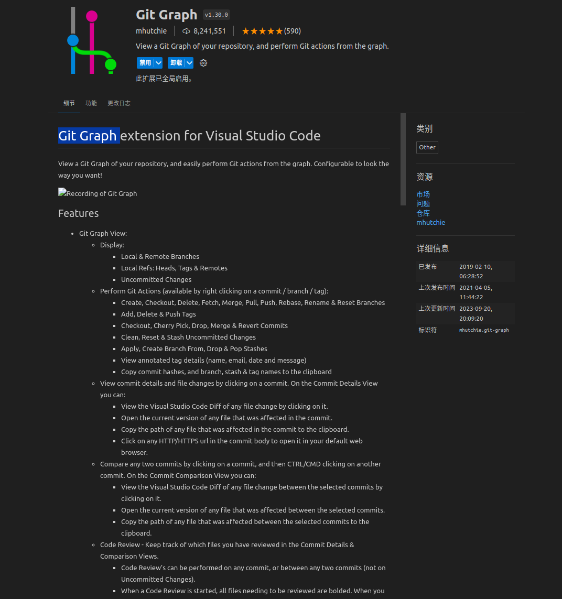
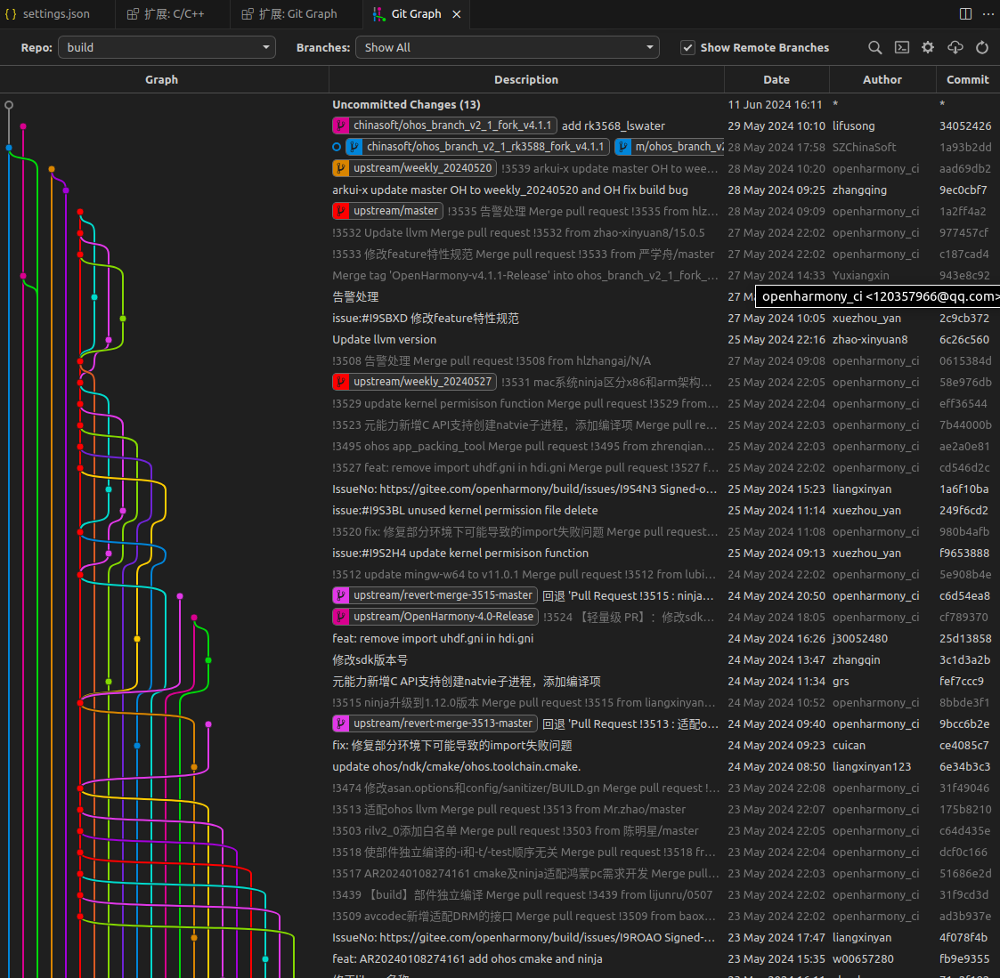
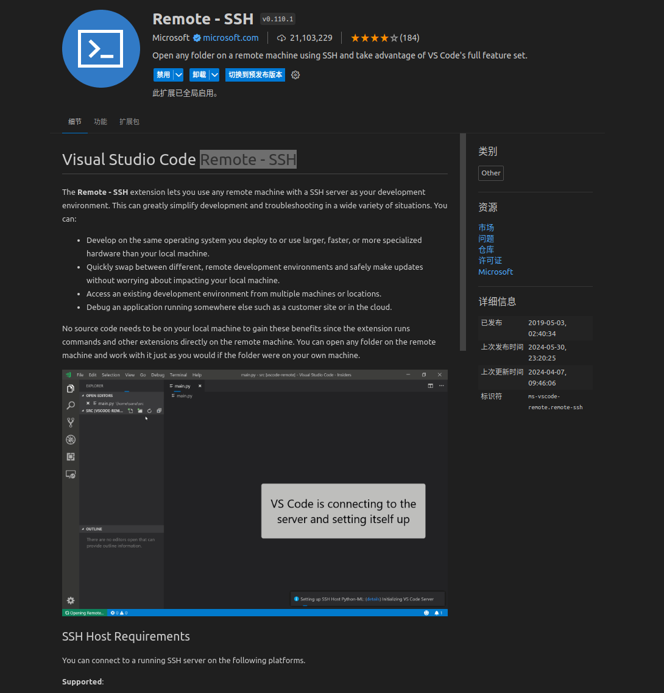
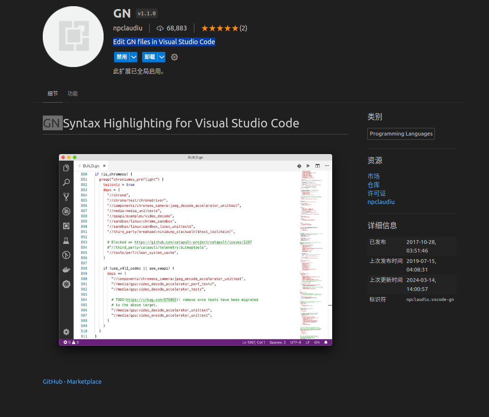

# 03-开发工具篇


## 应用IDE


下载路径


官方文档配套并不好用，版本会有迟滞





链接：[https://gitcode.com/openharmony/docs/blob/master/zh-cn/release-notes/OpenHarmony-v4.1.1-release.md](https://gitcode.com/openharmony/docs/blob/master/zh-cn/release-notes/OpenHarmony-v4.1.1-release.md)


切换每个版本都有对应版本的IDE，建议使用版本对应的IDE来进行开发。


应用开发工具的具体使用，可以参考此文档：[https://developer.huawei.com/consumer/cn/doc/harmonyos-guides-V2/deveco\_overview-0000001053582387-V2](https://developer.huawei.com/consumer/cn/doc/harmonyos-guides-V2/deveco\_overview-0000001053582387-V2)


## 系统开发


### vscode


推荐使用vscode


下载链接：[https://code.visualstudio.com/](https://code.visualstudio.com/)


远程连接开发：[https://gitcode.com/openharmony/docs/blob/master/zh-cn/device-dev/quick-start/quickstart-ide-env-remote.md](https://gitcode.com/openharmony/docs/blob/master/zh-cn/device-dev/quick-start/quickstart-ide-env-remote.md)





官方推荐使用DevEco Device Tool，做系统开发的话，这个可以不需要，但可以使用，部分工具还是挺好用的，也是基于vscode的一个插件。


### vscode插件


推荐几个好用插件，让开发过程更加的自如


#### C/C++工具包


C++开发必备





#### Git Graph


因为repo管理是超大型项目的一个总集管理，此插件便于我们查看不同git仓库的历史








Remote - SSH


远程连接，必要插件





#### GN


Edit GN files in Visual Studio Code，高亮GN脚本文件，作用不大，但更直观的看GN脚本





### vscode配置


由于超大型项目的文件过多，开发起来查找、索引都比较麻烦，所以需要添加一些配置，来忽略大部分很少关心的文件夹，让工程变得更加易用


```json


{


    "workbench.iconTheme": "vscode-icons",


    "workbench.editor.enablePreview": false,


    "files.autoSave": "afterDelay",


    "files.associations": {


        "iostream": "cpp",


        "*.tcc": "cpp",


        "source_location": "cpp",


        "*.ipp": "cpp",


        "stdlib.h": "c",


        "stdio.h": "c",


        "unistd.h": "c",


        "random": "cpp",


        "ios": "cpp",


        "__config": "cpp",


        "__bit_reference": "cpp",


        "__bits": "cpp",


        "__debug": "cpp",


        "__functional_base": "cpp",


        "__hash_table": "cpp",


        "__locale": "cpp",


        "__node_handle": "cpp",


        "__nullptr": "cpp",


        "__split_buffer": "cpp",


        "__string": "cpp",


        "__threading_support": "cpp",


        "__tuple": "cpp",


        "algorithm": "cpp",


        "array": "cpp",


        "atomic": "cpp",


        "bit": "cpp",


        "bitset": "cpp",


        "cctype": "cpp",


        "chrono": "cpp",


        "clocale": "cpp",


        "cmath": "cpp",


        "cstdarg": "cpp",


        "cstddef": "cpp",


        "cstdint": "cpp",


        "cstdio": "cpp",


        "cstdlib": "cpp",


        "cstring": "cpp",


        "ctime": "cpp",


        "cwchar": "cpp",


        "cwctype": "cpp",


        "exception": "cpp",


        "functional": "cpp",


        "initializer_list": "cpp",


        "iosfwd": "cpp",


        "istream": "cpp",


        "iterator": "cpp",


        "limits": "cpp",


        "locale": "cpp",


        "memory": "cpp",


        "new": "cpp",


        "numeric": "cpp",


        "ostream": "cpp",


        "queue": "cpp",


        "stdexcept": "cpp",


        "streambuf": "cpp",


        "string": "cpp",


        "string_view": "cpp",


        "tuple": "cpp",


        "type_traits": "cpp",


        "typeinfo": "cpp",


        "unordered_map": "cpp",


        "utility": "cpp",


        "vector": "cpp",


        "memory_resource": "cpp",


        "optional": "cpp",


        "codecvt": "cpp",


        "condition_variable": "cpp",


        "list": "cpp",


        "map": "cpp",


        "fstream": "cpp",


        "mutex": "cpp",


        "ratio": "cpp",


        "sstream": "cpp",


        "system_error": "cpp",


        "thread": "cpp",


        "valarray": "cpp",


        "vendor_adapter.h": "c",


        "hril_enum.h": "c",


        "hril.h": "c",


        "csignal": "cpp",


        "userial_vendor.h": "c",


        "bt_vendor_lib.h": "c"


    },


    "search.exclude": {


        "**/node_modules": true,


        "**/bower_components": true,


        "**/*.o": true,


        "**/out": true,


        "**/prebuilts": true,


        "**/kernel": true,


        "**/third_party": true,


        "**/.ccache": true,


        "**/.repo": true,


        "**/developtools": true,


        "**/napi_generator": true,


        "**/commonlibrary": true,


        "**/test": true,


        "**/device/board/chinasoft/common/uboot": true,


    },


    "C_Cpp.codeAnalysis.exclude": {


        "**/out":true,


        "**/kernel":true,


        "**/third_party":true,


        "**/.ccache":true,


        "**/.repo":true,


        "**/ccache.log":true,


        "**/ccache.log.old":true,


        "**/napi_generator":true,


        "**/commonlibrary":true,


        "**/test":true,


        "**/docs":true,


        "**/prebuilts":true,


        "**/device/board/chinasoft/common/uboot": true,


    },


    "C_Cpp.files.exclude": {


        "**/.vscode": true,


        "**/.vs": true,


        "**/out":true,


        "**/kernel":true,


        "**/third_party":true,


        "**/.ccache":true,


        "**/.repo":true,


        "**/ccache.log":true,


        "**/ccache.log.old":true,


        "**/napi_generator":true,


        "**/commonlibrary":true,


        "**/test":true,


        "**/docs":true,


        "**/prebuilts":true,


        "**/device/board/chinasoft/common/uboot": true,


    },


    "vsicons.dontShowNewVersionMessage": true,


    "editor.fontSize": 16,


    "cmake.configureOnOpen": true,


    "diffEditor.ignoreTrimWhitespace": false,


    "git.mergeEditor": true,


    "cmake.showOptionsMovedNotification": false,


    "cmake.pinnedCommands": [


        "workbench.action.tasks.configureTaskRunner",


        "workbench.action.tasks.runTask"


    ]


}


```

## DevEco Studio 与 DevEco Device Tool 的定位

OpenHarmony 提供了两套面向不同角色的开发工具：

- **DevEco Studio**：面向**应用开发者**，基于 IntelliJ 平台，提供 ArkTS/ArkUI 工程模板、布局预览、模拟器、断点调试、性能分析与应用签名发布。建议始终使用与目标系统版本匹配的 Studio 版本。
- **DevEco Device Tool**：面向**设备/系统开发者**，以 VS Code 插件形式提供，集成烧录、串口、hdc、HDF 驱动配置、内核/模块调试等系统级能力。

简单区分：写 App 用 DevEco Studio，移植系统/驱动用 DevEco Device Tool + VS Code。

## 命令行构建工具 hb

系统开发中，`hb` 是最高频的命令行工具（见上一章环境搭建）。它把 GN/Ninja 的复杂度封装为 `hb set / build / clean` 等少量命令，是自动化构建、CI 集成的基础。

## 设备调试与互联：hdc

`hdc`（OpenHarmony Device Connector）是设备调试命令行，作用类似 Android 的 adb：

```bash
hdc list targets        # 列出已连接设备
hdc shell               # 进入设备 shell
hdc file send a.txt /data/  # 推文件
hdc file recv /data/b.txt ./ # 拉文件
hdc install app.hap     # 安装应用
hdc hilog               # 查看日志
```

## 性能与 Trace 工具

- **hiperf**：CPU 采样与性能剖析，定位热点函数；
- **hitrace**：系统级追踪，可跟踪图形、IPC、调度等多个子系统的耗时链路；
- **SmartPerf / DevEco Profiler**：图形帧率、内存、启动耗时的可视化分析。

## 烧录与串口

- 通过 DevEco Device Tool 把编译出的镜像烧录到开发板（如 RK3568、Hi3516）；
- 用串口工具（minicom / putty / Device Tool 内置串口）查看 U-Boot 与内核启动日志，是底层调试的第一现场。

## 签名与发布

- **应用侧**：DevEco Studio 在调试与发布阶段自动或手动对 HAP 签名，未签名无法安装到真机；
- **系统侧**：镜像与分区有对应的签名校验机制，刷机需匹配密钥。

## 推荐工作流

| 角色 | 工具组合 |
| --- | --- |
| 应用开发 | DevEco Studio + 模拟器/真机 + hdc |
| 系统/驱动开发 | VS Code + DevEco Device Tool + hb + hdc + 串口 |
| 性能优化 | hitrace / hiperf / SmartPerf |

上表所列工具与前面推荐的 VS Code 插件（C/C++、Git Graph、Remote-SSH、GN）组合，即可覆盖从代码编辑到烧录调试的完整链路。

## 相关阅读

- [如何学习openharmony？](../01-ru-he-xue-xi-openharmony.md)
- [开发环境搭建篇](../02-kai-fa-huan-jing-da-jian-pian.md)
- [架构篇](../04-jia-gou-pian.md)
