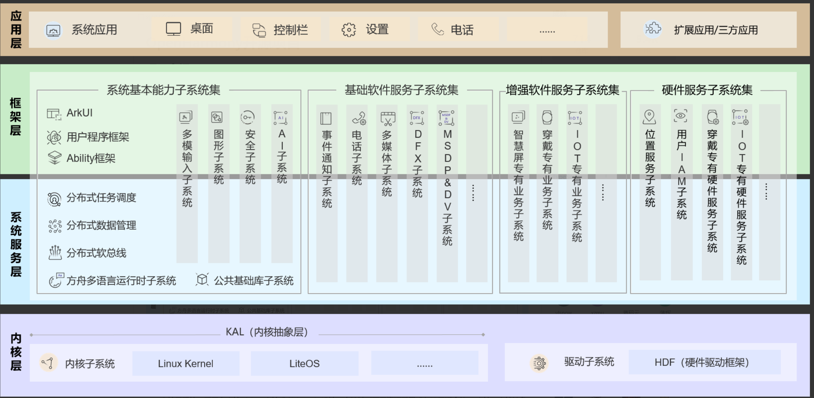
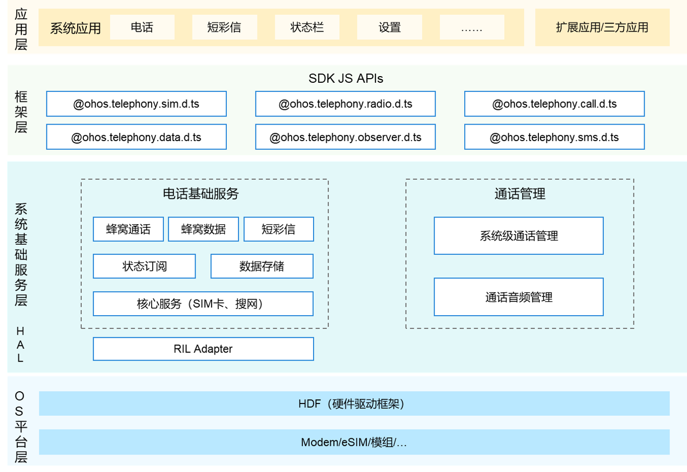
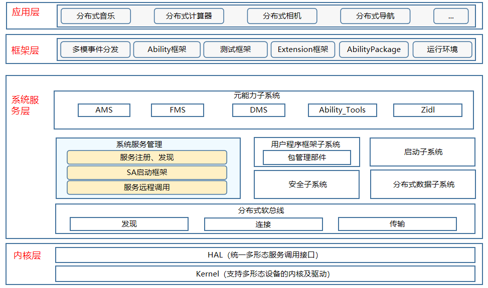
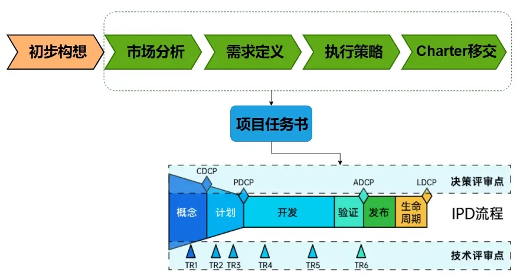

# 04-架构篇

软件架构（software architecture）就是软件的基本结构，合适的架构是软件成功的最重要因素之一。

常见的架构形态：分层架构、事件驱动架构、插件架构、微服务架构、云结构等

而openharmony架构不是特定的那种架构形态，是合理架构形态综合体。

很多时候，由于项目周期的原因，很多开发者并不怎么重视架构的重要性，都是一边实现，一边修正，最终，一代代的修改中，来完善程序。

简单项目无非多耗费点时间来修正，但是对于一个超大型项目来说，忽视架构的重要性，搞到最后肯定是个灾难。

## 总架构图

反复提及总架构，就是一个典型的分层架构。

而其中一个个子服务又是其中一个模块

而一个个子服务又可以扩展为一个个的子服务架构。

## 子服务架构

以几个子服务为例

分别为参与过的telephony子系统、多模输入子服务、系统服务管理子服务

一点点打开，总体基本呈现一种总分关系，一层层的模块，由大到小，共同构成一个完整的openharmony架构。

## Charter\&SOW任务书

了解华为的体系同学们，应该不陌生，IPD的重要环节。

本篇不谈IPD流程，大家只要知道架构起始源头是哪里就好。

## 需求设计

有了任务书，当然就是进入需求设计阶段，需要将任务书中的任务一步步提炼为一个个IR->SR->AR，细分到一个个功能点。

## 概要设计

概要设计阶段确定系统的整体形态、边界与模块划分。OpenHarmony 采用「分层 + 子系统」的架构思路，自底向上大致为：

* **内核层**：支持 Linux、LiteOS-A、LiteOS-M 多内核共存，配合 HDF（Hardware Driver Foundation）统一驱动框架屏蔽芯片与内核差异。
* **系统服务层**：分布式软总线、分布式数据/硬件、图形、多媒体、位置、DFX 等子系统，以系统服务（SA，由 samgr 统一管理）形式存在。
* **框架层**：为应用提供能力的统一抽象，如 ArkUI、Ability 框架、NAPI 等。
* **应用层**：基于 ArkTS/JS/C/C++ 的应用与原子化服务。

概要设计需确定各子系统的职责边界、对外接口，以及跨子系统协作机制——例如分布式能力依赖「软总线（通信）+ 数据管理（同步）+ 硬件虚拟化（外设共享）」三者协同。

## 详细设计

在概要划分的基础上，深入每个子系统的内部实现，落到可编码的粒度：定义关键组件、接口契约（HDI/IPC 接口）、核心数据结构与关键流程。

例如：启动流程中 `init` 如何拉起 `foundation`；`samgr` 如何管理 SA 的注册、获取与生命周期；IPC/RPC 在设备内走 binder、设备间走软总线的通道选择；HDF 的驱动加载与 HDI 调用链等。详细设计的产出应与需求设计中的功能点（AR）逐一对齐，作为编码依据。

## 功能设计

功能设计站在使用者（开发者与终端用户）视角，描述系统对外呈现的能力与体验。OpenHarmony 的功能设计围绕「全场景分布式」展开：一次开发多端部署、跨设备硬件共享、数据无缝流转、统一 UI 与交互等。

功能设计把底层子系统的能力映射为开发者可调用的 API 与用户可感知的特性，是需求设计与概要/详细设计之间的桥梁——它保证「架构设计」最终能转化为「用户价值」。

## 相关阅读

- [源码结构](../../02-framework/05-yuan-ma-jie-gou.md)
- [系统samgr](../../02-framework/08-xi-tong-samgr.md)
- [跨进程IPC](../../04-ipc-graphics/11-ipc/11-kua-jin-cheng-ipc.md)
