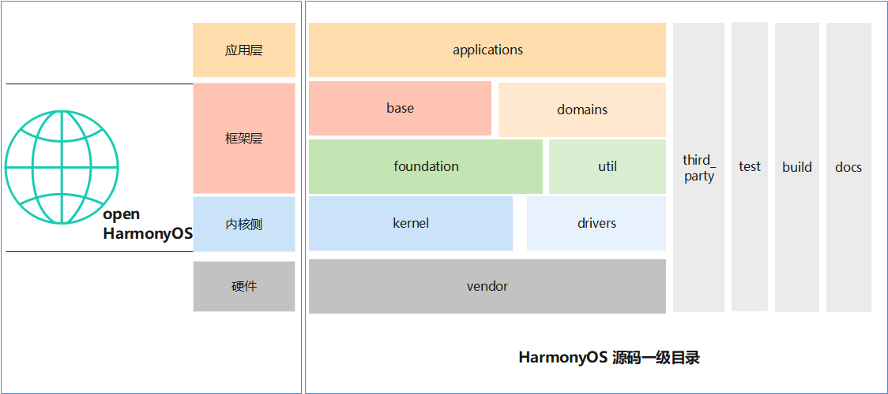

# 05-源码结构

## 源码目录基本结构





## 总结构

由上到下

```sh


├── applications--应用集


├── arkcompiler--方舟运行时


├── base--基础软件服务


├── build--build相关


├── commonlibrary--公共基础库


├── developtools--开发工具集


├── device--芯片&设备包


├── docs--文档


├── domains--特定领域集


├── drivers--驱动系统相关


├── foundation--基本能力子系统集


├── ide--IDE工具


├── interface--接口集


├── kernel--内核


├── napi_generator--napi框架生成工具


├── prebuilts--编译链集


├── productdefine--公共产品形态配置


├── test--测试集


├── third_party--第三方库


└── vendor--设备vendor配置


```

## 关键目录解析

### arkcompiler方舟运行时

```


├── ets_frontend--方舟运行时子系统的前端工具


├── ets_runtime--ArkTS语言运行时


├── runtime_core--方舟编译器运行时


└── toolchain--方舟工具链


```

### base--基础软件服务

```


├── account


│   └── os_account--帐号子系统


├── customization


│   ├── config_policy--配置策略组件


│   └── enterprise_device_management--企业设备管理组件


├── global


│   ├── i18n--国际化部件


│   ├── i18n_lite--lite国际化部件


│   ├── resource_management--资源管理组件


│   ├── resource_management_lite--lite资源管理组件


│   ├── system_resources--系统资源组件


│   └── timezone--时区数据管理部件


├── hiviewdfx


│   ├── blackbox_lite--lite系统故障日志组件


│   ├── faultloggerd--运行时崩溃临时日志的生成及管理模块


│   ├── hiappevent--事件打点


│   ├── hichecker--应用开发检测工具


│   ├── hicollie--软件看门狗功能


│   ├── hidumper--系统信息获取工具


│   ├── hidumper_lite--liteOS_M系统下dump工具


│   ├── hievent_lite--lite时间打点


│   ├── hilog--日志系统


│   ├── hilog_lite--liteDFX子系统


│   ├── hisysevent--系统埋点


│   ├── hitrace--业务流程调用链跟踪维测


│   ├── hiview--终端设备维测服务


│   └── hiview_lite--liteDFX子系统


├── inputmethod


│   └── imf--输入法框架


├── iothardware


│   └── peripheral--硬件设备操作


├── location--位置服务


├── msdp


│   └── device_status--设备状态感知框架


├── notification


│   ├── common_event_service--系统公共事件


│   ├── distributed_notification_service--通知子系统


│   └── eventhandler--线程间通信handler


├── powermgr


│   ├── battery_lite--lite电池服务


│   ├── battery_manager--电池服务


│   ├── battery_statistics--耗电统计组件


│   ├── display_manager--显示能效管理组件


│   ├── power_manager--电源管理服务组件


│   ├── powermgr_lite--轻量级电源组件


│   └── thermal_manager--热管理服务


├── print


│   └── print_fwk--打印框架


├── request


│   └── request--文件下载/上传能力


├── security


│   ├── access_token--应用权限管理


│   ├── appverify--应用完整性校验


│   ├── asset--键资产存储服务


│   ├── certificate_framework--证书算法库框架


│   ├── certificate_manager--证书管理


│   ├── code_signature--代码签名部件


│   ├── crypto_framework--加解密算法库框架


│   ├── dataclassification--数据传输管控模块


│   ├── device_auth--设备互信认证模块


│   ├── device_security_level--设备安全等级管理


│   ├── dlp_permission_service--DLP权限管理部件


│   ├── huks--通用密钥库系统


│   ├── permission_lite--lite应用权限管理


│   ├── security_component_manager--安全控件管理


│   └── selinux_adapter--安全增强式组件


├── sensors


│   ├── medical_sensor--健康类传感器


│   ├── miscdevice--小器件的sensor


│   ├── miscdevice_lite--lite小器件sensor


│   ├── sensor--传感器


│   ├── sensor_lite--轻量级sensor


│   └── start--泛sensor服务


├── startup


│   ├── appspawn--应用孵化器


│   ├── bootstrap_lite--lite启动引导组件


│   ├── hvb--安全启动组件


│   └── init--启动子系统


├── tee


│   └── tee_client--TEE Client组件


├── telephony


│   ├── call_manager--通话管理模块


│   ├── cellular_call--蜂窝通话


│   ├── cellular_data--蜂窝数据


│   ├── core_service--telephony核心服务


│   ├── ril_adapter--RIL适配


│   ├── sms_mms--短彩信


│   ├── state_registry--状态注册


│   └── telephony_data--数据库及持久化


├── theme


│   ├── screenlock_mgr--锁屏管理服务


│   └── wallpaper_mgr--壁纸管理服务


├── time


│   └── time_service--时间时区部件


├── update


│   ├── packaging_tools--升级包制作工具


│   ├── sys_installer--系统安装部件


│   ├── sys_installer_lite--liteOTA组件


│   ├── update_app--升级客户端


│   ├── updater--升级包安装组件


│   └── updateservice--升级服务组件


├── usb


│   └── usb_manager--USB服务组件


├── useriam


│   ├── face_auth--人脸认证


│   ├── fingerprint_auth--统一认证框架


│   ├── pin_auth--口令认证


│   └── user_auth_framework--统一用户认证


└── web


    └── webview--webview组件


```

### developtools开发工具集

```


├── ace_ets2bundle--声明式范式的语法编译转换


├── ace_js2bundle--Web范式的语法编译转换


├── bytrace--追踪进程、查看性能


├── global_resource_tool--资源编译工具


├── hapsigner--Hap包签名工具


├── hdc--设备连接调试


├── hiperf--应用性能优化剖析组件


├── integration_verification--集成验证


├── packing_tool--打包工具和拆包工具


├── profiler--性能调优组件


├── smartperf_host--性能功耗调优工具


└── syscap_codec--编解码工具


```

### domains特定领域集

```


└── advertising


    ├── advertising--广告服务框架


    └── oaid--广告标识服务部件


```

### drivers驱动相关

```


├── external_device_manager--扩展外部设备管理


├── hdf_core--驱动子系统核心


├── interface--HDI接口定义


├── liteos--lite内核驱动框架


└── peripheral--HDI接口、HAL实现、驱动模型


```

### foundation基础能力子系统集

```


├── ability


│   ├── ability_base--元能力基础定义部件


│   ├── ability_lite--lite元能力组件框架


│   ├── ability_runtime--元能力子系统


│   ├── dmsfwk--分布式组件管理


│   ├── dmsfwk_lite--lite轻量级分布式组件


│   ├── form_fwk--卡片管理


│   └── idl_tool--IDL工具


├── ai


│   ├── ai_engine--AI业务子系统


│   ├── intelligent_voice_framework--智能语音组件


│   ├── mindspore--MindSpore深度学习训练/推理框架


│   └── neural_network_runtime--NNRt神经网络运行时


├── arkui


│   ├── ace_engine--ArkUI开发框架


│   ├── ace_engine_lite--轻量JS-UI组件


│   ├── advanced_ui_component--advanced_ui组件


│   ├── napi--NAPI开发框架


│   ├── ui_appearance--用户界面外观组件


│   └── ui_lite--轻量图形UI组件


├── barrierfree


│   └── accessibility--无障碍子系统


├── bundlemanager


│   ├── bundle_framework--包管理子系统


│   ├── bundle_framework_lite--轻量包包管理子系统


│   ├── bundle_tool--bm工具命令组件


│   ├── distributed_bundle_framework--分布式包管理服务


│   └── ecological_rule_manager--生态规则管控服务


├── CastEngine


│   ├── castengine_cast_framework--音视频投播管理服务


│   ├── castengine_cast_plus_stream--媒体资源的投射组件


│   └── castengine_wifi_display--媒体分享组件


├── communication


│   ├── bluetooth--蓝牙服务组件


│   ├── bluetooth_service--蓝牙服务组件


│   ├── connected_nfc_tag--有源NFC标签组件


│   ├── dhcp--DHCP组件


│   ├── dsoftbus--分布式软总线组件


│   ├── ipc--跨进程通信


│   ├── netmanager_base--网络管理


│   ├── netmanager_ext--网络管理接口


│   ├── netstack--网络管理


│   ├── nfc--NFC组件


│   ├── wifi--wifi组件


│   ├── wifi_aware--近场通信组件


│   └── wifi_lite--lite wifi组件


├── deviceprofile


│   └── device_info_manager--设备硬件能力和系统软件特征组件


├── distributeddatamgr


│   ├── datamgr_service--分布式数据管理


│   ├── data_object--分布式数据对象部件


│   ├── data_share--数据共享部件


│   ├── distributedfile--分布式文件子系统


│   ├── kv_store--KV数据库


│   ├── pasteboard--剪贴板服务


│   ├── preferences--Key-Value组件


│   ├── relational_store--关系型数据库


│   └── udmf--统一数据管理框架


├── distributedhardware


│   ├── device_manager--分布式设备的认证组网管理


│   ├── distributed_audio--分布式音频


│   ├── distributed_camera--分布式相机


│   ├── distributed_hardware_fwk--分布式硬件管理框架


│   ├── distributed_input--分布式输入


│   └── distributed_screen--分布式投屏


├── filemanagement


│   ├── app_file_service--应用文件服务


│   ├── dfs_service--分布式文件服务


│   ├── file_api--文件访问接口


│   ├── storage_service--存储管理服务


│   └── user_file_service--公共文件访问框架


├── graphic


│   ├── graphic_2d--图形渲染服务


│   ├── graphic_3d--渲染的3D引擎


│   ├── graphic_surface--Surface组件


│   ├── graphic_utils_lite--图形HALS组件


│   └── surface_lite--轻量Surface组件


├── multimedia


│   ├── audio_framework--音频组件


│   ├── audio_lite--轻量音频组件


│   ├── av_codec--音视频编解码


│   ├── av_session--AVSession部件


│   ├── camera_framework--Camera组件


│   ├── camera_lite--轻量Camera组件


│   ├── drm_framework--DRM框架组件


│   ├── image_framework--Image组件


│   ├── media_foundation--媒体引擎组件


│   ├── media_library--MediaLibrary组件


│   ├── media_lite--轻量媒体子系统


│   ├── media_utils_lite--轻量媒体子系统工具


│   └── player_framework--媒体组件


├── multimodalinput


│   └── input--多模输入


├── resourceschedule


│   ├── background_task_mgr--后台任务管理


│   ├── device_standby--设备待机部件


│   ├── device_usage_statistics--设备使用信息统计


│   ├── ffrt--并发编程框架FFRT


│   ├── frame_aware_sched--智能感知调度部件


│   ├── memmgr--内存管理部件


│   ├── qos_manager--权限管控服务


│   ├── resource_schedule_service--资源调度服务


│   └── work_scheduler--延迟任务调度


├── systemabilitymgr


│   ├── safwk--系统服务通信管理


│   ├── safwk_lite--轻量系统服务通信管理


│   ├── samgr--系统服务管理部件


│   └── samgr_lite--轻量型系统服务管理


└── window


    ├── window_manager--窗口管理


    └── window_manager_lite--轻量窗口管理


```

## 相关阅读

- [架构篇](../../01-basic/04-jia-gou-pian.md)
- [native库](../06-native-ku.md)
- [NAPI接口](../07-napi-jie-kou.md)
