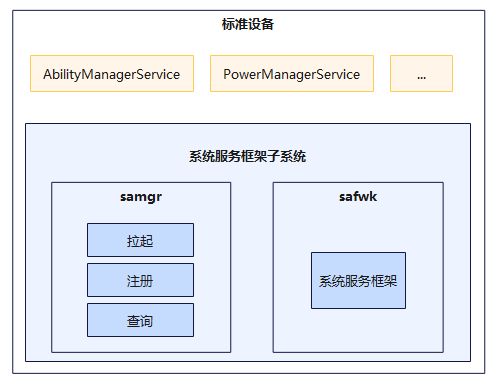
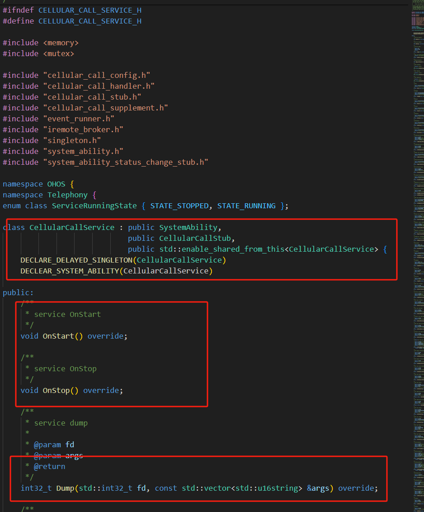
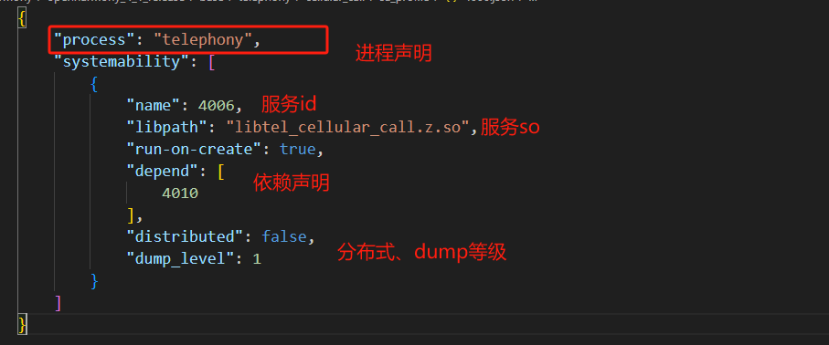
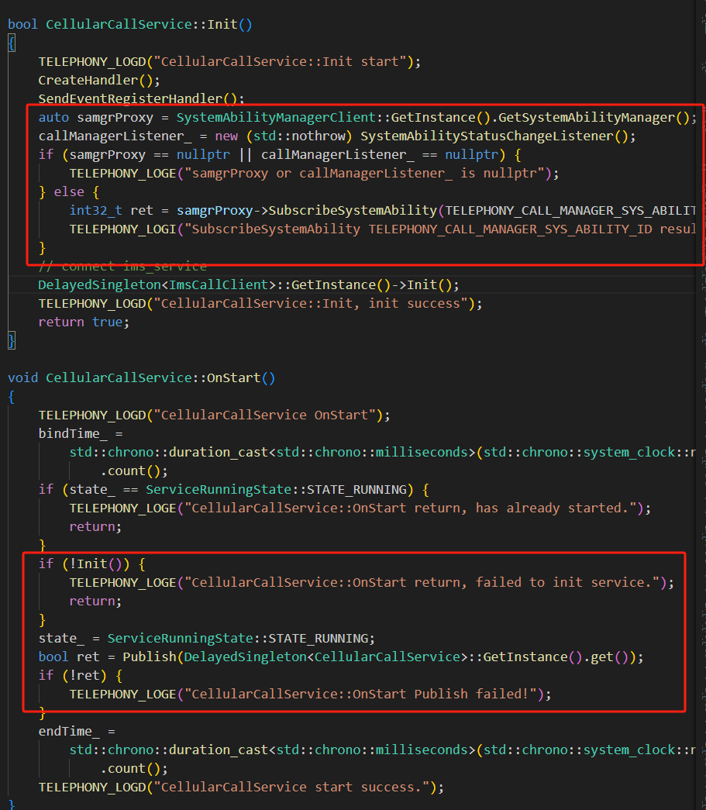
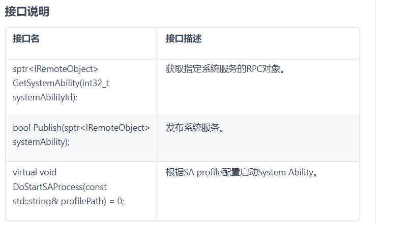

# 08-系统samgr

## 简介

所有的业务子系统发起点，提供OpenHarmony系统服务启动、注册、查询等功能。

服务链接：[https://gitcode.com/openharmony/systemabilitymgr\_samgr](https://gitcode.com/openharmony/systemabilitymgr\_samgr)

## 架构

## 作用

操作系统的服务是一个个独立的业务单元，但怎么将每个业务单元能够统一整合，这就是系统服务管理组件解决的问题。

主要提供两大能力：1，启动、注册、查询 2，服务相互通信

## 使用

以其中一个子服务为样例

### 声明注册

依赖关键SystemAbility，具备完整的服务生命周期

### 配置

### 实现

SystemAbility实现一般采用XXX.cfg + profile.json + libXXX.z.so的方式由init进程执行对应的XXX.cfg文件拉起相关SystemAbility进程。

## 服务管理原理解析

samgr 的核心职责是**系统服务的统一生命周期管理与跨进程通信调度**。以下从注册、发现、通信、死亡通知四个维度解析其原理。

### 1. 服务注册与发布

每个 SystemAbility（SA）在实现时继承 `SystemAbility` 基类，并重写 `OnStart()` / `OnStop()` 等生命周期回调。进程启动后，SA 通过 `Publish()` 方法向 samgr 注册，注册信息包括：

- **SA ID**：全局唯一标识（如 `TELEPHONY` 子系统对应固定 ID）。

- **进程信息**：所在进程名、user ID、可执行文件路径等。

- **接口能力**：对外暴露的 IPC 接口（由 HDI 或 `.idl` 定义）。

samgr 维护一张全局的 **SA 注册表**，这张表常驻在 `foundation` 进程中，并支持跨进程查询。

### 2. 服务发现（查询）

当客户端（如某个应用或系统服务）需要调用某个 SA 时，不会直接访问目标进程，而是通过 samgr 的 **查询接口** 获取该 SA 的代理（Proxy）：

- 客户端调用 `GetSystemAbility(id)` → samgr 在注册表中查找对应 SA → 返回 `IPCObjectProxy`。

- 此后客户端对 SA 的所有调用，均通过该 Proxy 经 IPC/Binder 发往服务端 Stub。

- 若目标 SA 尚未启动，samgr 会触发 **按需启动**（lazy start），通知 init 拉起对应进程。

### 3. 服务间通信（IPC）

samgr 不直接处理数据收发，而是依赖 IPC 框架（Binder / 软总线）完成跨进程通信：

- **设备内**：通过 Binder 驱动实现一次拷贝的高效 IPC。

- **设备间**：通过分布式软总线实现 RPC，对上层保持同一套 Proxy/Stub 接口语义。

- samgr 负责维护 SA 的 Proxy 缓存，避免重复查询带来的开销。

### 4. 死亡通知与容错

当某个 SA 进程异常退出时，Binder 驱动会通知 samgr 移除该 SA 的注册记录，并向已订阅该 SA 的客户端发送 **死亡通知**（death recipient）。客户端收到通知后可选择：

- 重新向 samgr 查询并等待 SA 重启恢复；

- 降级到本地备用逻辑，保证系统整体的可用性。

### 5. 与 init 的协作

SystemAbility 的进程启动由 `init` 负责。其一般配置为：

- `XXX.cfg`：声明进程启动参数、权限、能力、环境变量。

- `profile.json`：声明该 SA 的 ID、依赖的其他 SA、启动策略（按需 / 开机启动）。

- `libXXX.z.so`：SA 的业务实现库。

init 读取 `*.cfg` 与 `*.json` 后，在开机阶段或按需时 `fork` + `exec` 拉起 SA 进程，随后 SA 主动调用 `Publish()` 完成注册。

### 6. 源码位置

samgr 相关代码位于 `foundation/systemabilitymgr/samgr` 与 `foundation/systemabilitymgr/safwk`，其中：

- `samgr`：注册表、查询、生命周期管理。

- `safwk`：SystemAbility 基类、IPC 框架对接、死亡通知处理。

## 相关阅读

- [架构篇](../../01-basic/04-jia-gou-pian.md)
- [跨进程IPC](../../04-ipc-graphics/11-ipc/11-kua-jin-cheng-ipc.md)
- [启动流程](../../03-driver-boot/10-qi-dong-liu-cheng.md)
