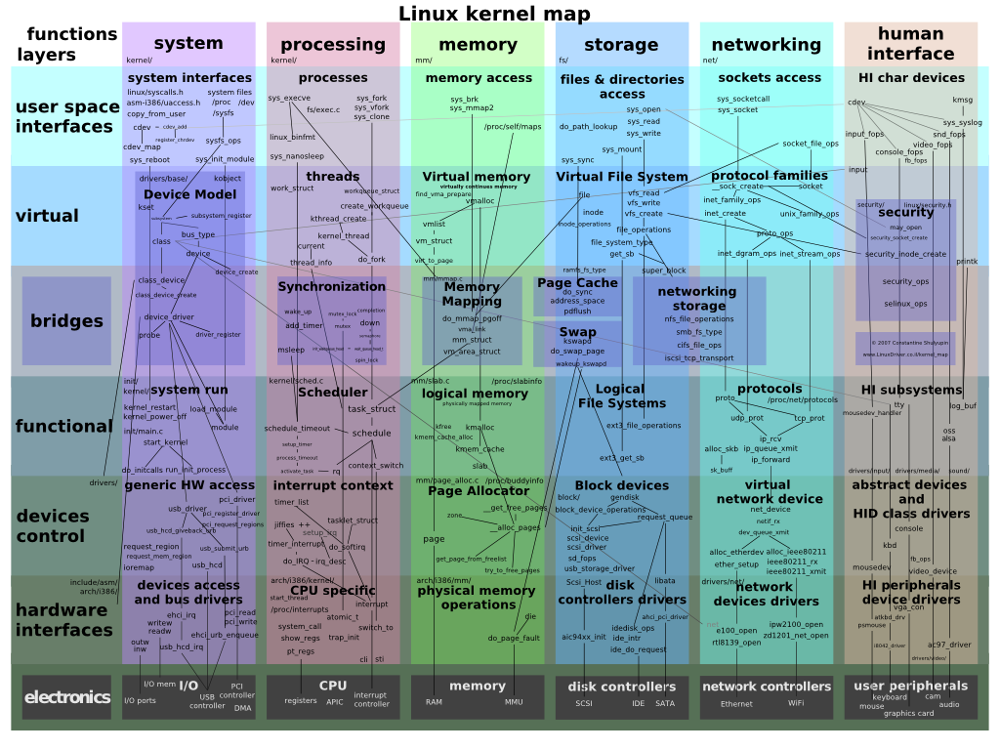
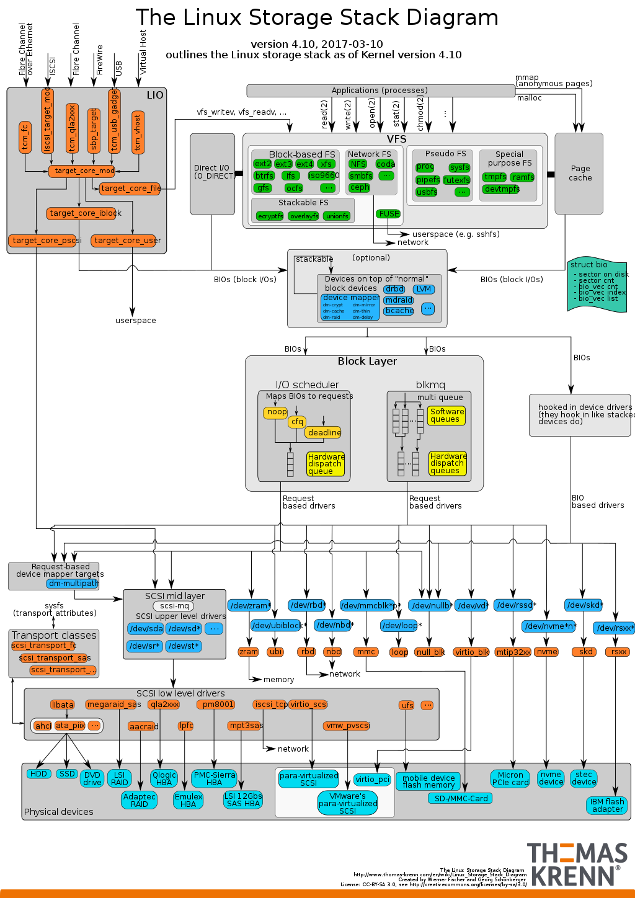

# 19-内核子系统-标准系统Linux

## 简介

Linux® 内核是 Linux 操作系统（OS）的主要组件，也是计算机硬件与其进程之间的核心接口。它负责两者之间的通信，还要尽可能高效地管理资源。

之所以称为内核，是因为在操作系统中就像果实硬壳中的种子一样，控制着硬件（无论是电话、笔记本电脑、服务器，还是任何其他类型的计算机）的所有主要功能。

Linux 是一个符合POSIX 标准的内核。它提供了一套应用程序接口（API），通过接口用户程序能与内核及硬件交互。仅仅一个内核并不是一套完整的操作系统。有一套基于 Linux 内核的完整操作系统叫作Linux 操作系统，或是GNU/Linux（在该系统中包含了很多GNU 计划的系统组件）

## 架构

Linux 是一个符合 POSIX 标准的单体内核，支持抢占式多任务、虚拟内存、VFS、网络协议栈与线程等功能。在 OpenHarmony 标准系统中，Linux 内核是承载富设备的基础内核，但 OpenHarmony 并非直接使用「 vanilla Linux」，而是在其之上做了若干适配与增强。

## OpenHarmony 对 Linux 的适配与增强

### 1. HDF 驱动框架集成

标准系统的硬件驱动不直接对接 Linux 原生驱动模型，而是通过 **HDF（Hardware Driver Foundation）** 统一接入：

* HDF 定义了跨内核的驱动开发标准（HDI 接口），同一套驱动代码可在 Linux、LiteOS-A 等内核间复用。
* 在 Linux 内核侧，HDF 通过 `khdf` 内核模块与 Linux 的 platform / misc / character 等子系统对接，实现驱动加载、设备树解析、中断管理等功能。
* 用户态驱动通过 `uhdf` 运行在用户空间，通过 netlink / ioctl 与内核态 HDF 通信，减少内核漏洞面。

### 2. 内核启动链

标准系统的启动流程中，Linux 内核由 `init`（`ueventd` + `init`）继续完成：

* Bootloader → Linux Kernel → `start_kernel` → 挂载根文件系统 → 执行 `/system/bin/init`。
* `init` 读取 `*.cfg` 和 `*.json`，拉起 `foundation`、`samgr` 及各系统服务进程，构建完整的 OpenHarmony 运行时。

### 3. 安全增强

OpenHarmony 在 Linux 内核基础上引入了安全子系统的若干增强：

* **权限与 SELinux**：基于 SELinux 实现更细粒度的强制访问控制（MAC），对系统服务、应用沙箱进行隔离。
* **设备认证**：内核启动阶段参与安全启动链，验证 bootloader 与内核镜像的签名。
* **安全容器**：通过内核命名空间（namespace）与 cgroup 配合，构建应用级沙箱。

### 4. 与 LiteOS 的多内核共存

OpenHarmony 采用「一套代码，弹性部署」策略：

* **轻量系统（L0）**：使用 **LiteOS-M**（无 MMU，百 KB 级内存）。
* **小型系统（L1）**：使用 **LiteOS-A**（有 MMU，M 级内存）。
* **标准系统（L2+）**：使用 **Linux**（GB 级内存）。

Linux 内核仅在标准系统中启用，负责管理高性能 CPU、大内存、GPU、多媒体等复杂硬件。其内核配置（`defconfig`）由 OpenHarmony 根据设备类型裁剪，去除不必要的子系统与驱动，降低攻击面与内存占用。

### 5. 内核源码位置

标准系统对应的 Linux 内核源码位于 `kernel/linux`，具体目录包括：

* `kernel/linux/linux-5.x`：Linux 内核主线源码。
* `kernel/linux/patches`：OpenHarmony 定制的补丁（HDF 适配、安全增强、性能优化等）。
* `drivers/hdf`：HDF 驱动框架的内核侧实现。

## I/O 调度器

Linux 内核支持多种 I/O 调度器（CFQ、Deadline、NOOP、BFQ 等）。OpenHarmony 标准系统根据存储介质类型（eMMC/UFS/SSD）在设备配置中选用合适的调度器，以平衡吞吐与响应时延。

## 相关阅读

- [启动流程](../../10-qi-dong-liu-cheng.md)
- [HDF驱动框架](../../09-hdf-qu-dong-kuang-jia.md)
- [内核子系统-Linux内核架构](../19-nei-he-zi-xi-tong-linux-nei-he-jia-gou.md)
