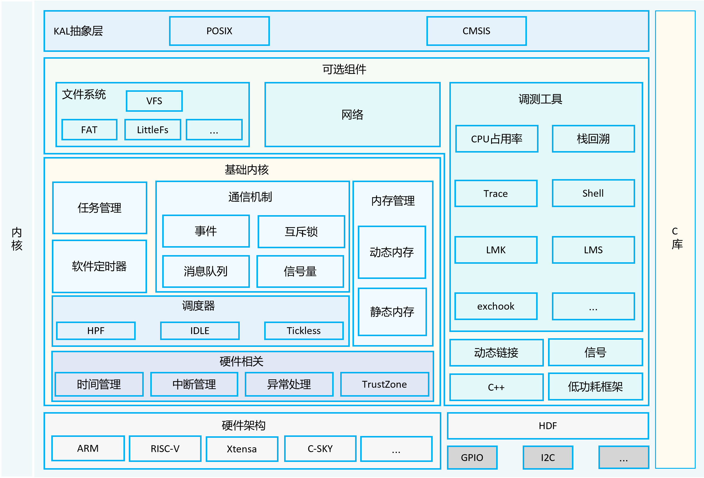

# 19-内核子系统-轻量系统


## 简介


OpenHarmony LiteOS-M内核是面向IoT领域构建的轻量级物联网操作系统内核，具有小体积、低功耗、高性能的特点。其代码结构简单，主要包括内核最小功能集、内核抽象层、可选组件以及工程目录等。支持驱动框架HDF（Hardware Driver Foundation），统一驱动标准，为设备厂商提供了更统一的接入方式，使驱动更加容易移植，力求做到一次开发，多系统部署。


OpenHarmony LiteOS-M内核架构包含硬件相关层以及硬件无关层，如下图所示，其中硬件相关层按不同编译工具链、芯片架构分类，提供统一的HAL（Hardware Abstraction Layer）接口，提升了硬件易适配性，满足AIoT类型丰富的硬件和编译工具链的拓展；其他模块属于硬件无关层，其中基础内核模块提供基础能力，扩展模块提供网络、文件系统等组件能力，还提供错误处理、调测等能力，KAL（Kernel Abstraction Layer）模块提供统一的标准接口。


## 架构





## 结构


```


/kernel/liteos_m


├── arch                 # 内核指令架构层目录


│   ├── arm              # arm 架构代码


│   │   ├── arm9         # arm9 架构代码


│   │   ├── cortex-m3    # cortex-m3架构代码


│   │   ├── cortex-m33   # cortex-m33架构代码


│   │   ├── cortex-m4    # cortex-m4架构代码


│   │   ├── cortex-m55   # cortex-m55架构代码


│   │   ├── cortex-m7    # cortex-m7架构代码


│   │   └── include      # arm架构公共头文件目录


│   ├── csky             # csky架构代码


│   │   └── v2           # csky v2架构代码


│   ├── include          # 架构层对外接口存放目录


│   ├── risc-v           # risc-v 架构


│   │   ├── nuclei       # 芯来科技risc-v架构代码


│   │   └── riscv32      # risc-v官方通用架构代码


│   └── xtensa           # xtensa 架构代码


│       └── lx6          # xtensa lx6架构代码


├── components           # 可选组件


│   ├── backtrace        # 栈回溯功能


│   ├── cppsupport       # C++支持


│   ├── cpup             # CPUP功能


│   ├── dynlink          # 动态加载与链接


│   ├── exchook          # 异常钩子


│   ├── fs               # 文件系统


│   ├── lmk              # Low memory killer 机制


│   ├── lms              # Lite memory sanitizer 机制


│   ├── net              # Network功能


│   ├── power            # 低功耗管理


│   ├── shell            # shell功能


│   └── trace            # trace 工具


├── drivers              # 驱动框架Kconfig


├── kal                  # 内核抽象层


│   ├── cmsis            # cmsis标准接口支持


│   └── posix            # posix标准接口支持


├── kernel               # 内核最小功能集支持


│   ├── include          # 对外接口存放目录


│   └── src              # 内核最小功能集源码


├── testsuites           # 内核测试用例


├── tools                # 内核工具


├── utils                # 通用公共目录


```

## LiteOS-M 与 LiteOS-A 的定位差异

OpenHarmony 内核子系统按设备资源分两条内核路线：

- **LiteOS-M（轻量系统）**：面向 MCU 类设备，RAM 通常小于 128 KB，不带 MMU，采用扁平地址空间，内核极简、可高度裁剪。
- **LiteOS-A（小型系统）**：面向带 MMU 的 SOC，支持进程/虚拟内存，能力更完整。

本章聚焦 LiteOS-M。

## 内核基础功能集

`kernel` 目录提供的最小功能集是 LiteOS-M 的核心，主要包括：

- **任务管理**：任务的创建/删除、优先级、状态切换，支持抢占式优先级调度与时间片轮转；
- **内存管理**：提供静态与动态内存算法（如 TLSF、bestfit），在不带 MMU 的平台上做确定性分配；
- **IPC 通信**：队列（Queue）、事件（Event）、互斥锁（Mutex）、信号量（Semaphore），用于任务间同步与数据传递；
- **软件定时器**：基于系统滴答的定时能力；
- **中断与异常**：中断注册/使能、异常接管与处理；
- **时间管理**：系统时钟、Tick、延时。

## KAL 内核抽象层

为了兼容不同生态的编程接口，LiteOS-M 通过 KAL（Kernel Abstraction Layer）对外提供两套标准接口：

- **CMSIS**：ARM 生态标准的 RTOS 接口，方便把已有 Cortex-M 代码迁移过来；
- **POSIX**：提供 `pthread`、`sem_*` 等 POSIX 接口，方便 Linux 侧代码下沉到轻量设备。

这种"一套内核、多套接口"的设计，降低了既有嵌入式代码的移植成本。

## 启动流程

设备上电后，先执行芯片相关的复位与汇编初始化（设置栈、中断向量），再进入 C 语言的 `main`/`OsMain`：依次完成硬件抽象层初始化、内核基础模块（任务、内存、IPC、定时器）初始化，最后创建系统任务并启动调度器，进入多任务运行。具体步骤可对照第 10 章启动流程。

## 驱动与组件

- **HDF 驱动框架**：`drivers` 目录承载 HDF 的 Kconfig 与适配，使外设驱动以统一方式接入，做到"一次开发，多系统部署"。
- **可选组件**（`components`）：按需裁剪，如 `shell`、网络 `net`、文件系统 `fs`、低功耗 `power`、栈回溯 `backtrace`、动态加载 `dynlink`、内存检测 `lms/lmk` 等，仅把产品需要的能力编入镜像。

## 适用场景

LiteOS-M 适合传感器节点、穿戴设备、家电控制板等资源极度受限、对功耗与体积敏感的 IoT 场景；当设备算力与内存提升到小型系统级别时，可平滑切换到 LiteOS-A / 标准系统 Linux 内核。

## 相关阅读

- [内核子系统-标准系统Linux](../19-nei-he-zi-xi-tong-biao-zhun-xi-tong-linux.md)
- [启动流程](../../10-qi-dong-liu-cheng.md)
