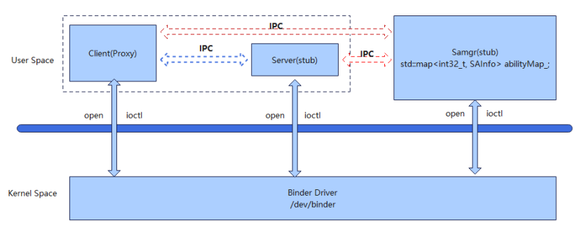
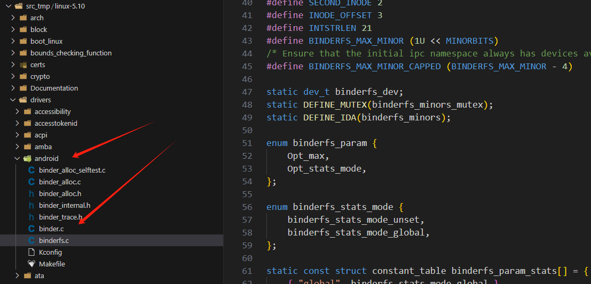
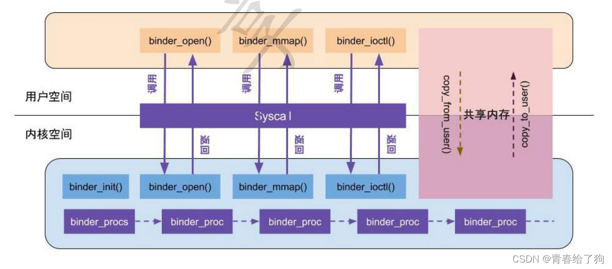
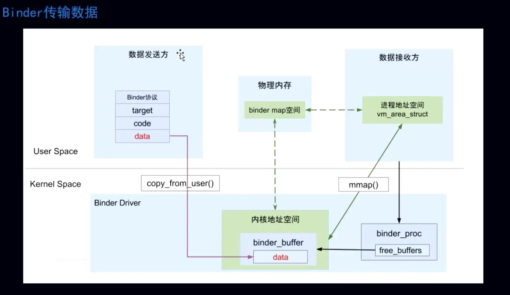

# 11-binder机制

## 简介

服务与服务之间通信的机制。

Binder机制通常采用客户端-服务器（Client-Server）模型，服务请求方（Client）可获取服务提供方（Server）的代理 （Proxy），并通过此代理读写数据来实现进程间的数据通信。

## 框架

官方文档：[https://gitcode.com/openharmony/systemabilitymgr\_safwk](https://gitcode.com/openharmony/systemabilitymgr\_safwk)

## 内核详解

OpenHarmony内核层面直接使用Android的binder机制

Binder的一次拷贝过程，从数据发送方的User Space通过copy\_from\_user()将数据拷贝入进程间公用内核空间的物理内存。数据接收方通过memory\_mapping（内存映射）从这块物理内存直接获取。

在内核空间划分出了一块物理内存，内核空间和接收方的虚拟内存都映射在这块物理内存上，所以不需要第二次拷贝。而共享内存的0次拷贝通信，是通过发送和接收方共享同一块物理内存来实现。

## Binder 驱动数据结构

Binder 内核驱动的核心数据结构定义了进程、线程、实体对象与引用的组织关系：

- **binder_proc**：每个打开 `/dev/binder` 的进程对应一个 `binder_proc`，记录该进程的所有线程、节点、引用、缓冲区。

- **binder_thread**：进程中的每个线程对应一个 `binder_thread`，记录线程的 Looper 状态、待处理事务队列。

- **binder_node**：Binder 实体对象，代表服务端暴露的某个服务对象（如 SystemAbility）。

- **binder_ref**：Binder 引用对象，代表客户端对某个实体对象的远程引用，通过 `handle` 索引。

- **binder_buffer**：内核中用于存放跨进程数据的缓冲区，通过内存映射实现一次拷贝。

## 服务注册与查询流程

**注册（Server 端）**

1. 服务端进程打开 `/dev/binder` 设备，建立 `binder_proc`。

2. 服务端创建 Binder 实体（`binder_node`），并调用 `ioctl(BINDER_SET_CONTEXT_MGR)` 向 ServiceManager 注册（或在 OpenHarmony 中向 samgr 注册）。

3. binder 驱动为实体分配唯一引用，并通知 ServiceManager 维护「服务名 → handle」映射表。

**查询（Client 端）**

1. 客户端向 ServiceManager（或 samgr）发送查询请求，携带目标服务名。

2. ServiceManager 返回该服务的 `handle`（即 `binder_ref` 的索引）。

3. 客户端通过该 `handle` 构造 `binder_ref`，后续对 `handle` 的 IPC 调用会被 binder 驱动路由到对应的 `binder_node` 与实体进程。

## 死亡通知（Death Recipient）

当服务端进程异常退出时，binder 驱动会遍历该进程的所有 `binder_node`，向持有这些节点引用的客户端发送 `BR_DEAD_BINDER` 通知。客户端预先注册的 `death_recipient` 回调被触发，可执行服务重连、降级或清理逻辑。OpenHarmony 的 samgr 正是依赖此机制实现 SA 的死亡感知与自动恢复。

## OpenHarmony 中的 Binder 定位

在 OpenHarmony 标准系统中，Binder 是**设备内 IPC** 的底层通道，对上被 IPC 框架（`IPCObjectProxy`/`IPCObjectStub`）封装，对下通过 `/dev/binder` 与内核驱动交互。分布式场景下，IPC 框架会切换到底层软总线通道，保持同一套 Proxy/Stub 接口不变。

## 相关阅读

- [跨进程IPC](../11-kua-jin-cheng-ipc.md)
- [架构篇](../../../01-basic/04-jia-gou-pian.md)
- [系统samgr](../../../02-framework/08-xi-tong-samgr.md)
