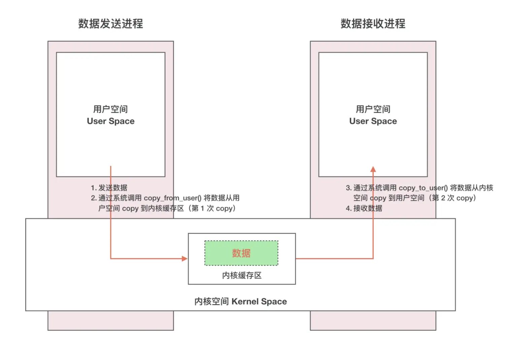
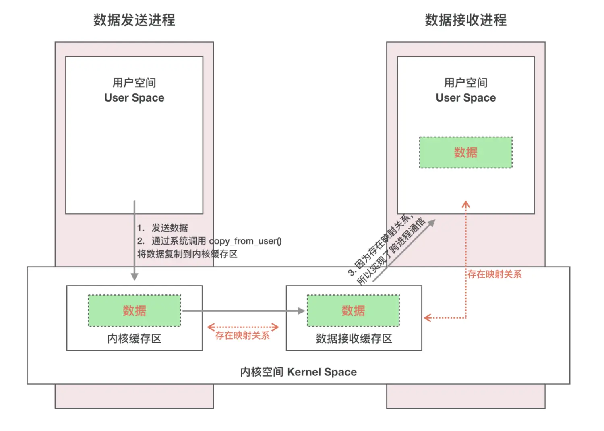
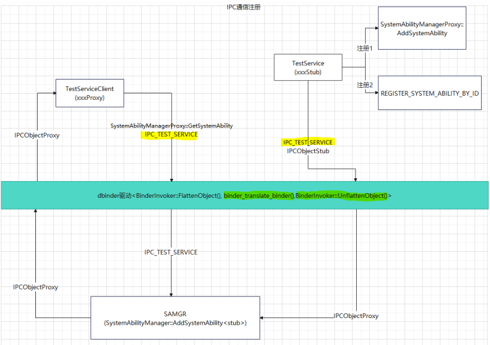

# 11-跨进程IPC

## Linux的IPC

OpenHarmony是基于Linux系统上的，先了解一下Linux中的IPC通信原理。

在Linux中，进程之间是隔离的，内存也是不共享的，进程空间分为用户空间和内核空间，用户空间是用户程序运行的空间，内核空间则是内核运行的空间，为了防止用户空间随便干扰，用户空间是独立的，内核空间是共享的，但为了安全性考虑，内核空间跟用户空间也是隔离的，它们之间的仅可以通过系统调用来通信。至此我们知道IPC的大致方案是A进程的数据通过系统调用把数据传递到内核空间，内核空间再利用系统调用把数据传递到B空间，其中会有两次数据的拷贝如下图：

## Binder IPC 原理

1.首先 Binder 驱动在内核空间创建一个数据接收缓存区；&#x20;

2.接着在内核空间开辟一块内核缓存区，建立内核缓存区和内核中数据接收缓存区之间的映射关系，以及内核中数据接收缓存区和接收进程用户空间地址的映射关系；

&#x20;3.发送方进程通过系统调用 copy\_from\_user() 将数据 copy 到内核中的内核缓存区，由于内核缓存区和接收进程的用户空间存在内存映射，因此也就相当于把数据发送到了接收进程的用户空间，这样便完成了一次进程间的通信。

OpenHarmony IPC流程

IPC通信包括客户端(client)和服务端(service)。

* 服务端TestService继承自IPCObjectStub。

* 客户端TestServiceClient通过iface\_cast(object)获取到一个TestServiceProxy对象。TestServiceProxy继承自PeerHolder，里面包含指向IPCObjectProxy的指针。

* 客户端的IPCObjectProxy和服务端IPCObjectStub是对应关系。

## IPC 框架核心对象与交互

### IPCObjectProxy / IPCObjectStub

- **IPCObjectStub**：服务端基类，负责接收来自客户端的 IPC 请求，解析参数并调用本地业务实现。每个 Stub 对应一个 binder 实体（`binder_node`）。

- **IPCObjectProxy**：客户端代理，封装了远程调用的细节。应用层看到的「服务接口」本质上是 Proxy 对象，调用其方法即发起一次 IPC。

- **PeerHolder**：Proxy 的持有者，内部维护指向 `IPCObjectProxy` 的指针，以及连接状态、死亡通知订阅等元信息。

### 数据序列化：MessageParcel / MessageOption

- **MessageParcel**：承担跨进程数据的「打包/解包」角色。发送方把参数（基本类型、对象、文件描述符等）写入 Parcel；接收方从 Parcel 中按顺序读取。Binder 驱动负责在内核空间搬运 Parcel 的数据缓冲区。

- **MessageOption**：控制 IPC 调用的行为选项，如是否同步阻塞、是否设置超时、是否启用异步调用等。

### 典型 IPC 调用链路

以客户端调用服务端接口为例：

1. 客户端获取 `TestServiceProxy`（通过 samgr 查询或 `iface_cast`）。

2. 客户端调用 Proxy 方法，内部构造 `MessageParcel` 写入参数。

3. Proxy 调用 `SendRequest`，通过 `IPCObjectProxy` 将请求送入 Binder 驱动（设备内）或软总线（设备间）。

4. 驱动/软总线将请求路由到服务端进程的 `IPCObjectStub`。

5. Stub 解析 `MessageParcel`，分发到具体业务实现，并将结果写回回复 Parcel。

6. 客户端在 `SendRequest` 返回后读取回复 Parcel，完成一次远程调用。

### IPC 与 samgr 的关联

在 OpenHarmony 中，系统服务的跨进程调用几乎都由 samgr 统一调度：

- samgr 负责维护 SA 的注册表，并提供 `GetSystemAbility` 查询接口。

- 查询返回的是 `IPCObjectProxy`，客户端据此即可发起 IPC。

- 若目标 SA 在远端设备，samgr 通过分布式软总线获取远端 Proxy，调用链路自动切换为 RPC，对应用层无感知。

## 相关阅读

- [架构篇](../../../01-basic/04-jia-gou-pian.md)
- [系统samgr](../../../02-framework/08-xi-tong-samgr.md)
- [binder机制](../11-binder-ji-zhi.md)
