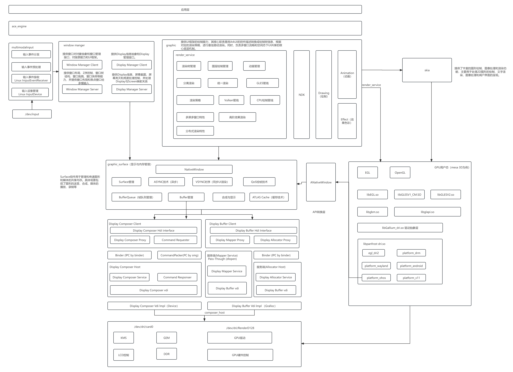

# 12-图形子系统-GPU适配

## 架构

其中 native window 转换并非必须，依照其他操作系统接口转换，则需要 native window 转换，将 EGL 接口，转换到 OpenHarmony 系统上使用。

## GPU 适配的核心问题

图形栈的渲染最终要落到 GPU 上执行。不同芯片（如 Mali、Adreno、PowerVR 等）提供的 GPU 驱动与用户态接口不同，OpenHarmony 需要在「统一的图形框架」与「多样的 GPU 驱动」之间建立适配层，使上层渲染服务不必感知具体硬件。适配主要围绕以下层面展开：

* **图形 API 对接**：OpenHarmony 的渲染依赖 EGL / OpenGL ES（部分场景使用 Vulkan 或软渲染 Skia）。GPU 适配需提供这些标准 API 在目标平台上的实现或对接。
* **Native Window 转换**：EGL 需要一个「可绘制的本地窗口（Native Window）」来绑定 Surface。OpenHarmony 通过自身的窗口/图形缓冲区机制（基于 Surface/Buffer 的生产者-消费者模型）向 EGL 提供 Native Window 适配，使 GPU 渲染结果能写入系统可合成的图形缓冲区。
* **缓冲与同步**：渲染产出的图形缓冲区通过 HDI/图形缓冲区接口传递给显示与合成子系统，并依赖 fences/sync 机制保证 GPU 写入完成后再被合成或上屏。

## 渲染分层（自上而下）

1. **应用框架层**：ArkUI / 图形 Native API（Native Drawing、WebGL 等）产生绘制指令。
2. **渲染服务层（Render Service）**：标准系统的 2D 渲染主要由 `graphic_2d`（Rosen 渲染服务）完成，负责指令录制、图层管理与合成策略。
3. **GPU 驱动/用户态层**：通过 EGL + OpenGL ES（或 Vulkan）调用 GPU 执行光栅化与合成加速；无 GPU 或适配未完成时可回退到软件渲染（Skia）。
4. **内核/显示层**：GPU 驱动经 DRM/显示 HDI 将最终画面送显。

## 适配要点

* **EGL 与窗口系统绑定**：把 OpenHarmony 的图形 Surface 适配为 EGL 的 `EGLNativeWindowType`，是跨平台移植的关键一步。
* **驱动对接方式**：既可直接对接芯片厂商提供的私有 GL 驱动，也可移植开源 Mesa3D 作为 OpenGL/Vulkan 的开源实现来获得 GPU 加速。
* **软硬结合**：当目标平台无可用 GPU 驱动时，使用 Skia 软渲染保证基本图形可用，待 GPU 驱动就绪后再切到硬件加速。
* **与合成解耦**：渲染结果以标准图形缓冲区形式输出，由窗口/合成子系统统一决定上屏策略，GPU 适配层无需关心最终如何显示。

## 典型适配流程

以新芯片平台首次接入 OpenHarmony 为例，GPU 适配通常按以下步骤推进：

1. **确认 GPU 型号与现有驱动**：查阅芯片厂商提供的 GPU 驱动（用户态库、内核模块）是否支持 EGL/GLES 或 Vulkan。
2. **移植 Mesa3D（可选）**：若厂商未提供闭源驱动，可移植 Mesa3D Gallium/LLVMpipe 或对应 GPU 的后端，获得开源 GL 实现。
3. **Native Window 实现**：实现 `OHNativeWindow` 相关接口，将系统的 `Surface`/`BufferQueue` 机制映射到 EGL 的 `eglCreateWindowSurface` 所需参数。
4. **渲染服务集成**：在 `graphic_2d` / Render Service 中配置 GPU 加速开关，使绘制指令通过 GL 后端下发而非 Skia 软绘。
5. **验证与调优**：使用标准图形测试（如 `glmark2`、`gfxbench` 或自研场景）验证渲染正确性与性能，排查画面撕裂、缓冲泄漏、GPU 挂死等问题。

## 常见问题与调试

| 现象 | 可能原因 | 排查方向 |
|------|----------|----------|
| 画面黑屏/花屏 | Native Window 绑定失败或 Buffer 格式不匹配 | 检查 `EGLConfig` 的 RGBA 位深与窗口 Buffer 是否一致；确认 `eglSwapBuffers` 返回值 |
| 渲染卡顿 | GPU 驱动未启用硬件加速，回退到 Skia | 查看日志是否出现 `fallback to software renderer`；确认 GPU 驱动库是否正确加载 |
| 内存持续增长 | 图形缓冲区未释放或 Fence 未正确等待 | 使用 `hidumper` 查看图形内存；抓 `BufferQueue` 状态确认生产者-消费者平衡 |
| 闪退/GPU 挂死 | GPU 驱动版本与内核不匹配 | 核对内核 DRM 版本与用户态 GPU 驱动版本；确认设备树（DTS）GPU 节点正确 |

## 相关阅读

- [图形子系统-openharmony](../12-tu-xing-zi-xi-tong-openharmony.md)
- [窗口子系统](../../13-chuang-kou-zi-xi-tong.md)
- [多模输入子系统](../../14-duo-mo-shu-ru-zi-xi-tong.md)
- [HDF 驱动框架](../../../03-driver-boot/09-hdf-qu-dong-kuang-jia.md)
