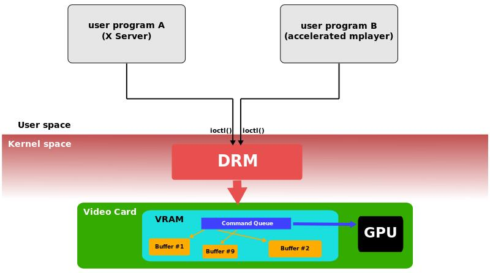
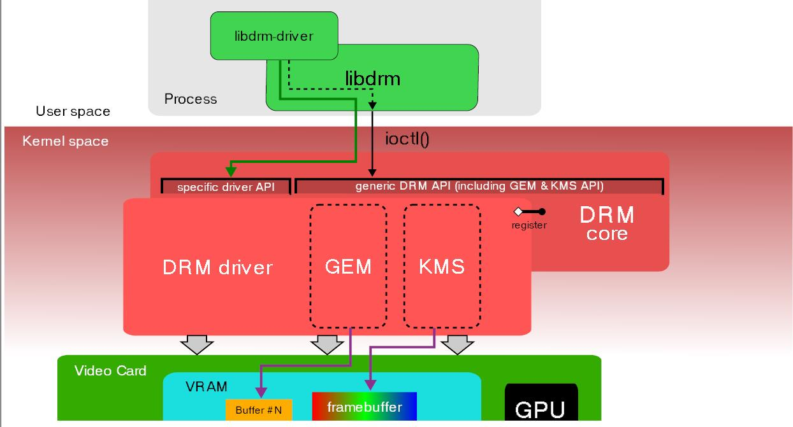

# 12-图形子系统-Linux图形显示系统之DRM

## 简介

Direct Rendering Manager(DRM)是linux内核子系统，负责与显卡交互。 DRM提供一组API，用户空间程序可以使用该API将命令和数据发送到GPU并执行诸如配置显示器的模式设置之类的操作。DRM最初是作为X server Direct Rendering基础结构的内核空间组件开发的，但从那以后它被其他图形系统(例如Wayland)所使用。用户空间程序可以使用DRM API命令GPU执行硬件加速的3D渲染和视频解码以及GPU计算。

## 使用

**DRM由两部分组成：通用“DRM core”和每种受支持的特定部分（“DRM Driver”）**。DRM core提供了可以注册不同DRM驱动程序的基本框架，还为用户空间提供了具有通用的，独立于硬件的，功能的最少ioctl集。另一方面，DRM Driver实现API的硬件相关部分，具体取决于它所支持的GPU类型，它应提供DRM核心未涵盖的其余ioctl的实现。

DRM驱动也可以扩展API，提供特定GPU上可用的具有附加功能的附加ioctl。当特定的DRM驱动程序提供增强的API时，用户空间libdrm也将通过一个额外的库libdrm-driver扩展，这个扩展库可以被用户空间用来调用其他ioctl接口。

DRM Core将几个接口导出到用户空间应用程序，让相应的libdrm包装成函数后来使用。

DRM Driver通过ioctl和sysfs文件导出设备专用的接口，供用户空间驱动程序和支持设备的应用程序使用。外部接口包括：内存映射，上下文管理，DMA操作，AGP管理，vblank控制，fence管理，内存管理和输出管理。

### GEM

Graphics Execution Manager（GEM）是一种内存管理方法。由于视频存储器的大小增加以及诸如OpenGL之类的图形API的日益复杂性，从性能角度看，在每个上下文切换处重新初始化图形卡状态的策略过于低效。另外，现代linux桌面还需要一种最佳方式与合成管理器（compositing manager）共享屏幕外缓冲区。这些要求诞生开发了用于管理内核内部图形缓冲区的新方法，图形执行管理方法（GEM）是其中一种。

### KMS（Kernel Mode Setting）

为了正常工作，显卡或者图形适配器必须设置一种模式（屏幕分辨率、颜色深度和刷新率的组合），该模式应在其自身和所连接的显示屏所支持的值的范围内。此操作称为mode-setting。通常需要对图形硬件进行原始访问，写入视频卡某些寄存器的能力。在开始使用framebuffer之前，以及在应用程序或者用户要求更改模式时，都必须执行模式设置操作。

每个进程（包括X Server）都应该能够命令内核执行模式设置操作，并且内核将确保并发操作不会导致不一致的状态。添加到DRM模块以执行这些模式设置操作的新内核API和代码称为Kernel Mode-Setting(KMS)。

## Hardware support

DRM将由用户模式图形设备程序使用，例如Mesa 3D。用户空间程序使用Linux系统调用访问DRM，DRM通过自身的系统调用来响应Linux的系统调用。

## libdrm

libdrm的作用就是将内核功能封装成 一系列的open/close/ioctl 等标准接口，应用程序调用这些接口来驱动设备实现画面显示，绝大部分可以分成两类行为：Graphics Execution Manager (GEM)、Kernel Mode-Setting (KMS)，gem：显存管理，如显存的分配和释放，kms：显示模式管理，如分辨率等的设置

是linux内核对显示框架进行分层设计的思想，相比于直接操作fb，drm框架提供更多的功能，包含图层合成、CMA、VSYNC等，而且架构更方便驱动人员维护和使用。

## 相关阅读

- [图形子系统-openharmony](../12-tu-xing-zi-xi-tong-openharmony.md)
- [图形子系统-Linux图形显示系统](../12-tu-xing-zi-xi-tong-linux-tu-xing-xian-shi-xi-tong.md)
