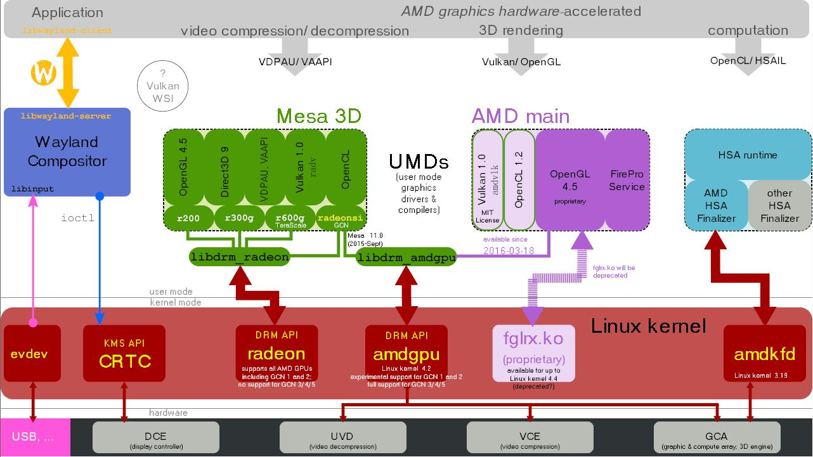

# 12-图形子系统-Linux图形显示系统之DRM

## 简介

Direct Rendering Manager(DRM)是linux内核子系统，负责与显卡交互。 DRM提供一组API，用户空间程序可以使用该API将命令和数据发送到GPU并执行诸如配置显示器的模式设置之类的操作。DRM最初是作为X server Direct Rendering基础结构的内核空间组件开发的，但从那以后它被其他图形系统(例如Wayland)所使用。用户空间程序可以使用DRM API命令GPU执行硬件加速的3D渲染和视频解码以及GPU计算。

## 使用


**DRM由两部分组成：通用“DRM core”和每种受支持的特定部分（“DRM Driver”）**。DRM core提供了可以注册不同DRM驱动程序的基本框架，还为用户空间提供了具有通用的，独立于硬件的，功能的最少ioctl集。另一方面，DRM Driver实现API的硬件相关部分，具体取决于它所支持的GPU类型，它应提供DRM核心未涵盖的其余ioctl的实现。

DRM驱动也可以扩展API，提供特定GPU上可用的具有附加功能的附加ioctl。当特定的DRM驱动程序提供增强的API时，用户空间libdrm也将通过一个额外的库libdrm-driver扩展，这个扩展库可以被用户空间用来调用其他ioctl接口。


DRM Core将几个接口导出到用户空间应用程序，让相应的libdrm包装成函数后来使用。

DRM Driver通过ioctl和sysfs文件导出设备专用的接口，供用户空间驱动程序和支持设备的应用程序使用。外部接口包括：内存映射，上下文管理，DMA操作，AGP管理，vblank控制，fence管理，内存管理和输出管理。

### GEM

Graphics Execution Manager（GEM）是一种内存管理方法。由于视频存储器的大小增加以及诸如OpenGL之类的图形API的日益复杂性，从性能角度看，在每个上下文切换处重新初始化图形卡状态的策略过于低效。另外，现代linux桌面还需要一种最佳方式与合成管理器（compositing manager）共享屏幕外缓冲区。这些要求诞生开发了用于管理内核内部图形缓冲区的新方法，图形执行管理方法（GEM）是其中一种。

### KMS（Kernel Mode Setting）

为了正常工作，显卡或者图形适配器必须设置一种模式（屏幕分辨率、颜色深度和刷新率的组合），该模式应在其自身和所连接的显示屏所支持的值的范围内。此操作称为mode-setting。通常需要对图形硬件进行原始访问，写入视频卡某些寄存器的能力。在开始使用framebuffer之前，以及在应用程序或者用户要求更改模式时，都必须执行模式设置操作。

每个进程（包括X Server）都应该能够命令内核执行模式设置操作，并且内核将确保并发操作不会导致不一致的状态。添加到DRM模块以执行这些模式设置操作的新内核API和代码称为Kernel Mode-Setting(KMS)。

## DRM 核心对象模型

现代 DRM 子系统围绕四个核心对象组织显示硬件，便于驱动开发与上层调用：

| 对象 | 作用 | 类比 |
|------|------|------|
| **Plane** | 图层，承载一个图像缓冲区（buffer），可叠加到 CRTC | 视频轨道、UI 图层 |
| **CRTC** | 显示控制器，负责扫描输出、生成时序（vblank） | 显卡上的显示引擎 |
| **Encoder** | 编码器，将 CRTC 输出的信号转换为显示器可识别的格式（如 HDMI/TTL/DSI） | 信号转换器 |
| **Connector** | 连接器，代表物理显示接口（HDMI、DP、eDP、DSI） | 物理接口本身 |

显示流程：`Buffer → Plane → CRTC → Encoder → Connector → 显示器`。合成器（如 Rosen）将多个应用的 Surface 合成为最终帧，通过 DRM 的 `Atomic Commit` 一次性更新 Plane 与 CRTC 配置，保证画面一致性。

## DRM 在 OpenHarmony 中的角色

OpenHarmony 标准系统的显示 HDI（Hardware Driver Interface）底层通常基于 DRM 实现：

- **显示 HDI 实现层**：向上对接 Render Service / 合成器，向下调用 DRM libdrm 接口完成图层配置、缓冲区提交、模式设置；
- **GPU 渲染结果**：Render Service 将合成后的帧缓冲区（GBM/DRM buffer）绑定到 DRM Plane，通过 KMS 送显；
- **兼容性**：不同芯片平台（如 Mali、Adreno、PowerVR）的 DRM 驱动差异由 HDI 层屏蔽，上层图形栈保持统一。

DRM 设备节点通常位于 `/dev/dri/card0`，`card0` 是主显示设备，`renderD128` 是无显示权限的纯渲染节点（供 GPU 渲染使用，避免应用直接操作显示状态）。

## libdrm 与调试

libdrm 的作用就是将内核功能封装成一系列的 open/close/ioctl 等标准接口，应用程序调用这些接口来驱动设备实现画面显示。绝大部分操作可以分成两类：

- **GEM（Graphics Execution Manager）**：显存管理，如显存的分配和释放；
- **KMS（Kernel Mode-Setting）**：显示模式管理，如分辨率、刷新率、图层配置。

是 linux 内核对显示框架进行分层设计的思想，相比于直接操作 fb，drm 框架提供更多的功能，包含图层合成、CMA、VSYNC 等，而且架构更方便驱动人员维护和使用。

### 常用调试方法

```bash
# 查看 DRM 设备与连接器状态
cat /sys/kernel/debug/dri/0/state

# 查看当前显示模式（分辨率、刷新率）
cat /sys/class/drm/card0-HDMI-A-1/modes

# 查看 GPU/DRM 日志
dmesg | grep -i drm

# 使用 modetest（libdrm 工具）测试显示模式
modetest -M <driver_name> -s <connector_id>@<crtc_id>:<mode>
```

## Hardware support





DRM将由用户模式图形设备程序使用，例如Mesa 3D。用户空间程序使用Linux系统调用访问DRM，DRM通过自身的系统调用来响应Linux的系统调用。

## libdrm

libdrm的作用就是将内核功能封装成 一系列的open/close/ioctl 等标准接口，应用程序调用这些接口来驱动设备实现画面显示，绝大部分可以分成两类行为：Graphics Execution Manager (GEM)、Kernel Mode-Setting (KMS)，gem：显存管理，如显存的分配和释放，kms：显示模式管理，如分辨率等的设置

是linux内核对显示框架进行分层设计的思想，相比于直接操作fb，drm框架提供更多的功能，包含图层合成、CMA、VSYNC等，而且架构更方便驱动人员维护和使用。


## 相关阅读

- [图形子系统-openharmony](../12-tu-xing-zi-xi-tong-openharmony.md)
- [图形子系统-Linux图形显示系统](../12-tu-xing-zi-xi-tong-linux-tu-xing-xian-shi-xi-tong.md)
- [图形子系统-GPU适配](../12-tu-xing-zi-xi-tong-gpu-shi-pei.md)
- [HDF驱动框架](../../../03-driver-boot/09-hdf-qu-dong-kuang-jia.md)
