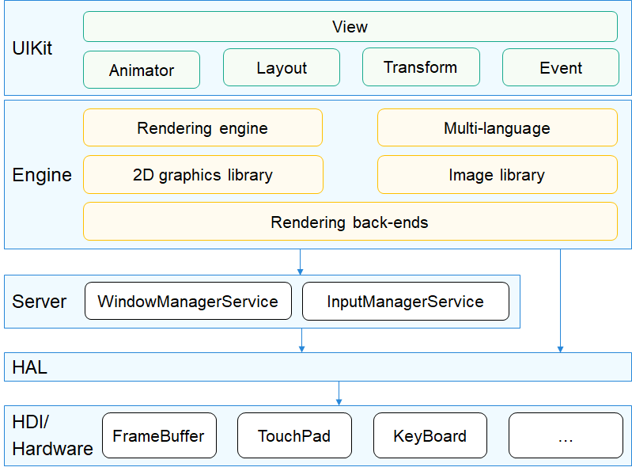
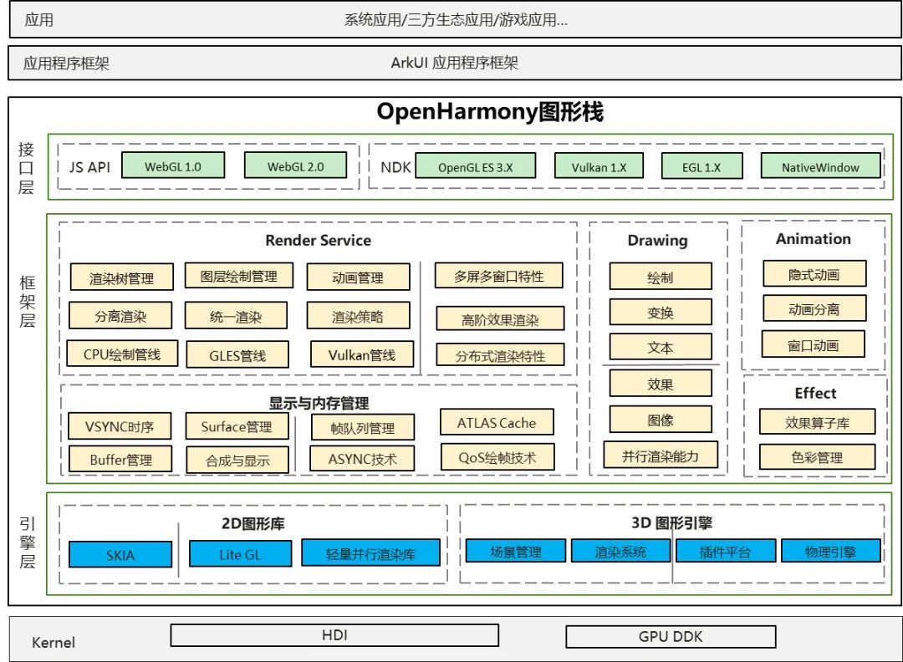

# 12-图形子系统-OpenHarmony

## 简介

图形子系统主要包括UI组件、布局、动画、字体、输入事件、窗口管理、渲染绘制等模块，构建基于轻量OS的应用框架，满足硬件资源较小的物联网设备的OpenHarmony系统应用开发。

## 架构

各模块介绍：

* View：应用组件，包括UIView、UIViewGroup、UIButton、UILabel、UILabelButton、UIList、UISlider等。
* Animator：动画模块，开发者可以自定义动画。
* Layout：布局控件，包括FlexLayout、GridLayout、ListLayout等。
* Transform：图形变换模块，包括旋转、平移、缩放等。
* Event：事件模块，包括click、press、drag、long press等基础事件。
* Rendering engine：渲染绘制模块。
* 2D graphics library：2D绘制模块，包括直线、矩形、圆、弧、图片、文字等绘制。包括软件绘制和硬件加速能力对接。
* Multi-language：多语言模块，用于处理不用不同语言文字的换行、整形等。
* Image library：图片处理模块，用于解析和操作不同类型和格式的图片，例如png、jpeg、ARGB8888、ARGB565等
* WindowManager：窗口管理模块，包括窗口创建、显示隐藏、合成等处理。
* InputManager：输入事件管理模块。

提供了图形接口能力

## 定位与适用场景

本章对应的是 OpenHarmony **轻量与小型系统**上的图形 UI 框架（早期称为 UI 子系统），目标是用极小的内存与算力，在 MCU、智能穿戴、智能家居面板等资源受限设备上提供基础的人机交互能力。它与标准系统上的 ArkUI（声明式开发范式）+ Rosen（图形渲染引擎）是两条不同的技术路线：轻量系统更强调"够用、轻巧、可裁剪"，用命令式 C++ 控件直接绘制。

## 渲染架构

图形子系统的渲染绘制模块同时具备两种能力：

* **软件绘制**：由 2D 图形库（2D graphics library）在 CPU 上完成直线、矩形、圆、弧、图片、文字等图元的光栅化，输出到 FrameBuffer，适用于无 GPU 或 GPU 能力很弱的设备。
* **硬件加速对接**：通过抽象层把绘制请求下发到 2D 加速硬件或 GPU，降低 CPU 占用、提升流畅度。

渲染流程大致为：控件布局 → 绘制指令生成 → 2D 图形库光栅化 → 送显（经由 WindowManager 合成到显示缓冲）。

## 2D 图形库

提供一组基础绘制原语，支持多种像素格式（如 ARGB8888、ARGB565）与图片格式（png、jpeg 等）。Image library 负责图片的解码与缩放，Text layout 处理不同语言文字的换行与整形（shaping），保证多语言下的排版正确。

## 布局与控件体系

* **View**：所有 UI 组件的基类，派生出 `UIViewGroup`（容器）、`UIButton`、`UILabel`、`UIList`、`UISlider` 等。
* **Layout**：布局控件，常见有 `FlexLayout`（弹性布局）、`GridLayout`（网格）、`ListLayout`（列表）。
* **Transform**：图形变换，支持旋转、平移、缩放。
* **Animator**：动画模块，开发者可以自定义属性动画（如位移、透明度、缩放）驱动 UI 变化。

## 事件与交互

Event 模块负责把底层的输入（来自 InputManager）封装为 click、press、long press、drag 等语义事件，分发给对应的控件。配合第 14 章多模输入子系统、第 13 章窗口子系统，构成完整的"输入 → 窗口 → UI 响应"链路。

## 与其他章节的关系

轻量系统的图形 UI 自成体系；若你需要了解标准系统的现代图形栈（ArkUI + Rosen）、或底层 Linux 显示驱动（DRM/KMS），请分别参考本系列的其他图形章节与内核显示相关章节。

## 相关阅读

- [窗口子系统](../../13-chuang-kou-zi-xi-tong.md)
- [多模输入子系统](../../14-duo-mo-shu-ru-zi-xi-tong.md)
- [图形子系统-Linux图形显示系统](../12-tu-xing-zi-xi-tong-linux-tu-xing-xian-shi-xi-tong.md)
