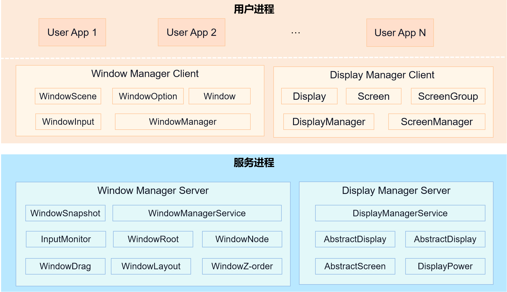
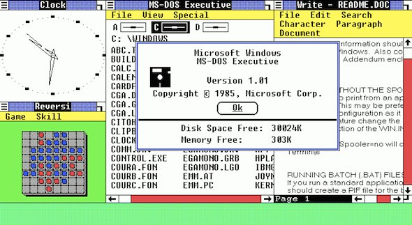
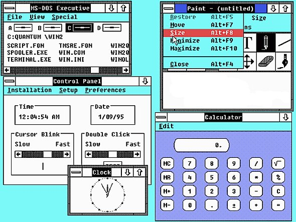
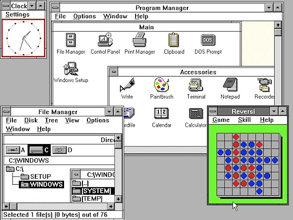
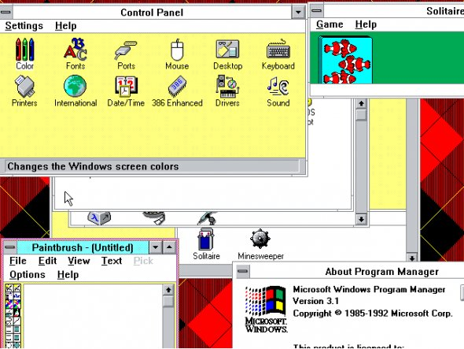
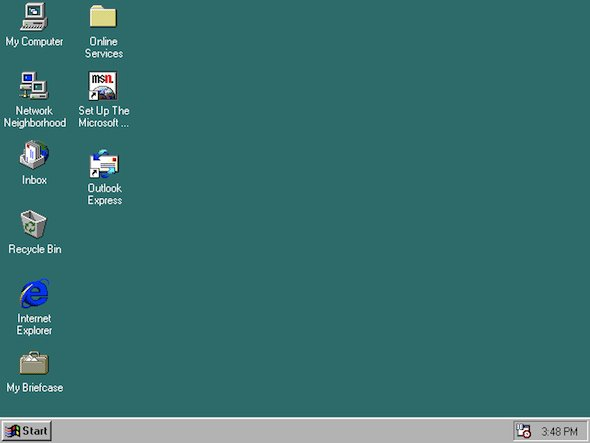
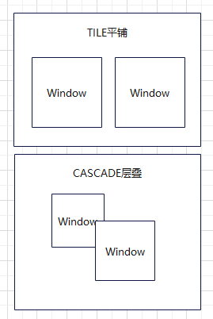
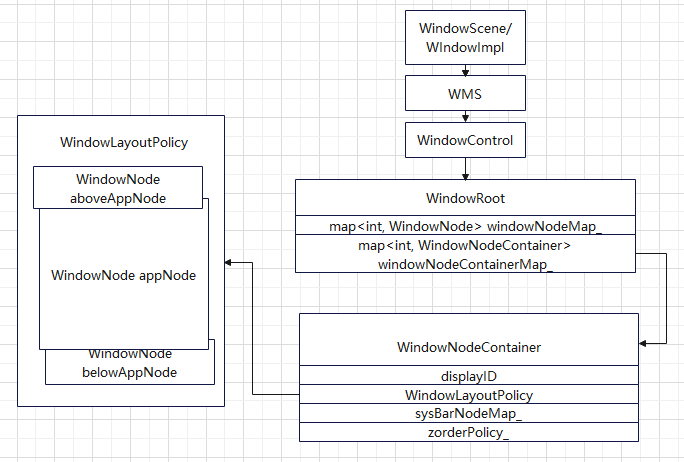

# 13-窗口子系统

## 简介

提供窗口管理和Display管理的基础能力，是系统图形界面显示所需的基础子系统。

窗口管理：窗口提供管理窗口的一些基础能力，包括对当前窗口的创建、销毁、各属性设置，以及对各窗口间的管理调度。

DisPlay：屏幕属性提供管理显示设备的一些基础能力，包括获取默认显示设备的信息，获取所有显示设备的信息以及监听显示设备的插拔行为。

## 架构

## 演变

参考文档：[https://www.open-open.com/news/view/185d270](https://www.open-open.com/news/view/185d270)

参考文档：[https://forums.openharmony.cn/forum.php?mod=viewthread\&tid=2211\&extra=page%3D1\&mobile=no](https://forums.openharmony.cn/forum.php?mod=viewthread\&tid=2211\&extra=page%3D1\&mobile=no)

### **Windows 1.0**

1985年微软首次发布 Windows 系统：Windows 1.0。这个版本基本上就是 MS-DOS 系统一个简单的图层，基于字符的 MS-DOS 系统是那个时候大多数电脑上的操作系统。Windows 1.0 没有得到广泛应用。

### Windows 2.0

1987年，微软发布 Windows 2.0，也是运行微软文字处理软件 Word 和表格处理软件 Excel 的第一个版本。该版本引发了当年苹果控告微软剽窃其 Macintosh 和 Lisa 部分设计元素的官司，但最终苹果败诉。

### **Windows 3.0**

Windows 3.0 于 1990 年发布。该版本褪去了大部分 MS-DOS 系统的东西，加入了大量图形操作界面。毫无意外，它获得了巨大成功，成为第一个真正广泛流行的系统版本。从外观上看，与我们如今使用的 Windows 系统已经很接近。

### **Windows 3.1**

随着 Windows 3.0 版本的成功，微软紧接着在 1991 年推出 Windows 3.1。它真正成为上世纪 90 年代初各种 IBM 兼容机的标准配置系统，也是最后一个看起来还略带 MS-DOS 气息的系统版本。

### **Windows 95**

1995年 8 月，微软发布 Windows 95 视窗系统，一款在微软历史上具有里程碑式的视窗版本。相对于之前的版本，Windows 95 专注于桌面，并几乎将所有元素引入图形按钮。微软自身的浏览器 IE、回收站以及开始按钮都是这时引入，可以说 Windows 95 开启了真正的图形界面时代。自此后，微软后续的版本基本没有什么非常大的变化。

## WindowManagerService 

WMS 主要负责 Window 的管理，比如创建、销毁、布局、层级的管理，并提供窗口布局、焦点、事件分发的能力，但不负责绘制。主要职责如下：

* 管理 Window 的创建与销毁、窗口的属性的维护
* 窗口树的维护
* 窗口焦点的管理
* 窗口的层级管理以及输入法窗口的层级提升
* 窗口布局与策略的管理
* 提供窗口的缩放与拖拽能力
* 避开区域的管理
* 加载 ACE 布局并触发布局回调事件

## DisplayManagerService 

DMS 提供 Display 信息、Display 事件通知以及管理 Display 与 Screen 映射关系，其他能力主要通过 RenderService 实现。主要职责如下：

* 通过 RenderService 获取并管理 Screen
* ScreenGroup 的管理
* Display 的管理，以及其与 Screen 的映射管理
* 对外提供显示信息，如宽高、虚拟像素比等
* 提供截屏、量灭屏、横竖屏、亮度等屏幕相关能力
* 提供扩展屏幕或镜像屏等多屏能力
* 虚拟屏幕的管理
* Display 事件的通知，如屏幕亮灭、显示大小、横竖屏、冻结等事件

## Window、Display、Screen 的关系 

Screen 是物理屏幕，Display 是逻辑屏幕，Window 则依附于 Display。Screen 与 Display 之间是多对多的关系，Display 与 Window 也是多对多的关系。在普通的单屏场景下，Screen 与 Display 是一对一，Display 与 Window 则是一对多。

## 窗口管理流程分析 

### 创建窗口 

窗口的创建从 Ability 的 OnStart 声明周期函数中触发。

* Ability 持有 AbilityWindow，AbilityWindow 则持有 WindowScene
* WindowScene 在初始化阶段会创建一个主窗口
* 窗口的创建会调用 Window::Create 函数创建 WindowImpl 对象，并调用 WindowManagerService::CreateWindow 函数
* 在 WindowManagerService 中，则通过 WindowController 生成 windowId 并创建 WindowNode
* 最后通过 WindowRoot 将 WindowNode 管理起来

### **AbilityWindow 与 WindowScene 的关系**

AbilityWindow 是 Ability 持有用来在生命周期函数中生成或调用窗口生命周期的类，操作窗口的类则是 WindowScene。WindowScene 由 WindowManager client 端提供，用于屏蔽元能力与窗口管理之间强耦合，方便后续无屏幕的小型设备裁剪显示系统。

### **WindowImpl 与 WindowNode 的区别**

WindowImpl 是 IWindow 的实现，是提供给上层操作窗口的接口。WindowNode 与 WindowImpl 一一对应，是 WMS 中操作窗口的实体，其通过 WindowRoot 管理。WindowNode 内部维护了一个 windowToken\_对象，该对象的指向就是 WindowImpl。

* WindowImpl 负责对应用于其他子模块提供操作窗口的能力，能力通过 WMS 与 RenderService 实现。WindowImpl 在创建时会创建 RSSurfaceNode 对象，该对象则会向 RenderService 提交一条窗口创建的事务。
* 在 WindowNode 创建时，WindowImpl 会将 RSSurfaceNode 的引用传递给 WindowNode。
* WindowNode 则是 WMS 中对窗口的抽象，内部维护了父子关系、显示隐藏、布局大小等。

### **WindowRoot 的作用**

顾名思义，WindowRoot 管理着所有的窗口。其内部维护着 WindowNode 与 WindowId 的 map，提供了对 WindowNode 的增删改查操作，并且提供了最小化所有窗口、最大化窗口、设置布局策略等能力。

### **WindowImpl 的管理**

主窗口的 WindowImpl 由 WindowScene 持有，子窗口则由主窗口自己管理维护。在 Ability 销毁时，会通知 WindowScene 销毁主窗口，主窗口则会销毁所有的子窗口，并通知 WMS 中的 WindowRoot 销毁相应的 WindowNode。

### 窗口的显示 

创建的流程仅仅是创建了 WindowImpl 与 WindowNode，并未涉及布局与渲染，那么窗口是如何显示的呢？

* 窗口的显示也是通过 Ability 触发，在其生命周期函数 OnActive/OnForground 内，会调用到 WindowScene::GoForeground 中。
  * 窗口的显示也可以通过在 ets 中手动调用 window.show()触发
* 调用主窗口的 show 方法，即 WindowImpl::Show
* 在其中会做一些判断，比如桌面的显示，会将其他 app 都最小化
* 接着 WindowImpl 通过 WMS 调用 WindowRoot 的 AddWindowNode 函数，并将 windowId 传递过来
* WindowRoot 通过 windowId 查找 WindowNode，并通过 diaplayId 创建或者获取 WindowNodeContainer 对象，并调用其 AddWindowNode 函数
* 在 WindowNodeContainer 内，会判断 window 类型并将 window 加入到相应的父窗口中（appRoot、belowRoot、aboveRoot）
* 接着会处理 WindowNode 中父子关系的映射，并调用 DMS 服务的 UpdateRSTree
* 处理所有窗口的 z 值，并按规则设置到每个窗口的 surfaceNode 中，该操作会向 RenderService 提交一条事务。
* z 值的规则为：从 belowRoot->appRoot->aboveRoot，z 值越来越大。同一类型中，window 的 priority 越大，z 值越大。同一 priority 的情况下，窗口被添加的越晚，z 值越大。z 值越大，排列越靠上。
* WindowNodeContainer 维护着两种布局策略，CASCADE 与 TILE，在维护完 z 值与父子关系等操作后，会调用布局策略的 AddWindowNode 函数
* 下面的流程均基于 CASCADE 策略
  * 判断窗口 Visibility，为 false 则不布局
  * 判断避开区域，限制窗口大小。如果是全屏窗口，则宽高与 display 一致。
  * 如果是悬浮窗口，默认大小设置为 display 的 3/4，并设置一个 Decorate 矩形，该矩形为窗口增加了 37vp、5vp、5vp、5vp（上右下左），该矩形用于拖拽与平移
  * 如果设置了 WINDOW\_FLAG\_PARENT\_LIMIT 标记并且是子窗口，限制子窗口的大小不能超过父窗口
  * 为悬浮窗口设置 hotZone，上下左右均增加 20vp。该区域用于多模输入模块判断手指是否落在 window 内，也就是增加判断范围。
  * 调用窗口的 surfaceNode 的 SetBounds 函数，指定窗口的坐标与大小。该函数也会向 RenderService 提交一条事务。
  * 迭代子窗口，为其执行同样的流程
* 总结下来，窗口的显示就是处理了父子关系、窗口先后关系，以及确定了坐标与大小，最后向 RenderService 提交事务，等待下个 vsync 的绘制

### **WindowNodeContainer 的作用**

WindowNodeContainer 与 Display 一一对应，其管理了单个 Display 中的所有窗口，WindowRoot 则管理了所有的窗口与 WindowNodeContainer。WindowNodeContainer 提供了布局策略的决策与设置、窗口焦点设置、窗口排列、避开区域管理、窗口分屏显示等能力。

**布局策略**

OH 目前支持两种策略，CASCADE（层叠）与 TILE（平铺）。默认的布局策略是 CASCADE，分屏显示也会将策略切换至 CASCADE。布局策略的主要能力就是决定窗口的排列布局方式、位置与大小。两种策略的区别如下：

## 触摸事件的传递 

触摸事件由多模输入模块传递到窗口，经过处理后，传递给 ACE 中的 UIContent 中。

* 通过 InputManager 注册为窗口输入事件消费者
* 触摸事件会回调至 WindowInputChannel::HandlePointerEvent 中
* 如果调用了窗口的 AddInputEventListener 设置触摸监听，转发事件至监听内，并且只将 POINTER\_ACTION\_DOWN 与 POINTER\_ACTION\_BUTTON\_DOWN 传递给窗口。
* 如果是 POINTER\_ACTION\_MOVE 事件，在下一帧将事件传递给窗口。如果是其他事件，立即传递给窗口。
* 在窗口内，如果是悬浮窗口：
  * POINTER\_ACTION\_DOWN
    * 判断手指是否落在窗口之外，窗口 Decorate 矩形内，如果是，开启拖拽模式
    * 如果触摸的 window 类型为 WINDOW\_TYPE\_DOCK\_SLICE，开始移动模式
  * POINTER\_ACTION\_MOVE
    * 如果开启拖拽模式，根据手指移动的距离，通过 WindowNodeContainer 修改窗口大小
    * 如果开启移动模式，根据手指移动的距离，通过 WindowNodeContainer 修改窗口位置
* 如果开启了开启拖拽或移动模式，事件不会继续传递，如果未开启，则会传递给 ACE 的 UIContent

## Display 管理流程分析 

### DMS 启动流程 

DMS 在启动时的主要工作就是从 RenderService 获取屏幕信息，并创建 ScreenGroup 与 Display

* 通过 RSInterface 注册屏幕连接回调，在屏幕连接后，创建 AbsScreen
* 再通过 RSInterface 获取屏幕支持的分辨率、刷新率等信息，设置到 AbsScreen 中
* 创建 ScreenGroup，将 AbsScreen 添加到 group 中
* 添加后会为 AbstractScreen 初始化 RSDisplayNode，并向 RenderService 提交一条 RSDisplayNode 创建的事务
* ScreenGroup 与 AbsScreen 初始化完毕后，会为 AbsScreen 创建一个 AbstractDisplay
* AbstractDisplay 保存了 AbsScreen 中的分辨率刷新率等信息，并且根据屏幕宽与高，决定虚拟像素比。
* 通知感兴趣的部件，Display 已经创建好
* WMS 也会通过 DMS 监听 Display 的变化，比如大小变化、横竖屏变化，WMS 会通知到 WindowNodeContainer 去更新 Display 的状态并重新布局所有窗口
* 如果遇到 BEFORE\_SUSPEND 事件，比如进入锁屏状态，WMS 会通过 WindowNodeContainer 通知每个窗口（WindowImpl）更新其状态为 STATE\_FROZEN，并告知 AMS，让持有窗口的 Ability 进入后台状态

## 相关阅读

- [图形子系统-openharmony](../12-graphics/12-tu-xing-zi-xi-tong-openharmony.md)
- [多模输入子系统](../14-duo-mo-shu-ru-zi-xi-tong.md)
- [媒体子系统](../../05-media-distributed/15-mei-ti-zi-xi-tong.md)
