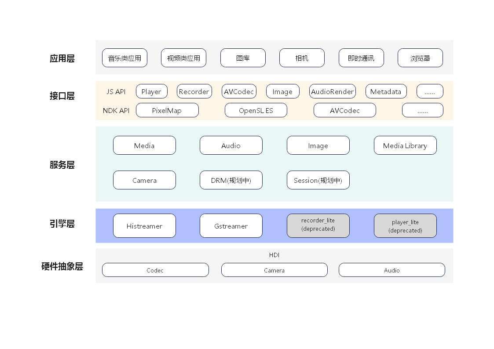
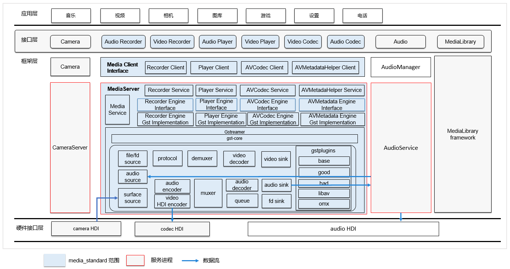

# 15-媒体子系统

## 简介

媒体子系统为开发者提供一套简单且易于理解的接口，使得开发者能够方便接入系统并使用系统的媒体资源。

媒体子系统包含了音视频、相机相关媒体业务，提供以下常用功能：

* 音频播放和录制。
* 视频播放和录制。
* 相机拍照和录制。

## 架构

* **Media**: 为应用提供播放、录制等接口，通过跨进程调用或直接调用方式，调用媒体引擎Gstreamer、Histreamer或其它引擎。
  * mini设备上，Media部件调用Histreamer支持音频播放等功能。
  * small设备上，Media部件调用recorder\_lite支持音视频录制，默认调用player\_lite支持音视频播放，通过设置系统属性变量debug.media\_service.histreamer为1使用histreamer。详细设置方法参见[syspara系统属性组件使用说明](https://gitcode.com/openharmony/docs/blob/master/zh-cn/device-dev/subsystems/subsys-boot-init-sysparam.md)或者参见[syspara模块代码](https://gitcode.com/openharmony/startup_syspara_lite)。
  * standard设备上，Media部件调用Gstreamer支持音视频播放、音视频录制。
* **Audio**: Audio部件支持音频输入输出、策略管理、音频焦点管理等功能。
* **Camera**: Camera部件提供相机操作接口，支持预览、拍照、录像。
* **Image**: Image部件支持常见图片格式的编解码。
* **MediaLibrary**: MediaLibrary支持本地和分布式媒体数据访问管理。
* **Histreamer**: 轻量级媒体引擎，支持文件/网络流媒体输入，支持音视频解码播放，支持音视频编码录制，支持插件扩展。
* **Gstreamer**: 开源GStreamer引擎，支持流媒体、音视频播放、录制等功能。

## media\_standard

可以看到底层其实是调用了Gstreamer的能力

## Gstreamer

### 简介

Gstreamer是一个支持Windows，Linux，Android， iOS的跨平台的多媒体框架，应用程序可以通过管道（Pipeline）的方式，将多媒体处理的各个步骤串联起来，达到预期的效果。每个步骤通过元素（Element）基于GObject对象系统通过插件（plugins）的方式实现，方便了各项功能的扩展。

gstreamer跟ffmpeg一样，也是一个媒体框架，可以实现采集，编码，解码，渲染，滤镜等一条龙的媒体解决方案。

1. 跟ffmpeg一样，也是有命令行工具进行测试验证。同时还可以通过代码框架直接封装命令来做工程开发，这一点ffmpeg是不具备的，ffmpeg需要学习API才能做工程开发，就算你会ffplay.exe或ffmpeg.exe验证某些需求，但要集成到代码，需要学习API来实现。而gstreamer只要知道的命令行实现方式，就可以马上命令行集成到代码中进行使用，当然你想代码优雅一点或者你是熟手也可以使用API来实现。
2. Gstreamer是glib实现的，跨平台的实现，windows,linux,androd,ios，macos官方原生支持，而且官方发布了windows,linux,androd,ios包，如果没有特别需求，可以直接拿发布包集成使用。而ffmpeg想支持android,ios，就需要自己做交叉编译了。
3. Gstreamer采用插件实现方式，根据业务需要可以灵活裁剪插件，可以将发布包做的非常小，特别适合在嵌入式和移动端等应用领域，而ffmpeg比较大，在嵌入领域需要自己做代码级裁剪。
4. Gstreamer 采用glib实现，用C语言来实现面向对象思维，完全不是标准C++那一套逻辑，由于要跨平台，原生的系统API都是适配封装了一套，甚至自己实现队列，MAP，容器，协程，线程，异步操作，不熟悉glib 的API话，代码理解比较困难，用惯了C++，STL，boost，感觉得这是gstream最让人反感的一点，不合主流，搞的我又要学一套API。
5. Gstreamer采用插件管理各个模块，软件框架比较复杂，采用了异步，协程编程模型，进一步增加了理解难度。

参考文档：[https://vinming.github.io/2022/03/12/gstreamer\_basic\_tutorial/](https://vinming.github.io/2022/03/12/gstreamer_basic_tutorial/)

### 框架

## 相关阅读

- [窗口子系统](../../04-ipc-graphics/13-chuang-kou-zi-xi-tong.md)
- [图形子系统-openharmony](../../04-ipc-graphics/12-graphics/12-tu-xing-zi-xi-tong-openharmony.md)
