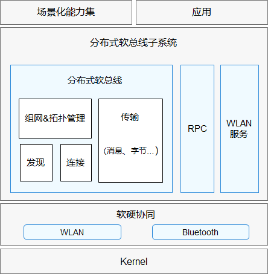

# 16-分布式软总线

## 简介

分布式软总线子系统旨在为OpenHarmony系统提供的通信相关的能力，包括：WLAN服务能力、蓝牙服务能力、软总线、进程间通信RPC（Remote Procedure Call）等通信能力。

WLAN服务：为用户提供WLAN基础功能、P2P（peer-to-peer）功能和WLAN消息通知的相应服务，让应用可以通过WLAN和其他设备互联互通。

蓝牙服务：为应用提供传统蓝牙以及低功耗蓝牙相关功能和服务。

软总线：为应用和系统提供近场设备间分布式通信的能力，提供不区分通信方式的设备发现，连接，组网和传输功能。

进程间通信：提供不区分设备内或设备间的进程间通信能力。

## 架构

## 核心功能

分布式软总线围绕「发现、连接、组网、传输」提供统一的近场通信能力，对上层业务屏蔽底层 Wi-Fi、蓝牙等链路的差异：

* **设备发现**：基于 Wi-Fi 与蓝牙等多种通信方式，提供不区分链路的设备发现能力，可发现周边同账号/同网络的 OpenHarmony 设备，并获取设备的基础信息（设备类型、设备 ID 等）。
* **连接管理**：在发现基础上完成设备间链路的建立、维护与断开，自动在 Wi-Fi 与蓝牙之间选择/切换合适的传输通道。
* **设备组网**：提供统一的设备组网与拓扑管理能力，维护可信设备组成的软总线网络拓扑，为数据传输提供已组网设备信息。
* **数据传输**：在已组网设备间提供数据传输通道，支持**消息、字节、字节流、文件**等多种传输类型，并对上层提供统一的数据收发接口。
* **进程间通信（RPC）**：基于软总线提供不区分「设备内 / 设备间」的远程过程调用能力，使跨设备调用如同本地调用。

## 子系统组成

分布式软总线从下到上大致分为以下层次：

1. **底层协议与链路层**：WLAN 服务、蓝牙服务，负责具体的无线链路管理与消息通知。
2. **软总线核心层（DSoftBus）**：实现设备发现、连接、组网与数据传输，是总线能力的核心。
3. **IPC/RPC 框架层**：基于软总线链路提供跨进程、跨设备的远程调用。
4. **对外接口层**：向应用与系统服务暴露统一的发现、连接、传输与 RPC 接口。

## 协议栈与发现机制

### 发现协议

软总线支持多通道并发发现，以提升设备发现成功率与速度：

| 通道 | 协议/方式 | 适用场景 |
|------|-----------|----------|
| CoAP（Constrained Application Protocol） | UDP 组播 | 局域网内同 Wi-Fi 设备发现 |
| BLE 广播 | 低功耗蓝牙广播 | 附近设备发现，无需 Wi-Fi 连接 |
| USB / P2P | 直连链路 | 特定场景（如 PC 与开发板） |

发现流程：设备周期性发送广播/组播报文（携带设备名、设备类型、设备 ID 等），监听端收到后解析并上报到软总线设备列表。

### 连接认证

发现后，设备间需完成认证才能建立可信传输通道：

1. **帐号校验**：确认双方是否登录同一帐号（由[34-帐号与用户身份](../34-zhang-hao-yu-shen-fen.md) 管理）；
2. **设备认证**：通过 HUKS + 安全协议交换凭据，确认对端可信（由[23-安全子系统](../../07-security/23-an-quan-zi-xi-tong.md) 完成）；
3. **会话建立**：认证通过后，软总线建立加密会话，后续通信均在该会话内进行。

## 传输通道

软总线对上层抽象出统一的传输接口，底层实际根据数据类型与网络状况选择最优链路：

| 传输类型 | 接口语义 | 底层可能承载 |
|----------|----------|--------------|
| 消息 | 小数据、可靠、按序 | TCP / P2P |
| 字节 | 小数据、无连接、尽力而为 | UDP / BLE |
| 字节流 | 大数据、可靠、长连接 | TCP / P2P |
| 文件 | 大文件、断点续传 | TCP / P2P / Wi-Fi Direct |

> 文件传输支持断点续传与进度回调，适合跨设备分享照片、视频等大体量数据。

## 典型流程

设备 A 与设备 B 协同的一般流程为：A 发起**发现** → 双方完成**连接**并加入同一**组网**拓扑 → A 通过 RPC/数据传输向 B 发起请求或推送数据 → B 响应并返回结果。上层业务无需关心数据走的是 Wi-Fi 还是蓝牙，由软总线统一调度。

## 关键设计点

* **链路无关**：上层只面向「设备」编程，链路选择、切换、冲突处理由总线内部完成。
* **安全可信**：设备发现与组网通常基于同账号或可信关系，传输通道提供加密保护。
* **统一抽象**：设备内 IPC 与设备间 RPC 使用同一套接口语义，降低分布式应用开发成本。
* **动态拓扑**：设备上下线时，软总线自动维护组网拓扑，通知上层服务变更，无需应用手动重连。

## 性能优化与调试

* **心跳与保活**：软总线维护设备间心跳，检测对端是否在线；心跳超时会自动清理拓扑并尝试重连。
* **QoS 与带宽感知**：高带宽场景（如文件传输）优先使用 Wi-Fi P2P 或局域网 TCP；低功耗场景（如传感器数据）使用 BLE。
* **调试命令**：开发阶段可通过 `hdc shell` 进入设备，使用软总线调试接口查看在线设备列表、拓扑与通道状态。

## 相关阅读

- [分布式数据管理](../17-fen-bu-shi-shu-ju-guan-li.md)
- [分布式硬件](../18-fen-bu-shi-ying-jian.md)
- [架构篇](../../01-basic/04-jia-gou-pian.md)
- [30-通信子系统](../30-tong-xin-zi-xi-tong.md)
- [23-安全子系统](../../07-security/23-an-quan-zi-xi-tong.md)
- [34-帐号与用户身份](../34-zhang-hao-yu-shen-fen.md)
