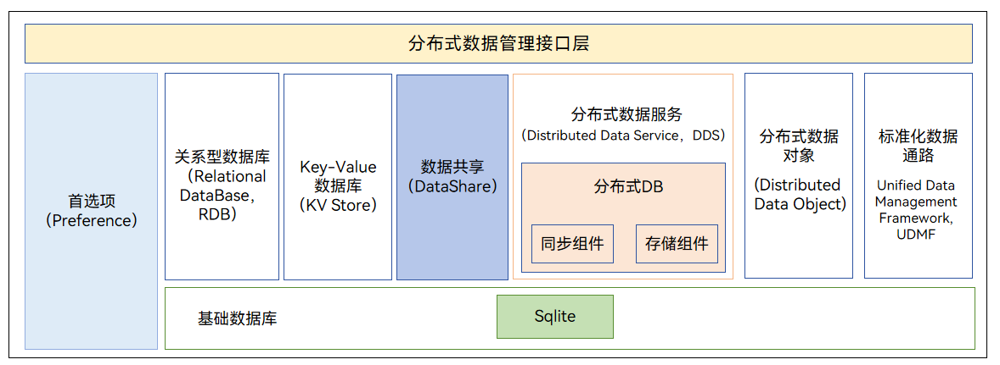

# 17-分布式数据管理

## 简介

分布式数据管理子系统支持单设备的各种结构化数据的持久化，以及跨设备之间数据的同步、共享功能。开发者通过分布式数据管理子系统，能够方便地完成应用程序数据在不同终端设备间的无缝衔接，满足用户跨设备使用数据的一致性体验。

## 架构

## 核心能力

分布式数据管理为应用提供跨设备的数据持久化与协同能力，主要包括：

- **单设备持久化**：在本地设备上对结构化数据进行存储与管理。

- **跨设备同步与共享**：应用数据可在不同终端设备间无缝衔接，保证用户跨设备使用数据的一致性体验。

- **数据对象化**：以统一的数据对象模型描述跨设备数据，降低多端协同的复杂度。

## 主要组成

1. **分布式键值数据库（Distributed KV Store）**

   - 提供单版本（Single KV）与多设备协同（Device KV）两种模式。

   - 支持以 Key-Value 方式存取结构化数据，并自动在可信设备间完成数据同步。

   - 适用于轻量、易变化的配置/状态类数据（如设置项、草稿）。

2. **偏好数据库（Preferences）**

   - 轻量的本地键值存储，常用于保存应用的用户偏好、配置项等小体量数据。

3. **分布式数据对象（Distributed Data Object）**

   - 将内存中的 JavaScript/ArkTS 对象标记为「分布式」，对象字段的变更会自动同步到组网内的其他设备，适合实时状态共享场景（如协同编辑、跨端进度）。

4. **统一数据管理框架（UDMF，Unified Data Management Framework）**

   - 定义数据跨应用、跨设备、跨平台流通的标准与统一通道，为剪贴板、拖拽、分享等场景提供标准化数据封装与解析。

## 同步与冲突处理

- **同步触发**：当设备处于同一组网且关系可信时，KV 数据库与分布式对象的写入会被自动同步到其他设备。

- **冲突策略**：多设备并发写入同一 Key 时，依据预置的冲突解决策略（如按设备优先级、时间戳）决定最终值，开发者也可自定义解决逻辑。

- **一致性目标**：以「最终一致」为设计目标，在弱网/离线场景下优先保证本地可用，恢复连接后再补齐同步。

## 典型使用场景

- 同一应用在多设备间的配置、收藏、阅读进度自动同步。

- 跨设备剪贴板、拖拽、分享（基于 UDMF）。

- 多端协同的状态实时共享（基于分布式数据对象）。

## 相关阅读

- [分布式软总线](../16-fen-bu-shi-ruan-zong-xian.md)
- [分布式硬件](../18-fen-bu-shi-ying-jian.md)
- [架构篇](../../01-basic/04-jia-gou-pian.md)
