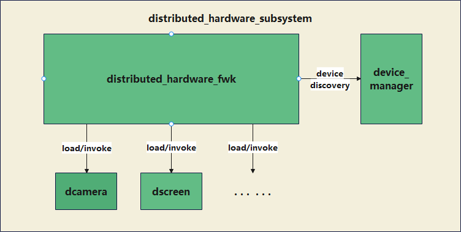

# 18-分布式硬件

## 简介

分布式硬件子系统是超级终端中用于设备间外设能力共享的子系统，其管理超级终端内各个设备的硬件信息，纳入硬件资源池统一管理，实现设备间硬件能力的跨设备共享和调用能力，打破了设备边界，并通过软件定义各种新产品形态和体验。

如手机可以使用电视大屏幕显示，办公PC也能使用手机摄像头提供更强的摄像能力。

分布式硬件平台对超级终端中的所有设备的硬件资源池化都是基于硬件虚拟化组件来进行构建的，每一个硬件在平台上注册对应的虚拟硬件实例，虚拟硬件通过虚拟化组件实现与对应的物理硬件之间的交互，从而实现了对周边设备对应硬件的控制和数据传输。

硬件资源池化基于驱动接口（HDI）完成硬件虚拟化，服务层各个业务子系统可以像使用本机硬件一样使用分布式硬件。

## 架构





## 核心思想：硬件虚拟化与资源池化

分布式硬件平台对超级终端中所有设备的硬件资源进行**池化**，其构建基础是**硬件虚拟化组件**：

* 每个硬件在平台上注册一个对应的**虚拟硬件实例**（Virtual Hardware Instance）。
* 虚拟硬件通过虚拟化组件，完成与对应物理硬件之间的交互，从而控制周边设备硬件并传输数据。
* 硬件资源池化基于**驱动接口（HDI，Hardware Driver Interface）**完成，这意味着业务子系统可以像使用本机硬件一样，去使用分布式网络中的远端硬件。

由此，设备边界被打破，一个设备可以调用另一个设备的外设能力，并通过软件定义出新的产品形态与体验（如手机调用电视大屏显示、PC 调用手机摄像头）。

## 主要组成

1. **硬件资源池管理框架**
   * 统一管理超级终端内各设备的硬件信息，维护硬件资源池与设备拓扑。
   * 负责任意硬件的注册、发现、能力查询与调度。
2. **硬件虚拟化组件**
   * 提供「虚拟硬件实例 ↔ 物理硬件」的映射与通信通道。
   * 通过 HDI 屏蔽不同设备、不同芯片平台的硬件差异。
3. **分布式外设能力（已开源的典型能力）**
   * **分布式相机**：远端设备的摄像头可被本地应用作为本地相机使用。
   * **分布式音频**：音频采集/播放能力可在设备间迁移与共享。
   * **分布式屏幕**：将本端画面投送到远端设备显示，或把远端设备作为扩展屏。
   * **分布式输入**：远端设备的键盘、鼠标、触控等输入事件可注入到本端。

## 虚拟硬件生命周期

虚拟硬件实例在资源池中经历完整的生命周期：

```
注册（Register）→ 发现（Discovery）→ 绑定（Bind）→ 使用（Use）→ 解绑（Unbind）→ 注销（Unregister）
```

- **注册**：物理设备启动时，向本地分布式硬件服务注册其外设能力（如"我有一个 4K 摄像头"）。
- **发现**：同帐号组网内的其他设备通过软总线发现该能力，并加入本地硬件资源池视图。
- **绑定**：本地应用请求使用远端硬件时，分布式硬件服务建立数据通道与控制通道，完成虚拟硬件与本地接口的绑定。
- **使用**：本地应用通过 HDI 调用虚拟硬件，数据经软总线传输到远端物理硬件执行。
- **解绑**：应用释放硬件或设备离线时，断开通道并释放资源。
- **注销**：物理设备关机或退出组网时，从资源池中移除对应实例。

## 调用流程（以「手机用电视大屏显示」为例）

1. 电视在硬件资源池中注册其「屏幕」虚拟硬件实例。
2. 手机发现并连接电视的虚拟屏幕，经 HDI 建立渲染数据通道。
3. 手机的图形子系统将画面经软总线送往电视，由电视物理屏幕呈现。
4. 对手机应用而言，调用的是「本机显示器」，无需感知远端物理设备。

## 数据流与控制流分离

分布式硬件内部通常将数据流与控制流分离：

- **控制流**：通过 IPC/RPC 经软总线传输，负责命令下发、状态查询、参数配置（小数据量、低延迟要求）。
- **数据流**：通过软总线的高带宽通道（如 P2P / TCP 直连）传输，负责音视频、图像等大体量数据。

这种分离保证了控制命令的实时性，同时让数据流充分利用网络带宽。

## 与系统子系统的协作

| 协作子系统 | 作用 |
|------------|------|
| [16-分布式软总线](../16-fen-bu-shi-ruan-zong-xian.md) | 提供设备发现、连接、组网与数据传输通道 |
| [23-安全子系统](../../07-security/23-an-quan-zi-xi-tong.md) | 设备认证与加密，确保只有可信设备能访问远端硬件 |
| [34-帐号与用户身份](../34-zhang-hao-yu-shen-fen.md) | 同帐号是设备互信的前提 |
| [09-HDF驱动框架](../../03-driver-boot/09-hdf-qu-dong-kuang-jia.md) | 统一驱动接口 HDI，屏蔽芯片差异 |
| [12-图形子系统](../../04-ipc-graphics/12-graphics/12-tu-xing-zi-xi-tong-openharmony.md) | 分布式屏幕的数据渲染与合成 |

## 关键价值

* **打破边界**：外设能力不再绑定于单一设备，可按需灵活组合。
* **按需分配**：依据场景与硬件能力动态选择最合适的设备提供服务。
* **统一访问**：上层业务通过虚拟硬件 + HDI 以统一方式使用本机与远端硬件。
* **生态扩展**：新硬件只需接入 HDF 并注册虚拟实例，即可被超级终端内所有设备共享。

## 相关阅读

- [分布式软总线](../16-fen-bu-shi-ruan-zong-xian.md)
- [分布式数据管理](../17-fen-bu-shi-shu-ju-guan-li.md)
- [架构篇](../../01-basic/04-jia-gou-pian.md)
- [09-HDF驱动框架](../../03-driver-boot/09-hdf-qu-dong-kuang-jia.md)
- [23-安全子系统](../../07-security/23-an-quan-zi-xi-tong.md)
- [34-帐号与用户身份](../34-zhang-hao-yu-shen-fen.md)
