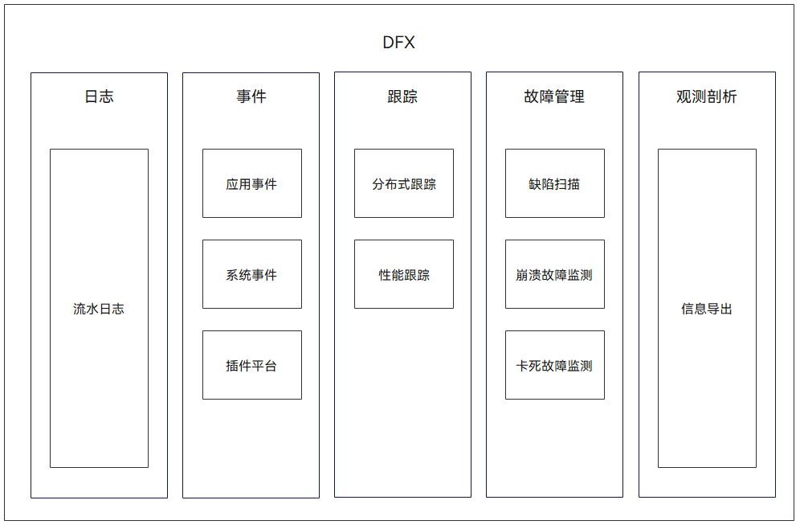

# 20-DFX子系统

## 简介

在OpenHarmony中，DFX([Design for X](https://en.wikipedia.org/wiki/Design_for_X))是为了提升质量属性的软件设计，目前包含的内容主要有：DFR（Design for Reliability，可靠性）和DFT（Design for Testability，可测试性）特性。

提供以下功能：

* HiLog流水日志，标准系统类设备（参考内存≥128MB）适用、HiLog\_Lite轻量流水日志，轻量系统类设备（参考内存≥128KiB），小型系统类设备（参考内存≥1MiB）适用。
* HiTraceChain分布式跟踪，标准系统类设备（参考内存≥128MiB）适用。
* HiTraceMeter性能跟踪，标准系统类设备（参考内存≥128MiB）适用。
* HiCollie卡死故障检测，标准系统类设备（参考内存≥128MiB）适用。
* HiSysEvent系统事件埋点，标准系统类设备（参考内存≥128MiB）适用。
* HiDumper信息导出，标准系统类设备（参考内存≥128MB）适用。
* Faultlogger崩溃故障检测，标准系统类设备（参考内存≥128MB）适用。
* Hiview插件平台，标准系统类设备（参考内存≥128MB）适用。
* HiAppEvent应用事件及HiChecker缺陷扫描仅供应用开发者使用。

## 结构

参考文档：[https://gitcode.com/openharmony/docs/blob/master/zh-cn/readme/DFX%E5%AD%90%E7%B3%BB%E7%BB%9F.md](https://gitcode.com/openharmony/docs/blob/master/zh-cn/readme/DFX%E5%AD%90%E7%B3%BB%E7%BB%9F.md)

## 核心机制

### HiLog / HiLog\_Lite

HiLog 提供标准系统上的**流水日志**能力，支持多级别（DEBUG/INFO/WARN/ERROR/FATAL）与多域标签，日志通过 ring buffer 缓存并支持落盘。轻量/小型系统使用 **HiLog\_Lite**，针对内存限制做了裁剪，接口语义保持一致，方便开发者一套代码跨设备复用。

**关键流程**：应用调用 `HiLog` 接口 → 日志写入内核共享内存 → `hilogd` 守护进程读取并持久化到 `/data/log/hilog` → 开发者通过 `hilog` 命令行查看。

### HiTraceChain / HiTraceMeter

* **HiTraceChain**：提供**分布式跟踪**能力，在跨设备调用链中传递唯一的 `trace id`，使多设备日志可以按调用链串联，定位端到端问题。
* **HiTraceMeter**：提供**性能跟踪**（trace 打点），支持应用和系统服务在关键函数上打 `StartTrace`/`FinishTrace` 标记，输出到 `/data/log/hitrace` 或可视化工具，用于分析卡顿、时延、CPU 占用。

### HiCollie

**卡死故障检测**组件。通过检测主线程（或指定线程）的消息队列是否在阈值时间内未响应，判定为 UI 线程或系统服务线程卡死。触发后可自动抓取 `hilog`、栈回溯、CPU 负载，辅助开发者快速定位卡死根因。

### Faultlogger

**崩溃故障检测**组件。当进程发生崩溃（如段错误、非法指令）时，Faultlogger 通过注册的信号处理器捕获异常，并生成崩溃日志（包含寄存器、栈回溯、内存映射）。日志存储于 `/data/log/faultlog`，并支持通过 `hilog` 或 `hidumper` 查询。

### Hiview 插件平台

Hiview 是 DFX 的**底座与调度平台**，提供事件总线、插件注册、策略执行等能力。上述 HiLog、HiTrace、HiCollie、Faultlogger 等均以 Hiview 插件形式运行，通过统一的事件管道进行数据流转与协同。开发者也可扩展自定义插件，接入 Hiview 的事件生态。

### 典型使用场景

* 线上问题排查：通过 HiLog + HiTraceChain 定位跨设备异常链路。
* 性能优化：通过 HiTraceMeter 获取系统调用耗时分布，找到瓶颈函数。
* 稳定性治理：通过 HiCollie 与 Faultlogger 自动捕获卡死与崩溃，缩短问题发现周期。

## 源码位置

* `hiviewdfx` 仓下主要包含：`hilog`、`hitrace`、`hicollie`、`faultlogger`、`hiview` 等目录。

## 相关阅读

- [XTS子系统](../21-xts-zi-xi-tong.md)
- [架构篇](../../01-basic/04-jia-gou-pian.md)
- [OTA升级子系统](../22-ota-sheng-ji-zi-xi-tong.md)
